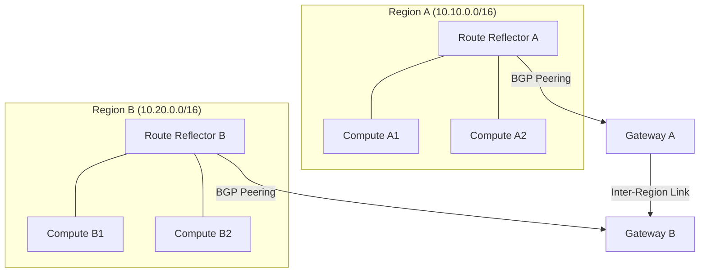

# How to Configure OpenStack Multiple Regions with Calico

Author: [nawazdhandala](https://github.com/nawazdhandala)

Tags: OpenStack, Calico, Multi-Region, Networking, Configuration

Description: A guide to configuring Calico networking across multiple OpenStack regions, covering cross-region BGP peering, IP pool partitioning, and global network policy management.

---

## Introduction

Running OpenStack across multiple regions with Calico networking requires careful planning to ensure that network policies are consistent, IP addresses do not conflict, and cross-region traffic is routed correctly. Each region operates as an independent Calico deployment, but workloads often need to communicate across regions.

This guide covers partitioning IP pools across regions, configuring BGP peering between regions, and managing global network policies that apply consistently across all regions. The goal is a multi-region deployment where each region is independently functional but can communicate with other regions when needed.

Multi-region Calico does not use a single shared datastore. Instead, each region has its own Calico installation, and cross-region connectivity is achieved through BGP peering at the network fabric level or through dedicated inter-region gateways.

## Prerequisites

- Two or more OpenStack regions, each with Calico networking
- Network connectivity between regions (dedicated links or VPN)
- `calicoctl` configured for each region
- BGP-capable routers or gateways at region boundaries
- A planned IP addressing scheme that avoids conflicts across regions

## Partitioning IP Pools Across Regions

Assign non-overlapping IP pools to each region to prevent address conflicts.

```yaml
# region-a-ippool.yaml
# IP pool for Region A
apiVersion: projectcalico.org/v3
kind: IPPool
metadata:
  name: region-a-vms
spec:
  cidr: 10.10.0.0/16
  blockSize: 26
  natOutgoing: true
  encapsulation: VXLAN
  nodeSelector: all()
```

```yaml
# region-b-ippool.yaml
# IP pool for Region B
apiVersion: projectcalico.org/v3
kind: IPPool
metadata:
  name: region-b-vms
spec:
  cidr: 10.20.0.0/16
  blockSize: 26
  natOutgoing: true
  encapsulation: VXLAN
  nodeSelector: all()
```

```bash
# Apply IP pools in their respective regions
# On Region A
DATASTORE_TYPE=kubernetes KUBECONFIG=/path/to/region-a/kubeconfig calicoctl apply -f region-a-ippool.yaml

# On Region B
DATASTORE_TYPE=kubernetes KUBECONFIG=/path/to/region-b/kubeconfig calicoctl apply -f region-b-ippool.yaml
```



## Configuring Cross-Region BGP Peering

Set up BGP peering between region gateways to exchange routes.

```yaml
# region-a-bgp-peer.yaml
# BGP peer configuration on Region A route reflectors
apiVersion: projectcalico.org/v3
kind: BGPPeer
metadata:
  name: peer-to-region-b
spec:
  # Region B gateway IP
  peerIP: 172.16.0.2
  # Region B AS number (use different AS per region for eBGP)
  asNumber: 64513
  # Only apply to route reflector nodes in Region A
  nodeSelector: route-reflector == 'true'
```

```yaml
# region-b-bgp-peer.yaml
# BGP peer configuration on Region B route reflectors
apiVersion: projectcalico.org/v3
kind: BGPPeer
metadata:
  name: peer-to-region-a
spec:
  # Region A gateway IP
  peerIP: 172.16.0.1
  # Region A AS number
  asNumber: 64512
  # Only apply to route reflector nodes in Region B
  nodeSelector: route-reflector == 'true'
```

Configure BGP settings per region:

```yaml
# region-a-bgp-config.yaml
apiVersion: projectcalico.org/v3
kind: BGPConfiguration
metadata:
  name: default
spec:
  nodeToNodeMeshEnabled: false
  asNumber: 64512
  # Advertise the region's VM CIDR
  prefixAdvertisements:
    - cidr: 10.10.0.0/16
```

## Managing Global Network Policies

Apply consistent policies across regions by using the same policy definitions.

```yaml
# global-security-policy.yaml
# This policy should be applied identically in all regions
apiVersion: projectcalico.org/v3
kind: GlobalNetworkPolicy
metadata:
  name: cross-region-web-access
  annotations:
    docs.example.com/scope: "all-regions"
spec:
  selector: role == 'web'
  types:
    - Ingress
  ingress:
    # Allow from any region's web tier
    - action: Allow
      source:
        nets:
          - 10.10.0.0/16
          - 10.20.0.0/16
        selector: role == 'web'
      protocol: TCP
      destination:
        ports:
          - 80
          - 443
```

```bash
#!/bin/bash
# apply-global-policies.sh
# Apply consistent policies across all regions

POLICY_DIR="./global-policies"

for region_config in /path/to/region-*/kubeconfig; do
  region_name=$(basename $(dirname ${region_config}))
  echo "Applying policies to ${region_name}..."

  for policy_file in ${POLICY_DIR}/*.yaml; do
    DATASTORE_TYPE=kubernetes KUBECONFIG=${region_config} \
      calicoctl apply -f ${policy_file}
  done
done
```

## Verification

```bash
#!/bin/bash
# verify-multi-region.sh
echo "=== Multi-Region Calico Verification ==="

for region in region-a region-b; do
  echo ""
  echo "--- ${region} ---"
  KUBECONFIG="/path/to/${region}/kubeconfig"

  echo "IP Pools:"
  DATASTORE_TYPE=kubernetes KUBECONFIG=${KUBECONFIG} calicoctl get ippools -o wide

  echo "BGP Peers:"
  DATASTORE_TYPE=kubernetes KUBECONFIG=${KUBECONFIG} calicoctl get bgppeers -o wide

  echo "Global Policies:"
  DATASTORE_TYPE=kubernetes KUBECONFIG=${KUBECONFIG} calicoctl get globalnetworkpolicies -o name
done
```

## Troubleshooting

- **Cross-region traffic not flowing**: Verify BGP sessions between region gateways are established. Check that route advertisements include the correct CIDRs for each region.
- **IP address conflicts**: Audit IP pools across all regions. Each region must have a non-overlapping CIDR.
- **Policies inconsistent across regions**: Use a GitOps approach to manage policy definitions. Store policies in version control and apply them to all regions from a single source.
- **High latency for cross-region traffic**: Cross-region traffic traverses WAN links. This is expected. Use Calico policies to prefer local traffic where possible.

## Conclusion

Configuring multiple OpenStack regions with Calico requires careful IP pool partitioning, cross-region BGP peering, and consistent policy management. By assigning non-overlapping CIDRs, establishing BGP peering between region gateways, and using a centralized policy management workflow, you can build a multi-region deployment where workloads communicate reliably across regions while maintaining consistent security policies.
