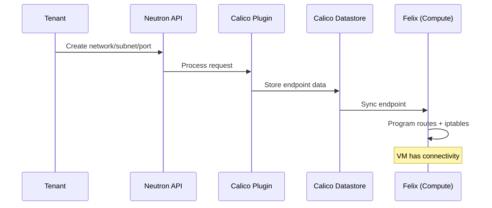

# How to Configure OpenStack Neutron API Integration with Calico

Author: [nawazdhandala](https://github.com/nawazdhandala)

Tags: OpenStack, Calico, Neutron, API, Configuration

Description: A step-by-step guide to configuring the Neutron API integration with Calico for OpenStack, covering plugin installation, database configuration, and API extension setup.

---

## Introduction

Calico integrates with OpenStack through the Neutron API, replacing the default ML2/OVS networking with a pure Layer 3 approach. The Neutron API remains the interface that tenants use to create networks, subnets, and ports, but the backend implementation uses Calico for routing and security enforcement instead of virtual switches.

This guide covers the step-by-step configuration of the Neutron-Calico integration, from installing the Calico Neutron plugin to configuring API extensions and verifying the integration. The goal is a working Neutron API that creates Calico-managed networking resources transparently.

Understanding the Neutron-Calico integration architecture is important: Neutron handles the API layer and database, while Calico handles the data plane. The Calico DHCP agent and Felix work together to configure networking on compute nodes based on Neutron API calls.

## Prerequisites

- An OpenStack deployment with Neutron installed
- Calico components (Felix, BIRD) installed on compute nodes
- etcd cluster or Kubernetes API for Calico datastore
- Administrative access to Neutron configuration files
- Python package management tools (pip)

## Installing the Calico Neutron Plugin

Install the Calico plugin for Neutron on the controller nodes.

```bash
# Install the Calico Neutron plugin
pip install networking-calico

# Verify the plugin is installed
pip show networking-calico
```

Configure Neutron to use the Calico plugin:

```bash
# /etc/neutron/neutron.conf
# Calico core plugin configuration
cat << 'EOF' | sudo tee /etc/neutron/neutron.conf.d/calico.conf
[DEFAULT]
# Use Calico as the core network plugin
core_plugin = calico

# Calico handles DHCP internally
dhcp_agents_per_network = 0

[calico]
# etcd connection settings for Calico datastore
etcd_host = 10.0.0.5
etcd_port = 2379
# Use TLS for etcd connection in production
etcd_cert_file = /etc/calico/certs/etcd-cert.pem
etcd_key_file = /etc/calico/certs/etcd-key.pem
etcd_ca_cert_file = /etc/calico/certs/etcd-ca.pem
EOF

# Restart Neutron server to load the plugin
sudo systemctl restart neutron-server
```

## Configuring the Calico DHCP Agent

Calico provides its own DHCP agent that works with the Calico networking model.

```bash
# /etc/neutron/dhcp_agent.ini
# Configure for Calico DHCP
cat << 'EOF' | sudo tee /etc/neutron/dhcp_agent.ini
[DEFAULT]
# Use the Calico DHCP driver
interface_driver = neutron.agent.linux.interface.RoutedInterfaceDriver
dhcp_driver = networking_calico.dhcp_agent.CalicoDHCPDriver

# Enable metadata proxy for VM instance metadata
enable_isolated_metadata = True
EOF

# Restart the DHCP agent
sudo systemctl restart neutron-dhcp-agent
```



## Configuring Security Group Integration

Calico translates Neutron security groups into Calico network policies automatically.

```bash
# Verify security group driver configuration
# /etc/neutron/plugins/ml2/ml2_conf.ini (if using ML2)
# Or in the Calico plugin configuration

# Check that security groups are working
openstack security group list
openstack security group rule list default

# Create a test security group to verify integration
openstack security group create test-calico-sg
openstack security group rule create \
  --protocol tcp --dst-port 80 \
  --remote-ip 0.0.0.0/0 test-calico-sg

# Verify Calico translated the security group
calicoctl get profiles -o wide | grep test-calico-sg
```

## Configuring Neutron API Extensions

Enable Calico-specific Neutron API extensions for advanced features.

```bash
# Check available API extensions
openstack extension list --network

# Verify Calico extensions are loaded
openstack extension show security-group
openstack extension show router

# Test the API with a complete workflow
# Create network
openstack network create calico-test-net

# Create subnet
openstack subnet create \
  --network calico-test-net \
  --subnet-range 10.50.0.0/24 \
  --dns-nameserver 8.8.8.8 \
  calico-test-subnet

# Create port
openstack port create \
  --network calico-test-net \
  --security-group test-calico-sg \
  calico-test-port

# Verify the port was created and has a Calico endpoint
openstack port show calico-test-port -f yaml
```

## Verification

```bash
#!/bin/bash
# verify-neutron-calico.sh
# Verify Neutron-Calico integration

echo "=== Neutron-Calico Integration Verification ==="

# Check Neutron is using Calico plugin
echo "Neutron core plugin:"
grep "core_plugin" /etc/neutron/neutron.conf | grep -v "^#"

# Check Neutron server health
echo ""
echo "Neutron server status:"
openstack network agent list

# Check Calico DHCP agent
echo ""
echo "DHCP Agent:"
openstack network agent list --agent-type dhcp

# Test API operations
echo ""
echo "API Test - Create and verify network:"
openstack network create verify-test-net 2>/dev/null
openstack network show verify-test-net -f value -c status
openstack network delete verify-test-net

# Check Felix is receiving updates
echo ""
echo "Felix endpoint count:"
calicoctl get workloadendpoints --all-namespaces -o json | \
  python3 -c "import json,sys; print(len(json.load(sys.stdin).get('items',[])))"
```

## Troubleshooting

- **Neutron server fails to start**: Check that `networking-calico` is installed in the correct Python environment. Verify the plugin name in `neutron.conf` is exactly `calico`.
- **Network creation fails via API**: Check Neutron server logs at `/var/log/neutron/server.log`. Common issues are etcd connection failures or missing Calico datastore configuration.
- **Security groups not translating to Calico profiles**: Verify the security group driver is configured. Check Felix logs on compute nodes for profile sync errors.
- **DHCP not providing IP addresses**: Verify the Calico DHCP agent is running. Check that the `dhcp_driver` is set to `networking_calico.dhcp_agent.CalicoDHCPDriver`.

## Conclusion

Configuring the Neutron API integration with Calico establishes the foundation for Calico-based networking in OpenStack. By installing the Calico plugin, configuring DHCP, and setting up security group integration, you create a seamless experience where tenants use the standard Neutron API while Calico handles the data plane. Verify the integration thoroughly before deploying production workloads.
