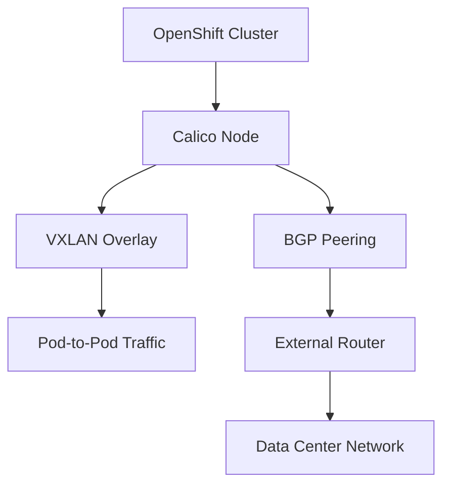

# How to Customize Migration from OVN to Calico on OpenShift for Real Clusters

Author: [nawazdhandala](https://github.com/nawazdhandala)

Tags: Calico, OpenShift, OVN, Networking, Migration

Description: A practical guide to customizing the migration from OVN-Kubernetes to Calico on OpenShift clusters, covering network policy translation, IP pool configuration, and workload-specific tuning for production environments.

---

## Introduction

Migrating from OVN-Kubernetes to Calico on OpenShift is a significant networking change that affects every pod and service in your cluster. While the default migration path covers basic scenarios, production clusters often require customizations to preserve existing network policies, maintain IP address schemes, and accommodate workload-specific requirements.

This guide focuses on the practical customizations you will need when migrating real-world OpenShift clusters. We cover translating OVN-specific network policies to Calico equivalents, configuring IP pools to match your existing address scheme, and tuning Calico for workloads that depend on specific networking behaviors.

Before diving into customization, it is important to understand that OVN-Kubernetes and Calico have different approaches to network policy enforcement, encapsulation, and IP address management. Recognizing these differences is key to planning a smooth migration.

## Prerequisites

- An OpenShift 4.x cluster currently running OVN-Kubernetes as the CNI
- Cluster admin access with `oc` CLI configured
- A documented inventory of existing NetworkPolicy and EgressFirewall resources
- Calico operator installed but not yet activated
- A maintenance window scheduled for the migration

## Auditing Existing OVN Network Configuration

Before customizing the migration, you need a complete picture of your current OVN networking setup. Export all network policies, egress firewalls, and related configuration.

```bash
# Export all NetworkPolicy resources across all namespaces
oc get networkpolicy --all-namespaces -o yaml > ovn-network-policies.yaml

# Export OVN-specific EgressFirewall resources
oc get egressfirewall --all-namespaces -o yaml > ovn-egress-firewalls.yaml

# List all services with their cluster IPs and types
oc get svc --all-namespaces -o wide > services-inventory.txt

# Check current pod CIDR and service CIDR
oc get network.config cluster -o yaml > cluster-network-config.yaml
```

Review the exported resources and identify any OVN-specific features that need Calico equivalents. Common items include EgressFirewall rules, which map to Calico GlobalNetworkPolicy resources.

## Customizing Calico IP Pools and BGP Configuration

Configure Calico IP pools to match your existing cluster network CIDR. This ensures pods retain compatible addressing after migration.

```yaml
# calico-ippool.yaml
# Custom IP pool matching the existing OVN pod CIDR
apiVersion: projectcalico.org/v3
kind: IPPool
metadata:
  # Name this pool to reflect its purpose
  name: openshift-pod-network
spec:
  # Must match your existing cluster network CIDR from network.config
  cidr: 10.128.0.0/14
  # VXLAN encapsulation for compatibility with existing infrastructure
  encapsulation: VXLAN
  # Enable NAT for outbound traffic from pods
  natOutgoing: true
  # Assign to all nodes by default
  nodeSelector: all()
```

If your cluster uses BGP peering with external routers, configure BGPPeer resources:

```yaml
# calico-bgppeer.yaml
# BGP peering configuration for top-of-rack switches
apiVersion: projectcalico.org/v3
kind: BGPPeer
metadata:
  name: rack-switch-peer
spec:
  # IP address of the external BGP peer (your ToR switch)
  peerIP: 192.168.1.1
  # AS number of the external peer
  asNumber: 64512
  # Apply to nodes with this label
  nodeSelector: rack == 'rack-01'
```



## Translating OVN Network Policies to Calico Policies

While Kubernetes NetworkPolicy resources work with both OVN and Calico, OVN-specific EgressFirewall rules must be converted to Calico GlobalNetworkPolicy resources.

```yaml
# calico-egress-policy.yaml
# Translated from OVN EgressFirewall to Calico GlobalNetworkPolicy
apiVersion: projectcalico.org/v3
kind: GlobalNetworkPolicy
metadata:
  name: restrict-external-egress
spec:
  # Apply to all pods in the target namespace
  namespaceSelector: kubernetes.io/metadata.name == 'production'
  # Egress rules only
  types:
    - Egress
  egress:
    # Allow DNS resolution
    - action: Allow
      protocol: UDP
      destination:
        ports:
          - 53
    # Allow traffic to internal services
    - action: Allow
      destination:
        nets:
          - 10.0.0.0/8
    # Allow specific external endpoints
    - action: Allow
      destination:
        nets:
          - 203.0.113.0/24
    # Deny all other egress
    - action: Deny
```

Apply the translated policies before switching the CNI to ensure network security is maintained throughout the migration:

```bash
# Apply Calico IP pool configuration
oc apply -f calico-ippool.yaml

# Apply translated network policies
oc apply -f calico-egress-policy.yaml

# Verify the policies are accepted by Calico
oc get globalnetworkpolicies.projectcalico.org
```

## Tuning Calico for Workload-Specific Requirements

Some workloads may need specific Calico configurations. For example, high-throughput applications benefit from eBPF dataplane mode, and multi-tenant clusters need stricter policy enforcement.

```yaml
# calico-felixconfig.yaml
# Felix configuration for performance tuning
apiVersion: projectcalico.org/v3
kind: FelixConfiguration
metadata:
  name: default
spec:
  # Enable eBPF dataplane for better performance (optional)
  bpfEnabled: false
  # Set log severity for troubleshooting during migration
  logSeverityScreen: Info
  # Enable flow logs for network visibility
  flowLogsFlushInterval: 15s
  flowLogsFileEnabled: true
```

## Verification

After completing the migration, verify that all networking functions work correctly.

```bash
# Verify all pods are running and have IP addresses
oc get pods --all-namespaces -o wide | grep -v Running

# Check Calico node status on all nodes
oc get pods -n calico-system -o wide

# Test pod-to-pod connectivity across nodes
oc run test-client --image=busybox --restart=Never -- sleep 3600
oc exec test-client -- wget -qO- http://kubernetes.default.svc.cluster.local/healthz

# Verify network policies are enforced
oc get globalnetworkpolicies.projectcalico.org
oc get networkpolicies --all-namespaces
```

## Troubleshooting

- **Pods stuck in ContainerCreating**: Check Calico node logs with `oc logs -n calico-system -l k8s-app=calico-node`. This usually indicates IP pool CIDR mismatch or IPAM issues.
- **Network policies not enforced**: Verify that GlobalNetworkPolicy resources are applied with `oc get globalnetworkpolicies.projectcalico.org -o yaml`. Check Felix logs for policy calculation errors.
- **BGP sessions not established**: Confirm BGPPeer configuration matches the external router settings. Use `oc exec` into a calico-node pod and run `birdcl show protocols` to check BGP session state.
- **DNS resolution failures**: Ensure the egress policy allows UDP port 53. Check that CoreDNS pods are running and have valid Calico endpoints.
- **Performance degradation**: Compare encapsulation modes. If VXLAN adds too much overhead, consider switching to IP-in-IP or native routing if your infrastructure supports it.

## Conclusion

Customizing the OVN to Calico migration for production OpenShift clusters requires careful auditing of existing network configuration, thoughtful IP pool planning, and accurate translation of OVN-specific policies to Calico equivalents. By following the steps in this guide, you can preserve your existing network security posture while gaining the advanced features that Calico provides. Always test the full migration in a staging environment before applying it to production clusters.
