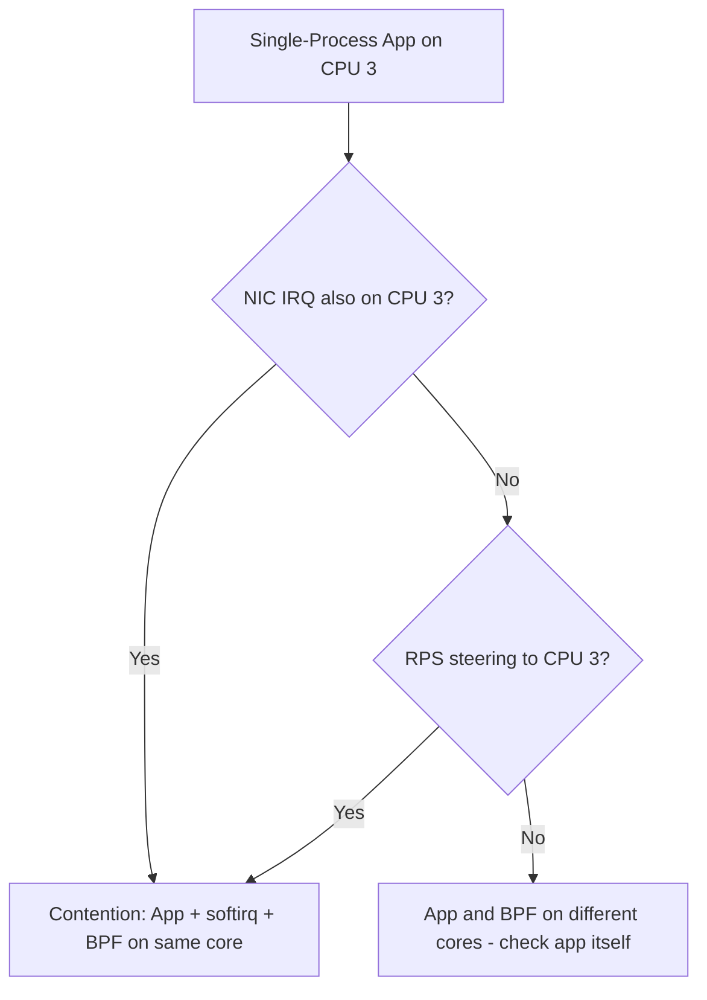

# Diagnosing Single-Process Performance Bottlenecks in Cilium

Author: [nawazdhandala](https://github.com/nawazdhandala)

Tags: Cilium, Kubernetes, Networking, Performance, Single-Process, CPU

Description: How to diagnose performance bottlenecks when a single-process workload runs through Cilium's eBPF datapath, focusing on CPU pinning, scheduling, and per-core analysis.

---

## Introduction

Single-process workloads in Kubernetes present a unique performance challenge for Cilium. When an application uses only one process (and often one thread) for network I/O, all packet processing is funneled through a single CPU core. This means the application and Cilium's eBPF programs compete for the same core's resources, and any inefficiency is magnified.

Diagnosing single-process performance issues requires understanding how the Linux scheduler places the application thread and how Cilium's softirq processing interacts with it. A poorly scheduled single-process workload can lose 30-50% of its potential throughput due to CPU contention.

This guide covers the diagnostic tools and methodology for identifying exactly where a single-process workload is losing performance in a Cilium environment.

## Prerequisites

- Kubernetes cluster with Cilium v1.14+
- `perf`, `mpstat`, `pidstat` available on nodes
- `kubectl` and `cilium` CLI
- Understanding of Linux CPU scheduling
- A single-process workload exhibiting poor performance

## Identifying the CPU Bottleneck

```bash
# Find the application's CPU affinity
APP_PID=$(kubectl exec my-app -- cat /proc/1/status | grep "^Pid:" | awk '{print $2}')

# On the node, check CPU affinity
taskset -p $APP_PID

# Monitor per-CPU utilization during the workload
mpstat -P ALL 1 30

# Look for a single CPU at 100% while others are idle
# This indicates the single-process bottleneck
```

Check what is consuming CPU on that core:

```bash
# Profile the specific CPU
perf record -C <cpu-number> -g -- sleep 10
perf report --stdio --sort=dso,symbol | head -30

# Look for the split between:
# - Application code (your binary)
# - Kernel networking (net_rx_action, napi_poll)
# - Cilium eBPF (bpf_prog_run, __htab_map_lookup_elem)
```

## Analyzing Cilium's Impact on the Core

```bash
# Check BPF program execution stats
bpftool prog show --json | jq '.[] | select(.name | contains("cil")) | {name, run_cnt, run_time_ns, avg_ns: (.run_time_ns / (.run_cnt + 1))}'

# Monitor softirq distribution
cat /proc/softirqs | grep NET

# Check if softirq is processed on the same core as the application
# High NET_RX on the application's core = contention
```

## Checking IRQ Assignment

```bash
# Find which CPU handles the NIC IRQs for the application's traffic
cat /proc/interrupts | grep -E "eth|ens|eno"

# Check the flow hash to see which queue handles the flow
# Use ethtool to check flow steering
ethtool -n eth0 | head -20
```



## Checking Container CPU Limits

```bash
# Check if CPU limits are throttling
kubectl exec my-app -- cat /sys/fs/cgroup/cpu/cpu.stat
# Look for nr_throttled and throttled_time

kubectl describe pod my-app | grep -A5 "Limits"
# If CPU limit is 1 core and both app + softirq compete, throttling occurs
```

## Using Hubble for Flow Analysis

```bash
# Check flow patterns from the single-process app
hubble observe --pod my-app --protocol TCP -o json | \
  jq '{src: .source.pod_name, dst: .destination.pod_name, verdict: .verdict}' | head -20

# Check for retransmissions or drops
hubble observe --pod my-app --type drop
```

## Verification

```bash
# Verify your findings by running a controlled test
# Pin the app to a specific CPU and run iperf3 on the same core vs different core

# Same core test
taskset -c 0 iperf3 -c $SERVER_IP -t 10 -P 1 &
# Force IRQ to CPU 0
echo 1 > /proc/irq/<nic-irq>/smp_affinity

# Different core test
taskset -c 0 iperf3 -c $SERVER_IP -t 10 -P 1 &
echo 2 > /proc/irq/<nic-irq>/smp_affinity

# Compare results to quantify contention
```

## Troubleshooting

- **Cannot find application PID on node**: Use `crictl ps` to find the container, then `crictl inspect` for the PID.
- **perf not available**: Install `linux-tools-$(uname -r)` or use BCC tools like `profile`.
- **CPU utilization data unclear**: Use `pidstat -t -p $APP_PID 1` for per-thread breakdown.
- **Cilium agent itself consuming excessive CPU**: Check `cilium monitor` for excessive events and disable verbose logging.

## Collecting Diagnostic Data Systematically

Before making any changes, collect a complete diagnostic snapshot. This ensures you have a baseline to compare against and can reproduce the issue:

```bash
# Create a diagnostic data directory
DIAG_DIR="/tmp/cilium-diag-$(date +%Y%m%d-%H%M%S)"
mkdir -p $DIAG_DIR

# Collect Cilium status
cilium status --verbose > $DIAG_DIR/cilium-status.txt

# Collect Cilium configuration
cilium config view > $DIAG_DIR/cilium-config.txt

# Collect BPF map information
cilium bpf ct list global > $DIAG_DIR/ct-entries.txt 2>&1
cilium bpf nat list > $DIAG_DIR/nat-entries.txt 2>&1

# Collect endpoint information
cilium endpoint list -o json > $DIAG_DIR/endpoints.json

# Collect node information
kubectl get nodes -o wide > $DIAG_DIR/nodes.txt
kubectl describe nodes > $DIAG_DIR/node-details.txt

# Collect Cilium agent logs
kubectl logs -n kube-system ds/cilium --tail=500 > $DIAG_DIR/cilium-logs.txt

# Archive everything
tar czf $DIAG_DIR.tar.gz $DIAG_DIR
echo "Diagnostic data saved to $DIAG_DIR.tar.gz"
```

Keep this diagnostic snapshot for comparison after applying fixes. The data is also useful if you need to escalate to Cilium support or open a GitHub issue.

### Understanding the Diagnostic Output

When reviewing the diagnostic data, focus on these key indicators:

1. **Cilium status**: Look for any components showing errors or degraded state
2. **BPF map utilization**: Compare current entries against maximum capacity
3. **Endpoint health**: Check for endpoints in "not-ready" or "disconnected" state
4. **Agent logs**: Search for ERROR and WARNING messages, especially related to BPF programs or policy computation

The combination of these data points will point you toward the specific subsystem causing the performance issue.

## Conclusion

Diagnosing single-process performance in Cilium centers on understanding CPU core contention between the application, kernel softirq processing, and Cilium's eBPF programs. The key diagnostic steps are identifying which CPU the application runs on, measuring what else competes for that core, and quantifying the overhead from each component. With this information, you can proceed to targeted fixes like IRQ steering, CPU pinning, or Cilium configuration changes.
