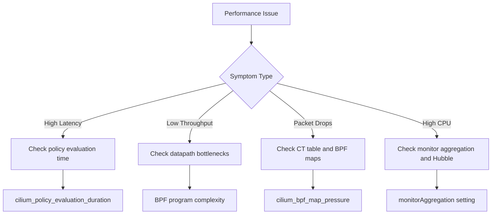

# How to Diagnose Performance Issues in Cilium

Author: [nawazdhandala](https://github.com/nawazdhandala)

Tags: Cilium, Performance, Diagnostics, eBPF, Kubernetes

Description: Learn how to diagnose performance issues in Cilium using built-in metrics, BPF tools, and systematic analysis to identify bottlenecks in the networking datapath.

---

## Introduction

Cilium's eBPF-based networking is designed for high performance, but misconfigurations, resource constraints, or workload patterns can create bottlenecks. Performance issues in Cilium can manifest as increased latency, reduced throughput, packet drops, or high CPU usage on cluster nodes.

Diagnosing these issues requires understanding where in the datapath the bottleneck occurs: is it in the BPF program execution, the connection tracking tables, the policy evaluation, or the Hubble observability overhead? Each component has specific metrics and diagnostic tools.

This guide provides a systematic diagnostic methodology for Cilium performance issues, from high-level symptom identification to low-level BPF analysis.

## Prerequisites

- Kubernetes cluster with Cilium installed
- Prometheus with Cilium metrics enabled
- kubectl and cilium CLI access
- iperf3 or netperf for benchmarking
- Basic understanding of network performance metrics

## Identifying Performance Symptoms

Start by categorizing the performance problem:

```bash
# Check overall Cilium agent resource usage
kubectl -n kube-system top pod -l k8s-app=cilium --sort-by=cpu

# Check for node-level resource pressure
kubectl get nodes -o json | python3 -c "
import json, sys
nodes = json.load(sys.stdin)
for node in nodes['items']:
    name = node['metadata']['name']
    conditions = {c['type']: c['status'] for c in node['status']['conditions']}
    pressure = [k for k in ['MemoryPressure','DiskPressure','PIDPressure'] if conditions.get(k) == 'True']
    if pressure:
        print(f'WARNING {name}: {pressure}')
    else:
        print(f'OK {name}')
"

# Check for packet drops indicating congestion
kubectl -n kube-system exec ds/cilium -- \
  wget -qO- http://localhost:9962/metrics 2>/dev/null | \
  grep "cilium_drop_count_total" | grep -v "^#"
```



## Analyzing Datapath Performance

Check the BPF datapath for bottlenecks:

```bash
# Check BPF map sizes and pressure
kubectl -n kube-system exec ds/cilium -- cilium bpf ct list global | wc -l
kubectl -n kube-system exec ds/cilium -- cilium status | grep -A5 "BPF Maps"

# Check NAT table usage
kubectl -n kube-system exec ds/cilium -- cilium bpf nat list | wc -l

# View BPF program complexity (instruction count)
kubectl -n kube-system exec ds/cilium -- cilium bpf prog list

# Check for BPF map pressure metrics
kubectl -n kube-system exec ds/cilium -- \
  wget -qO- http://localhost:9962/metrics 2>/dev/null | \
  grep "cilium_bpf_map_pressure"
```

## Measuring Network Latency and Throughput

Run benchmarks to quantify the performance issue:

```bash
# Deploy iperf3 server
kubectl run iperf3-server --image=networkstatic/iperf3 --port=5201 -- -s
kubectl expose pod iperf3-server --port=5201

# Run TCP throughput test
kubectl run iperf3-client --image=networkstatic/iperf3 --rm -it --restart=Never -- \
  -c iperf3-server.default -t 30 -P 4

# Run latency test (TCP_RR equivalent)
kubectl run iperf3-latency --image=networkstatic/iperf3 --rm -it --restart=Never -- \
  -c iperf3-server.default -t 10 --bidir

# Cross-node test (ensure pods are on different nodes)
kubectl run iperf3-server-node2 --image=networkstatic/iperf3 --port=5201 \
  --overrides='{"spec":{"nodeName":"node-2"}}' -- -s
kubectl run iperf3-client-node1 --image=networkstatic/iperf3 --rm -it --restart=Never \
  --overrides='{"spec":{"nodeName":"node-1"}}' -- \
  -c iperf3-server-node2.default -t 30

# Clean up
kubectl delete pod iperf3-server iperf3-server-node2 2>/dev/null
kubectl delete svc iperf3-server 2>/dev/null
```

## Checking Policy Evaluation Performance

Complex policies can slow down packet processing:

```bash
# Count the number of policies
kubectl get cnp -A --no-headers | wc -l
kubectl get ccnp --no-headers 2>/dev/null | wc -l

# Check policy evaluation duration
kubectl -n kube-system exec ds/cilium -- \
  wget -qO- http://localhost:9962/metrics 2>/dev/null | \
  grep "cilium_policy"

# Check endpoint regeneration time (policies trigger regeneration)
kubectl -n kube-system exec ds/cilium -- \
  wget -qO- http://localhost:9962/metrics 2>/dev/null | \
  grep "cilium_endpoint_regeneration_time_stats"

# Count endpoints (more endpoints = more regeneration overhead)
kubectl -n kube-system exec ds/cilium -- cilium endpoint list | wc -l
```

## Diagnosing Hubble Overhead

Hubble can add measurable overhead in high-traffic environments:

```bash
# Check Hubble-specific resource usage
kubectl -n kube-system exec ds/cilium -- \
  wget -qO- http://localhost:9962/metrics 2>/dev/null | \
  grep "cilium_event_ts\|cilium_perf_event"

# Check monitor aggregation level
kubectl -n kube-system exec ds/cilium -- cilium config | grep MonitorAggregation

# If aggregation is "none", it could be a significant CPU cost
# Compare CPU usage with Hubble metrics enabled vs disabled
```

## Verification

After applying performance optimizations:

```bash
# 1. Re-run throughput benchmark
kubectl run iperf3-client --image=networkstatic/iperf3 --rm -it --restart=Never -- \
  -c iperf3-server.default -t 30 -P 4

# 2. Check CPU usage is reduced
kubectl -n kube-system top pod -l k8s-app=cilium --sort-by=cpu

# 3. Verify no new drops
kubectl -n kube-system exec ds/cilium -- \
  wget -qO- http://localhost:9962/metrics 2>/dev/null | \
  grep "cilium_drop_count_total"

# 4. Check BPF map pressure is healthy
kubectl -n kube-system exec ds/cilium -- \
  wget -qO- http://localhost:9962/metrics 2>/dev/null | \
  grep "cilium_bpf_map_pressure"
```

## Troubleshooting

- **Throughput significantly lower than expected**: Check if IPSec or WireGuard encryption is enabled, which adds overhead. Check with `cilium status | grep Encryption`.

- **High latency on cross-node traffic**: Check tunnel mode. VXLAN adds overhead compared to native routing. Check with `cilium status | grep "Datapath Mode"`.

- **CPU usage scales linearly with traffic**: Monitor aggregation is likely set to `none`. Change to `medium` for production workloads.

- **Sudden performance degradation**: Check if a new network policy was applied that triggers endpoint regeneration across the cluster.

## Conclusion

Diagnosing Cilium performance requires a layered approach: start with high-level metrics (CPU, memory, drops), then benchmark actual throughput and latency, and finally investigate specific subsystems (BPF maps, policy evaluation, Hubble overhead). Most performance issues trace back to a small number of root causes: disabled monitor aggregation, oversized BPF programs from complex policies, CT table pressure, or encryption overhead. Measure, identify, tune, and re-measure to systematically improve your cluster's networking performance.
