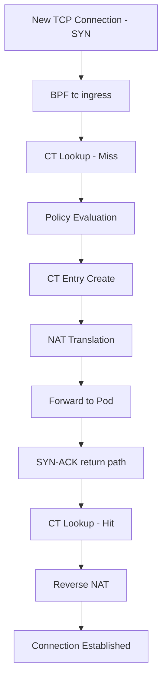

# Diagnosing Connection Rate (TCP_CRR) Issues in Cilium Performance

Author: [nawazdhandala](https://github.com/nawazdhandala)

Tags: Cilium, Kubernetes, Networking, Performance, TCP_CRR, Connection Rate

Description: How to diagnose TCP connection rate (TCP_CRR) performance issues in Cilium, covering conntrack overhead, SYN processing, and NAT table analysis.

---

## Introduction

TCP_CRR (TCP Connect/Request/Response) measures how quickly new TCP connections can be established, used for one request-response exchange, and torn down. This benchmark is critical for workloads that create many short-lived connections, such as HTTP/1.0 clients, serverless function invocations, and connection-pool-less microservices.

In Cilium, TCP_CRR performance is heavily influenced by conntrack table operations, NAT translation, and the SYN/SYN-ACK processing path through eBPF programs. Each new connection requires creating conntrack entries, evaluating policies, and potentially performing SNAT or DNAT -- all of which add overhead to the connection establishment phase.

This guide walks through diagnosing TCP_CRR performance issues in Cilium-managed clusters.

## Prerequisites

- Kubernetes cluster with Cilium v1.14+
- `netperf` container image (cilium/netperf)
- `cilium` CLI, `kubectl`, `bpftool`
- Node-level access for kernel profiling

## Measuring TCP_CRR Baseline

```bash
# Deploy netperf server
kubectl run netperf-server --image=cilium/netperf \
  --overrides='{"spec":{"nodeSelector":{"kubernetes.io/hostname":"node-1"}}}' \
  -- netserver -D

SERVER_IP=$(kubectl get pod netperf-server -o jsonpath='{.status.podIP}')

# Run TCP_CRR test
kubectl run netperf-crr --image=cilium/netperf \
  --rm -it --restart=Never \
  --overrides='{"spec":{"nodeSelector":{"kubernetes.io/hostname":"node-2"}}}' \
  -- netperf -H $SERVER_IP -t TCP_CRR -l 30

# Also test host-to-host for baseline
kubectl run host-crr --image=cilium/netperf \
  --overrides='{"spec":{"hostNetwork":true,"nodeSelector":{"kubernetes.io/hostname":"node-2"}}}' \
  --rm -it --restart=Never \
  -- netperf -H <node-1-ip> -t TCP_CRR -l 30
```

## Analyzing Conntrack Behavior

Each TCP_CRR transaction creates and destroys a conntrack entry:

```bash
# Monitor conntrack entry creation rate during test
watch -n1 "cilium bpf ct list global | wc -l"

# Check conntrack GC timing
cilium metrics list | grep gc

# Profile conntrack operations
bpftool prog show --json | jq '.[] | select(.name | contains("ct")) | {name, run_cnt, run_time_ns}'
```

## Checking NAT Table Pressure

```bash
# NAT entries grow with connection rate
cilium bpf nat list | wc -l

# Check NAT map capacity
cilium config view | grep bpf-nat-global-max

# Monitor port allocation exhaustion
cilium bpf nat list | awk '{print $3}' | sort | uniq -c | sort -rn | head
```

## SYN Processing Path Analysis

```bash
# Use Hubble to observe SYN processing
hubble observe --protocol TCP --last 1000 -o json | \
  jq 'select(.l4.TCP.flags.SYN == true) | {verdict, drop_reason: .drop_reason_desc}'

# Check for SYN drops
hubble observe --type drop --protocol TCP --last 100

# Monitor Cilium for policy evaluation on new connections
cilium monitor --type policy-verdict | head -20
```



## Verification

```bash
# Verify findings with targeted tests
# Compare with and without NAT in the path
# Direct pod-to-pod (no service)
kubectl exec netperf-client -- netperf -H $POD_IP -t TCP_CRR -l 10

# Via ClusterIP service (with NAT)
kubectl exec netperf-client -- netperf -H $SVC_IP -t TCP_CRR -l 10

# The difference shows NAT overhead
```

## Troubleshooting

- **Very low TCP_CRR (<5000 conn/s)**: Check for L7 policy in the path causing per-connection Envoy proxy setup.
- **Conntrack table growing unbounded**: Verify GC is running with `cilium config view | grep ct-global-tcp-timeout`.
- **NAT port exhaustion**: Increase `bpf-nat-global-max` or reduce `tcp_fin_timeout`.
- **SYN drops under load**: Increase `net.core.somaxconn` and `net.ipv4.tcp_max_syn_backlog`.

## Collecting Diagnostic Data Systematically

Before making any changes, collect a complete diagnostic snapshot. This ensures you have a baseline to compare against and can reproduce the issue:

```bash
# Create a diagnostic data directory
DIAG_DIR="/tmp/cilium-diag-$(date +%Y%m%d-%H%M%S)"
mkdir -p $DIAG_DIR

# Collect Cilium status
cilium status --verbose > $DIAG_DIR/cilium-status.txt

# Collect Cilium configuration
cilium config view > $DIAG_DIR/cilium-config.txt

# Collect BPF map information
cilium bpf ct list global > $DIAG_DIR/ct-entries.txt 2>&1
cilium bpf nat list > $DIAG_DIR/nat-entries.txt 2>&1

# Collect endpoint information
cilium endpoint list -o json > $DIAG_DIR/endpoints.json

# Collect node information
kubectl get nodes -o wide > $DIAG_DIR/nodes.txt
kubectl describe nodes > $DIAG_DIR/node-details.txt

# Collect Cilium agent logs
kubectl logs -n kube-system ds/cilium --tail=500 > $DIAG_DIR/cilium-logs.txt

# Archive everything
tar czf $DIAG_DIR.tar.gz $DIAG_DIR
echo "Diagnostic data saved to $DIAG_DIR.tar.gz"
```

Keep this diagnostic snapshot for comparison after applying fixes. The data is also useful if you need to escalate to Cilium support or open a GitHub issue.

### Understanding the Diagnostic Output

When reviewing the diagnostic data, focus on these key indicators:

1. **Cilium status**: Look for any components showing errors or degraded state
2. **BPF map utilization**: Compare current entries against maximum capacity
3. **Endpoint health**: Check for endpoints in "not-ready" or "disconnected" state
4. **Agent logs**: Search for ERROR and WARNING messages, especially related to BPF programs or policy computation

The combination of these data points will point you toward the specific subsystem causing the performance issue.

## Conclusion

Diagnosing TCP_CRR performance in Cilium focuses on the connection establishment path: conntrack entry creation, policy evaluation on the first SYN, and NAT translation overhead. The key diagnostic step is comparing pod-to-pod performance (with and without services) against host-to-host baseline to isolate where overhead is added. With this data, you can apply targeted fixes to the specific bottleneck in the connection setup path.
