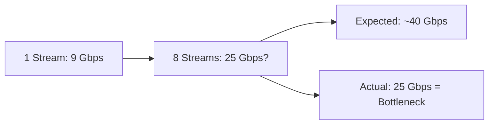

# Diagnosing Multi-Stream Performance Issues in Cilium

Author: [nawazdhandala](https://github.com/nawazdhandala)

Tags: Cilium, Kubernetes, Networking, Performance, Multi-Stream, eBPF

Description: Learn how to diagnose multi-stream TCP throughput issues in Cilium, including parallel flow analysis, CPU distribution problems, and BPF program bottlenecks.

---

## Introduction

Multi-stream TCP testing pushes multiple parallel connections between endpoints simultaneously. Unlike single-stream tests that stress a single CPU core, multi-stream workloads reveal how well Cilium distributes processing across all available cores. When aggregate throughput across many streams falls short of expectations, the causes differ fundamentally from single-stream bottlenecks.

Common issues include uneven flow distribution across NIC queues, BPF map lock contention, CPU scheduling interference from other workloads, and memory bandwidth saturation. Diagnosing these requires tools that can observe per-core and per-queue behavior under load.

This guide walks through the complete diagnostic workflow for multi-stream Cilium performance, from initial measurement to root cause identification.

## Prerequisites

- Kubernetes cluster (v1.24+) with Cilium v1.14+
- `cilium` CLI and `kubectl` access
- `iperf3` container image
- Node-level access for `perf`, `ethtool`, and `mpstat`
- Prometheus with Cilium metrics enabled

## Measuring Multi-Stream Throughput

Start with a comprehensive multi-stream benchmark:

```bash
# Deploy iperf3 server
kubectl run iperf-server --image=networkstatic/iperf3 \
  --overrides='{"spec":{"nodeSelector":{"kubernetes.io/hostname":"node-1"}}}' \
  -- -s

# Get server pod IP
SERVER_IP=$(kubectl get pod iperf-server -o jsonpath='{.status.podIP}')

# Run multi-stream client with 8, 16, and 32 parallel streams
for STREAMS in 8 16 32; do
  echo "=== Testing with $STREAMS streams ==="
  kubectl run "iperf-client-$STREAMS" --image=networkstatic/iperf3 \
    --rm -it --restart=Never \
    --overrides='{"spec":{"nodeSelector":{"kubernetes.io/hostname":"node-2"}}}' \
    -- -c $SERVER_IP -t 30 -P $STREAMS -J
done
```

Record aggregate throughput for each stream count. If throughput does not scale linearly with stream count, there is a bottleneck.



## Analyzing CPU Distribution

Multi-stream performance depends on even CPU distribution:

```bash
# On the server node during the test, run mpstat
mpstat -P ALL 1 30

# Look for:
# - Some CPUs at 100% while others idle (uneven distribution)
# - All CPUs at moderate load (balanced, look elsewhere)
# - softirq dominating (kernel overhead)
```

Check NIC queue distribution:

```bash
# View per-queue packet counts
ethtool -S eth0 | grep -E "rx_queue_[0-9]+_packets"

# Check number of queues vs CPUs
ethtool -l eth0

# If queues < CPUs, increase them
ethtool -L eth0 combined $(nproc)
```

## Inspecting BPF Program Contention

Cilium's BPF maps are shared across all CPUs. Under multi-stream load, lock contention can appear:

```bash
# Check BPF map operation counts and timing
bpftool map show --json | jq '.[] | select(.name | contains("cilium")) | {name, max_entries}'

# Monitor conntrack operations
cilium bpf ct list global | wc -l

# Check for BPF program errors
cilium monitor --type drop -v
```

Use `perf` to find contention points:

```bash
# On the node, during the test
perf record -g -a -- sleep 10
perf report --sort=dso,symbol | head -40

# Look for high time in:
# - htab_map_update_elem (BPF map contention)
# - __htab_map_lookup_elem (lookup overhead)
# - bpf_skb_load_bytes (packet parsing)
```

## Checking Memory and PCIe Bandwidth

Multi-stream can saturate memory bandwidth:

```bash
# Check NUMA topology
numactl --hardware

# Ensure NIC and CPU are on the same NUMA node
cat /sys/class/net/eth0/device/numa_node
cat /sys/devices/system/node/node0/cpulist

# Monitor PCIe bandwidth (if available)
lspci -vvv -s $(ethtool -i eth0 | grep bus-info | awk '{print $2}') | grep -i width
```

## Hubble Flow Analysis

Use Hubble to analyze flow distribution:

```bash
# Enable Hubble if not already
cilium hubble port-forward &

# Observe flow distribution
hubble observe --protocol TCP --last 1000 -o json | \
  jq -r '.source.namespace + "/" + .source.pod_name + " -> " + .destination.namespace + "/" + .destination.pod_name' | \
  sort | uniq -c | sort -rn
```

## Verification

Validate your diagnostic findings:

```bash
# Confirm CPU distribution issue
mpstat -P ALL 1 10 | tail -$(nproc)

# Verify NIC queue count matches expectations
ethtool -l eth0

# Confirm no BPF errors
cilium status --verbose | grep -i error

# Check Cilium agent resource usage during test
kubectl top pods -n kube-system -l k8s-app=cilium
```

## Troubleshooting

- **Throughput plateaus at specific stream count**: Usually indicates NIC queue exhaustion. Increase queue count with `ethtool -L`.
- **Uneven CPU usage**: Verify RSS (Receive Side Scaling) is enabled and hash function distributes flows evenly.
- **High softirq time**: Consider enabling Cilium's XDP acceleration for the ingress path.
- **Memory bandwidth saturation**: Check NUMA affinity and consider pinning pods to specific NUMA nodes.
- **BPF map contention visible in perf**: Increase per-CPU map usage or reduce policy complexity.

## Conclusion

Diagnosing multi-stream performance in Cilium requires observing CPU distribution, NIC queue behavior, BPF map contention, and memory bandwidth simultaneously. The key difference from single-stream diagnosis is that bottlenecks tend to be about resource distribution rather than per-core efficiency. By systematically checking each layer, you can identify whether the limit is in hardware (NIC queues, PCIe bandwidth), the kernel (RSS, IRQ affinity), or Cilium's BPF programs (map contention, policy complexity).
