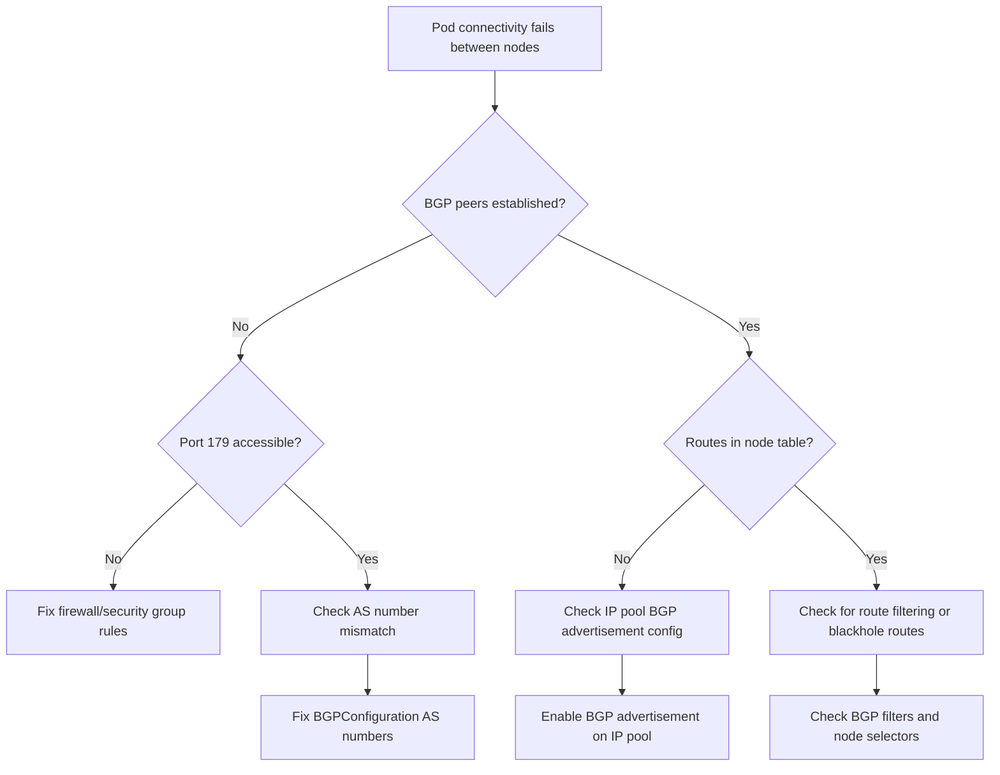

# Diagnosing Route Advertisement Problems in Calico BGP

Author: [nawazdhandala](https://github.com/nawazdhandala)

Tags: Calico, Kubernetes, BGP

Description: Learn systematic approaches to diagnose BGP route advertisement failures in Calico, including BIRD status checks, BGP peering verification, and route table analysis.

---

## Introduction

Calico uses the Border Gateway Protocol (BGP) to distribute routing information across your Kubernetes cluster. When BGP route advertisements fail, pods on different nodes cannot communicate because the routes to their IP ranges are not propagated to the network fabric.

Route advertisement problems typically manifest as intermittent connectivity failures between pods on different nodes, while pods on the same node can communicate fine. The underlying cause is usually a BGP peering failure, route reflector misconfiguration, or network infrastructure blocking BGP traffic on port 179.

This guide provides a systematic diagnostic approach to identify the exact cause of BGP route advertisement failures in your Calico deployment.

## Prerequisites

- A Kubernetes cluster with Calico configured in BGP mode
- `kubectl` with cluster-admin access
- `calicoctl` CLI tool installed
- Access to network infrastructure (routers/switches) if using external BGP peers
- Basic understanding of BGP concepts (peering, AS numbers, route advertisements)

## Checking BGP Peering Status

Start by verifying the BGP peering state across all nodes:

```bash
# Check BGP peer status using calicoctl
# This shows the state of all BGP sessions from each node
calicoctl node status

# Expected output for healthy peering:
# Calico process is running.
# IPv4 BGP status
# +--------------+-------------------+-------+----------+-------------+
# | PEER ADDRESS |     PEER TYPE     | STATE |  SINCE   |    INFO     |
# +--------------+-------------------+-------+----------+-------------+
# | 10.0.1.2     | node-to-node mesh | up    | 09:15:30 | Established |
# | 10.0.1.3     | node-to-node mesh | up    | 09:15:31 | Established |
# +--------------+-------------------+-------+----------+-------------+

# If calicoctl is not available, check via the calico-node pod
kubectl exec -n calico-system $(kubectl get pod -n calico-system \
  -l k8s-app=calico-node -o jsonpath='{.items[0].metadata.name}') -- \
  calico-node -bird-ready

# Check BIRD routing daemon status directly
kubectl exec -n calico-system $(kubectl get pod -n calico-system \
  -l k8s-app=calico-node -o jsonpath='{.items[0].metadata.name}') -- \
  birdcl show protocols all
```

## Examining BGP Configuration Resources

Review the Calico BGP configuration to identify misconfigurations:

```yaml
# Check the BGPConfiguration resource
# Run: kubectl get bgpconfigurations.crd.projectcalico.org default -o yaml
# Expected healthy configuration:
apiVersion: projectcalico.org/v3
kind: BGPConfiguration
metadata:
  name: default
spec:
  logSeverityScreen: Info
  # nodeToNodeMeshEnabled should be true unless using route reflectors
  nodeToNodeMeshEnabled: true
  # asNumber should be consistent across the cluster
  asNumber: 64512
```

```bash
# List all BGP peers configured in the cluster
kubectl get bgppeers.crd.projectcalico.org -o yaml

# Check for BGP filters that may block route advertisements
kubectl get bgpfilters.crd.projectcalico.org -o yaml 2>/dev/null

# Verify IP pools are configured for BGP advertisement
kubectl get ippools.crd.projectcalico.org -o yaml | grep -A2 "natOutgoing\|ipipMode\|vxlanMode"
```

## Analyzing Route Tables on Nodes

Check whether routes are actually present in the node routing tables:

```bash
# Check routes on a specific node
# Replace NODE_NAME with the affected node
kubectl debug node/NODE_NAME -it --image=nicolaka/netshoot -- ip route show

# Look specifically for Calico routes (they use the bird/calico protocol)
kubectl debug node/NODE_NAME -it --image=nicolaka/netshoot -- \
  ip route show proto bird

# Compare routes across two nodes to find missing routes
echo "=== Node 1 routes ==="
kubectl debug node/NODE1 -it --image=nicolaka/netshoot -- ip route show proto bird
echo "=== Node 2 routes ==="
kubectl debug node/NODE2 -it --image=nicolaka/netshoot -- ip route show proto bird
```

## Checking for Network-Level BGP Blocks

BGP uses TCP port 179. Verify this port is accessible between nodes:

```bash
# Test BGP port connectivity between nodes
# From node1, try to reach node2 on port 179
kubectl debug node/NODE1 -it --image=nicolaka/netshoot -- \
  nc -zv NODE2_IP 179 -w 5

# Check if there are firewall rules blocking BGP
kubectl debug node/NODE1 -it --image=nicolaka/netshoot -- \
  iptables -L -n | grep 179

# Check cloud provider security groups / firewall rules
# For AWS: check Security Group allows TCP 179 between nodes
# For GCP: check VPC firewall rules allow TCP 179
# For Azure: check NSG rules allow TCP 179
```



## Verification

After identifying the issue, verify routes are being advertised correctly:

```bash
# Verify BGP sessions are established
calicoctl node status

# Check that routes exist for all node pod CIDRs
kubectl get nodes -o jsonpath='{range .items[*]}{.metadata.name}{": "}{.spec.podCIDR}{"\n"}{end}'

# Verify each node has routes to other nodes' pod CIDRs
for NODE in $(kubectl get nodes -o jsonpath='{.items[*].metadata.name}'); do
  echo "=== Routes on $NODE ==="
  kubectl debug node/$NODE -it --image=nicolaka/netshoot -- ip route show proto bird 2>/dev/null
done

# Test pod-to-pod connectivity across nodes
kubectl run diag-server --image=nginx --restart=Never
kubectl run diag-client --image=busybox --restart=Never -- sleep 300
kubectl wait --for=condition=Ready pod/diag-server pod/diag-client --timeout=60s
SERVER_IP=$(kubectl get pod diag-server -o jsonpath='{.status.podIP}')
kubectl exec diag-client -- wget -qO- --timeout=5 http://$SERVER_IP
kubectl delete pod diag-server diag-client
```

## Troubleshooting

- **BGP state shows "Connect" or "Active" instead of "Established"**: The remote peer is not responding. Check that calico-node is running on the remote node, port 179 is open, and AS numbers match.
- **BGP state shows "OpenSent"**: The TCP connection was established but BGP negotiation failed. This usually indicates an AS number mismatch between peers.
- **Routes exist but traffic still fails**: Check if IPIP or VXLAN encapsulation is required. If nodes are on different subnets, set `ipipMode: CrossSubnet` or `vxlanMode: CrossSubnet` on the IP pool.
- **Only some nodes missing routes**: Check if the affected node has a BGP filter applied via node selectors in BGPPeer resources that excludes it.

## Conclusion

Diagnosing BGP route advertisement problems in Calico follows a systematic path: verify BGP peering state, check configuration resources for mismatches, analyze node route tables, and test network-level connectivity on port 179. The BIRD routing daemon status and calicoctl node status commands are your primary diagnostic tools. Most issues trace back to either firewall rules blocking port 179, AS number misconfigurations, or IP pools not configured for BGP advertisement.
