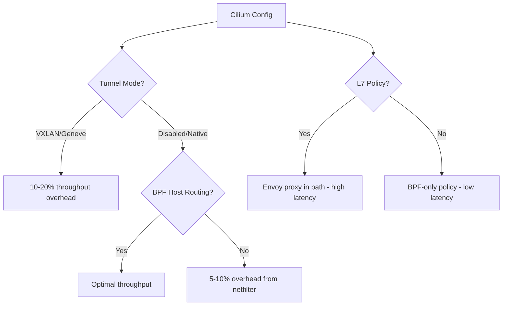

# Diagnosing Test Configuration Issues in Cilium Performance

Author: [nawazdhandala](https://github.com/nawazdhandala)

Tags: Cilium, Kubernetes, Performance, Configuration, Benchmarking

Description: How to diagnose Cilium configuration issues that affect performance test results, including datapath mode, BPF settings, and feature flag analysis.

---

## Introduction

Cilium's performance characteristics vary dramatically based on its configuration. The difference between tunneling mode and native routing, between legacy host routing and BPF host routing, or between L3/L4 policy and L7 policy can be 2-5x in throughput and latency benchmarks.

Diagnosing configuration-related performance issues requires understanding which features are enabled, how they interact, and what overhead each adds. A single misconfigured option can negate all other tuning efforts.

This guide covers the systematic analysis of Cilium configuration for performance testing.

## Prerequisites

- Kubernetes cluster (v1.24+) with Cilium v1.14+
- `cilium` CLI, `cilium-dbg` access inside the Cilium agent pod, and `kubectl` access
- Node-level root access
- Prometheus monitoring (recommended)

## Configuration Audit

```bash
# Dump complete Cilium configuration

kubectl -n kube-system get configmap cilium-config -o yaml > /tmp/cilium-config.txt

# Check critical performance settings
kubectl -n kube-system get configmap cilium-config -o yaml | \
  grep -E "routing-mode|tunnel-protocol|bpf-host-legacy-routing|kube-proxy-replacement|loadbalancer-acceleration"

# Verify datapath mode
kubectl -n kube-system exec ds/cilium -c cilium-agent -- \
  cilium-dbg status --verbose | grep -E "Host Routing|KubeProxyReplacement|XDP"
```

## Feature Impact Matrix



## Comparing Configurations

```bash
# Test with current config
echo "=== Current Config ==="
kubectl -n kube-system get configmap cilium-config -o yaml | grep -E "tunnel|routing|bpf"
kubectl exec iperf-client -- iperf3 -c $SERVER_IP -t 20 -P 1 -J | \
  jq '.end.sum_sent.bits_per_second / 1000000000'

# Example direct-routing config; requires an underlay that routes PodCIDRs
helm upgrade cilium cilium/cilium --namespace kube-system \
  --set routingMode=native \
  --set bpf.masquerade=true \
  --set bpf.hostLegacyRouting=false \
  --set kubeProxyReplacement=true
kubectl rollout status ds/cilium -n kube-system

echo "=== Optimized Config ==="
kubectl exec iperf-client -- iperf3 -c $SERVER_IP -t 20 -P 1 -J | \
  jq '.end.sum_sent.bits_per_second / 1000000000'
```

## Verification

```bash
# Run the validation checks above
# Cilium and its managed components should report OK
cilium status --verbose
```

## Troubleshooting

- **Validation fails on specific nodes**: Check if nodes were provisioned from different images.
- **Kernel module load fails**: Verify the module is available for your kernel version.
- **Cilium status unhealthy**: Check agent logs with `kubectl logs -n kube-system ds/cilium`.
- **Tools missing in containers**: Use an image that includes the required tools or mount from host.

## Collecting Diagnostic Data Systematically

Before making any changes, collect a complete diagnostic snapshot. This ensures you have a baseline to compare against and can reproduce the issue:

```bash
# Create a diagnostic data directory
DIAG_DIR="/tmp/cilium-diag-$(date +%Y%m%d-%H%M%S)"
mkdir -p $DIAG_DIR

# Collect Cilium status
kubectl -n kube-system exec ds/cilium -c cilium-agent -- \
  cilium-dbg status --verbose > $DIAG_DIR/cilium-status.txt

# Collect Cilium configuration
kubectl -n kube-system get configmap cilium-config -o yaml > $DIAG_DIR/cilium-config.txt

# Collect BPF map information
kubectl -n kube-system exec ds/cilium -c cilium-agent -- \
  cilium-dbg bpf ct list > $DIAG_DIR/ct-entries.txt 2>&1
kubectl -n kube-system exec ds/cilium -c cilium-agent -- \
  cilium-dbg bpf nat list > $DIAG_DIR/nat-entries.txt 2>&1

# Collect endpoint information
kubectl -n kube-system exec ds/cilium -c cilium-agent -- \
  cilium-dbg endpoint list -o json > $DIAG_DIR/endpoints.json

# Collect node information
kubectl get nodes -o wide > $DIAG_DIR/nodes.txt
kubectl describe nodes > $DIAG_DIR/node-details.txt

# Collect Cilium agent logs
kubectl logs -n kube-system ds/cilium --tail=500 > $DIAG_DIR/cilium-logs.txt

# Archive everything
tar czf $DIAG_DIR.tar.gz $DIAG_DIR
echo "Diagnostic data saved to $DIAG_DIR.tar.gz"
```

Keep this diagnostic snapshot for comparison after applying fixes. The data is also useful if you need to escalate to Cilium support or open a GitHub issue.

### Understanding the Diagnostic Output

When reviewing the diagnostic data, focus on these key indicators:

1. **Cilium status**: Look for any components showing errors or degraded state
2. **BPF map utilization**: Compare current entries against maximum capacity
3. **Endpoint health**: Check for endpoints in "not-ready" or "disconnected" state
4. **Agent logs**: Search for ERROR and WARNING messages, especially related to BPF programs or policy computation

The combination of these data points will point you toward the specific subsystem causing the performance issue.

## Advanced Diagnostic Techniques

### Using Cilium Monitor for Real-Time Analysis

The `cilium-dbg monitor` command provides real-time visibility into the eBPF datapath:

```bash
# Monitor all traffic for a specific endpoint
ENDPOINT_ID=$(kubectl -n kube-system exec ds/cilium -c cilium-agent -- \
  cilium-dbg endpoint list -o json | jq '.[0].id')
kubectl -n kube-system exec ds/cilium -c cilium-agent -- \
  cilium-dbg monitor --related-to $ENDPOINT_ID --type trace

# Monitor drops with verbose output
kubectl -n kube-system exec ds/cilium -c cilium-agent -- \
  cilium-dbg monitor --type drop -v

# Monitor policy verdicts
kubectl -n kube-system exec ds/cilium -c cilium-agent -- \
  cilium-dbg monitor --type policy-verdict

# Filter by specific protocol
kubectl -n kube-system exec ds/cilium -c cilium-agent -- \
  cilium-dbg monitor --type trace -v | grep TCP
```

### Using Hubble for Historical Analysis

Hubble provides historical flow data that helps identify patterns:

```bash
# Start Hubble relay port-forward
cilium hubble port-forward &

# Query recent flows with filters
hubble observe --protocol TCP --last 500 -o json | \
  jq 'select(.flow.verdict == "DROPPED") | {src: .flow.source.pod_name, dst: .flow.destination.pod_name, reason: .flow.drop_reason_desc}'

# Get flow statistics by source and destination
hubble observe --last 1000 -o json | \
  jq -r '\(.flow.source.namespace)/\(.flow.source.pod_name) -> \(.flow.destination.namespace)/\(.flow.destination.pod_name): \(.flow.verdict)' | \
  sort | uniq -c | sort -rn | head -20
```

### Kernel Tracing with BPF

For deep datapath analysis, use BPF tracing tools:

```bash
# Trace BPF program execution time
bpftool prog show --json | jq '.[] | select(.name | contains("cil")) | {name, run_cnt, run_time_ns, avg_ns: (if .run_cnt > 0 then (.run_time_ns / .run_cnt | floor) else 0 end)}'

# Use bpftrace for custom tracing
bpftrace -e 'tracepoint:xdp:xdp_redirect { @cnt[probe] = count(); }'
```

These diagnostic tools form a comprehensive toolkit for understanding exactly what happens to packets as they traverse Cilium's eBPF datapath.

## Conclusion

Properly diagnosing test configuration issues in Cilium performance is essential for reliable Cilium performance testing. Each component plays a role in the accuracy and reproducibility of benchmark results.
