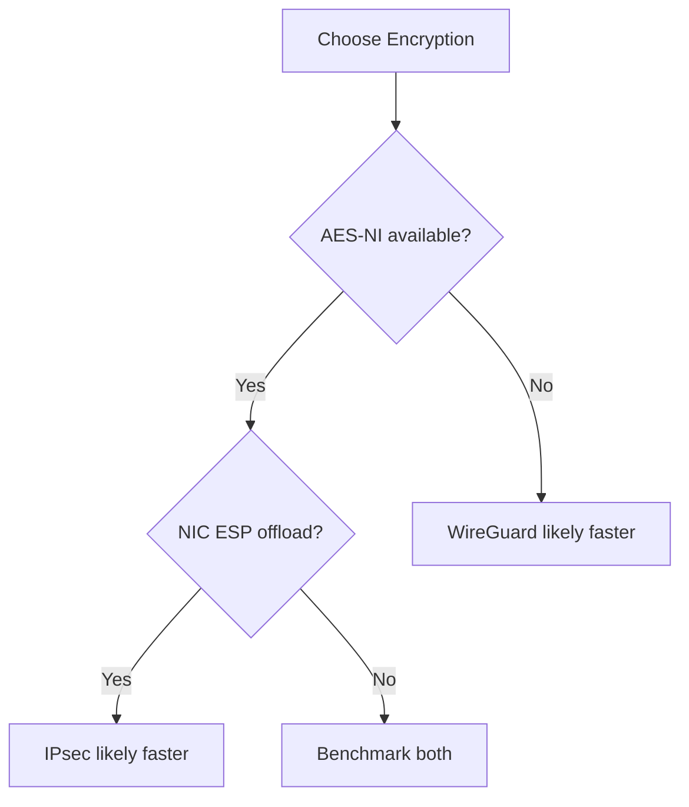

# Diagnosing WireGuard vs IPsec Performance Differences in Cilium

Author: [nawazdhandala](https://github.com/nawazdhandala)

Tags: Cilium, Kubernetes, WireGuard, IPsec, Encryption, Performance

Description: How to diagnose performance differences between WireGuard and IPsec encryption in Cilium and identify which protocol is optimal for your workload.

---

## Introduction

Cilium supports both WireGuard and IPsec for transparent encryption. WireGuard uses ChaCha20-Poly1305 and operates at the network layer, while IPsec uses AES-GCM with hardware acceleration and operates with ESP tunnels. The performance characteristics differ significantly depending on hardware capabilities and workload patterns.

Diagnosing which encryption protocol performs better for your specific environment requires systematic benchmarking across multiple dimensions: throughput, latency (TCP_RR), connection rate (TCP_CRR), and CPU overhead. The winner depends on whether your hardware supports AES-NI (which benefits IPsec) or if you are CPU-bound (where WireGuard's simpler code path helps).

This guide walks through the diagnostic process to determine which encryption protocol is optimal for your Cilium cluster.

## Prerequisites

- Kubernetes cluster with Cilium v1.14+
- Linux kernel 5.6+ for native WireGuard
- Hardware with AES-NI support (for IPsec comparison)
- `iperf3` and `netperf` for benchmarking
- `cilium` CLI and `helm`

## Benchmark Methodology

Test both protocols under identical conditions:

```bash
# Test 1: WireGuard
helm upgrade cilium cilium/cilium --namespace kube-system \
  --set encryption.enabled=true \
  --set encryption.type=wireguard
kubectl rollout status ds/cilium -n kube-system
sleep 30

echo "=== WireGuard Results ==="
kubectl exec iperf-client -- iperf3 -c $SERVER_IP -t 30 -P 1 -J | \
  jq '.end.sum_sent.bits_per_second / 1000000000'
kubectl exec netperf-client -- netperf -H $SERVER_IP -t TCP_RR -l 20
kubectl exec netperf-client -- netperf -H $SERVER_IP -t TCP_CRR -l 20

# Test 2: IPsec
helm upgrade cilium cilium/cilium --namespace kube-system \
  --set encryption.enabled=true \
  --set encryption.type=ipsec \
  --set encryption.ipsec.keyFile=/etc/ipsec/keys
kubectl rollout status ds/cilium -n kube-system
sleep 30

echo "=== IPsec Results ==="
kubectl exec iperf-client -- iperf3 -c $SERVER_IP -t 30 -P 1 -J | \
  jq '.end.sum_sent.bits_per_second / 1000000000'
kubectl exec netperf-client -- netperf -H $SERVER_IP -t TCP_RR -l 20
kubectl exec netperf-client -- netperf -H $SERVER_IP -t TCP_CRR -l 20
```

## CPU Overhead Comparison

```bash
# During each test, measure CPU usage
mpstat -P ALL 1 10

# Profile crypto functions
perf record -g -a -- sleep 10
perf report --stdio | grep -E "chacha|poly|aes|gcm|ipsec|esp|wireguard" | head -20
```

## Hardware Capability Check

```bash
# Check for AES-NI (benefits IPsec)
grep -c aes /proc/cpuinfo

# Check for AVX/SSSE3 (benefits WireGuard ChaCha20)
grep -c -E "avx|ssse3" /proc/cpuinfo

# Check for crypto hardware offload on NIC
ethtool -k eth0 | grep -i offload | grep -i esp
```



## Verification

```bash
# Compare results side by side
echo "Metric      | WireGuard | IPsec"
echo "Throughput  | X Gbps    | Y Gbps"
echo "TCP_RR      | X trans/s | Y trans/s"
echo "TCP_CRR     | X conn/s  | Y conn/s"
echo "CPU Usage   | X%        | Y%"
```

## Troubleshooting

- **IPsec much faster than WireGuard**: Your hardware has strong AES-NI. Use IPsec.
- **WireGuard much faster than IPsec**: Your CPU lacks AES-NI or IPsec xfrm path is inefficient. Use WireGuard.
- **Similar performance**: Default to WireGuard for simpler configuration and key management.
- **Both slower than expected**: Check for software crypto fallback or MTU issues in both cases.

## Collecting Diagnostic Data Systematically

Before making any changes, collect a complete diagnostic snapshot. This ensures you have a baseline to compare against and can reproduce the issue:

```bash
# Create a diagnostic data directory
DIAG_DIR="/tmp/cilium-diag-$(date +%Y%m%d-%H%M%S)"
mkdir -p $DIAG_DIR

# Collect Cilium status
cilium status --verbose > $DIAG_DIR/cilium-status.txt

# Collect Cilium configuration
cilium config view > $DIAG_DIR/cilium-config.txt

# Collect BPF map information
cilium bpf ct list global > $DIAG_DIR/ct-entries.txt 2>&1
cilium bpf nat list > $DIAG_DIR/nat-entries.txt 2>&1

# Collect endpoint information
cilium endpoint list -o json > $DIAG_DIR/endpoints.json

# Collect node information
kubectl get nodes -o wide > $DIAG_DIR/nodes.txt
kubectl describe nodes > $DIAG_DIR/node-details.txt

# Collect Cilium agent logs
kubectl logs -n kube-system ds/cilium --tail=500 > $DIAG_DIR/cilium-logs.txt

# Archive everything
tar czf $DIAG_DIR.tar.gz $DIAG_DIR
echo "Diagnostic data saved to $DIAG_DIR.tar.gz"
```

Keep this diagnostic snapshot for comparison after applying fixes. The data is also useful if you need to escalate to Cilium support or open a GitHub issue.

### Understanding the Diagnostic Output

When reviewing the diagnostic data, focus on these key indicators:

1. **Cilium status**: Look for any components showing errors or degraded state
2. **BPF map utilization**: Compare current entries against maximum capacity
3. **Endpoint health**: Check for endpoints in "not-ready" or "disconnected" state
4. **Agent logs**: Search for ERROR and WARNING messages, especially related to BPF programs or policy computation

The combination of these data points will point you toward the specific subsystem causing the performance issue.

## Conclusion

Diagnosing WireGuard vs IPsec performance in Cilium requires systematic benchmarking across throughput, latency, and connection rate dimensions. The result depends heavily on hardware capabilities: AES-NI and NIC ESP offload favor IPsec, while CPUs without hardware crypto support favor WireGuard's efficient ChaCha20 implementation. Run the full benchmark suite to make an informed decision for your specific hardware.
