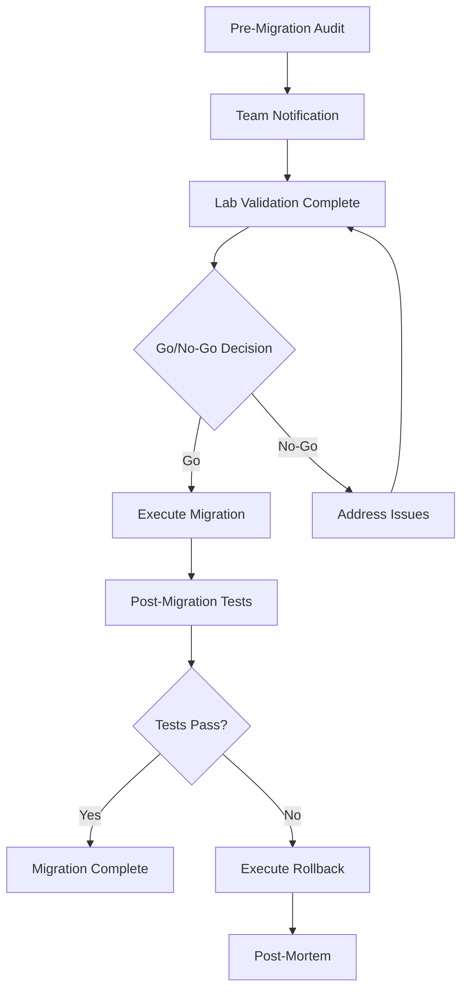

# How to Document Migration from OVN to Calico on OpenShift for Your Team

Author: [nawazdhandala](https://github.com/nawazdhandala)

Tags: Calico, OpenShift, OVN, Documentation, Migration

Description: A guide to creating comprehensive internal documentation for your OVN-to-Calico migration on OpenShift, including runbooks, decision records, and knowledge transfer materials.

---

## Introduction

Documentation is the most overlooked part of a CNI migration. When you migrate from OVN-Kubernetes to Calico on OpenShift, the networking model changes for every team that deploys workloads on the cluster. Without clear documentation, teams will struggle with policy authoring, troubleshooting, and understanding the new networking behavior.

This guide helps you create practical internal documentation that covers the migration rationale, the technical changes, operational runbooks, and knowledge transfer materials. Good migration documentation serves three audiences: decision-makers who need to understand why, operators who need to know how, and developers who need to adapt their workloads.

The documentation artifacts described here are templates you should customize for your organization. Focus on the specific details that matter to your team rather than generic Calico documentation that is already available upstream.

## Prerequisites

- Completed or planned OVN-to-Calico migration with known configuration details
- Access to your organization's documentation platform (wiki, Git repo, Confluence)
- List of teams affected by the migration
- Architecture diagrams of current cluster networking
- Test results from lab migration testing

## Creating an Architecture Decision Record

Start with an Architecture Decision Record (ADR) that captures why the migration is happening. This document is for stakeholders and future team members.

```markdown
# ADR-042: Migrate OpenShift CNI from OVN-Kubernetes to Calico

## Status
Accepted

## Context
Our OpenShift 4.x clusters use OVN-Kubernetes as the default CNI.
We need advanced network policy features including:
- Global network policies across namespaces
- DNS-based egress policies
- Network flow logging for compliance

## Decision
Migrate to Calico as the cluster CNI plugin.

## Consequences
- All teams must review their NetworkPolicy resources for compatibility
- EgressFirewall resources will be replaced with Calico GlobalNetworkPolicy
- Network troubleshooting procedures change (new CLI tools, log locations)
- Training sessions required for platform and application teams
```

## Writing the Migration Runbook

The runbook is the most critical document. It should be executable by any qualified operator without additional context.

```yaml
# pre-migration-audit-policy.yaml
# Apply this during the audit phase to log traffic patterns
apiVersion: projectcalico.org/v3
kind: GlobalNetworkPolicy
metadata:
  name: pre-migration-audit-policy
  annotations:
    # Document the purpose of each policy
    docs.example.com/migration-step: "pre-migration-audit"
    docs.example.com/rollback-action: "delete this policy"
spec:
  # Log all traffic during migration window for audit
  types:
    - Ingress
    - Egress
  ingress:
    - action: Log
  egress:
    - action: Log
```

Structure your runbook with clear phases:

```bash
#!/bin/bash
# migration-runbook-checklist.sh
# This script validates each migration phase prerequisite

echo "=== Phase 1: Pre-Migration Checks ==="
echo "[ ] Backup all NetworkPolicy resources"
echo "[ ] Backup all EgressFirewall resources"
echo "[ ] Document current pod CIDR"
echo "[ ] Document current service CIDR"
echo "[ ] Notify all application teams of maintenance window"
echo "[ ] Verify lab migration test results are approved"

echo ""
echo "=== Phase 2: Migration Execution ==="
echo "[ ] Install Tigera Operator"
echo "[ ] Apply Calico Installation CR"
echo "[ ] Monitor calico-system pod rollout"
echo "[ ] Verify all nodes report Ready status"

echo ""
echo "=== Phase 3: Post-Migration Validation ==="
echo "[ ] Run connectivity test suite"
echo "[ ] Verify all network policies are enforced"
echo "[ ] Check application health endpoints"
echo "[ ] Monitor error rates for 30 minutes"

echo ""
echo "=== Phase 4: Rollback Criteria ==="
echo "[ ] >5% of pods in CrashLoopBackOff triggers rollback"
echo "[ ] Any critical service unreachable triggers rollback"
echo "[ ] Network policy enforcement gaps detected triggers rollback"
```



## Building a Network Policy Translation Guide

Create a reference document that maps OVN-specific resources to their Calico equivalents. This is the document developers will use most frequently.

| OVN EgressFirewall Field | Calico Equivalent |
|--------------------------|-------------------|
| spec.egress[].type: Allow | spec.egress[].action: Allow |
| spec.egress[].type: Deny | spec.egress[].action: Deny |
| spec.egress[].to.cidrSelector | spec.egress[].destination.nets |
| spec.egress[].to.dnsName | spec.egress[].destination.domains |
| (applied per namespace) | spec.namespaceSelector |

Key differences to document:

1. Calico policies have explicit ordering via the `order` field
2. Calico supports both `Allow` and `Pass` actions
3. Calico GlobalNetworkPolicy applies cluster-wide by default
4. Calico supports selector-based policy application

## Creating Troubleshooting Documentation

Document the new troubleshooting procedures that operators need after migration:

```bash
# Common Calico troubleshooting commands
# Document these in your operations wiki

# Check Calico node status across all nodes
oc get pods -n calico-system -l k8s-app=calico-node -o wide

# View Felix logs for policy programming issues
oc logs -n calico-system -l k8s-app=calico-node -c calico-node --tail=100

# Check BGP peering status (if using BGP)
oc exec -n calico-system $(oc get pod -n calico-system -l k8s-app=calico-node -o name | head -1) -c calico-node -- birdcl show protocols

# Verify endpoint status for a specific pod
oc get workloadendpoints.projectcalico.org --all-namespaces

# Check IP pool utilization
oc get ipamblocks.crd.projectcalico.org -o wide
```

## Verification

Validate your documentation by having a team member who was not involved in the migration follow the runbook in a lab environment:

```bash
# Documentation verification checklist
# Have a peer reviewer execute each step independently

# Verify: Can the runbook be followed without additional context?
# Verify: Are all commands copy-pasteable and correct?
# Verify: Are rollback steps clear and tested?
# Verify: Is the policy translation guide accurate?
# Verify: All referenced documents exist and are accessible
# Verify: All team members have been added to the documentation space
```

## Troubleshooting

- **Documentation becomes stale**: Assign an owner for each document and schedule quarterly reviews. Link documents to the relevant Calico version.
- **Teams not reading documentation**: Hold a migration walkthrough session and record it. Create a short one-page quick-start guide alongside the detailed runbook.
- **Runbook steps fail in production**: Always test runbook steps in the lab first. Include expected output for each command so operators can verify they are on track.
- **Translation guide missing edge cases**: Keep a living document and add entries as teams report issues. Create a shared channel for migration questions.

## Conclusion

Comprehensive migration documentation turns a one-time migration event into reusable organizational knowledge. By creating an ADR, a detailed runbook, a policy translation guide, and troubleshooting procedures, you ensure that your team can operate the new Calico-based networking stack confidently. Invest the time in documentation now to avoid repeated questions and incidents after the migration is complete.
