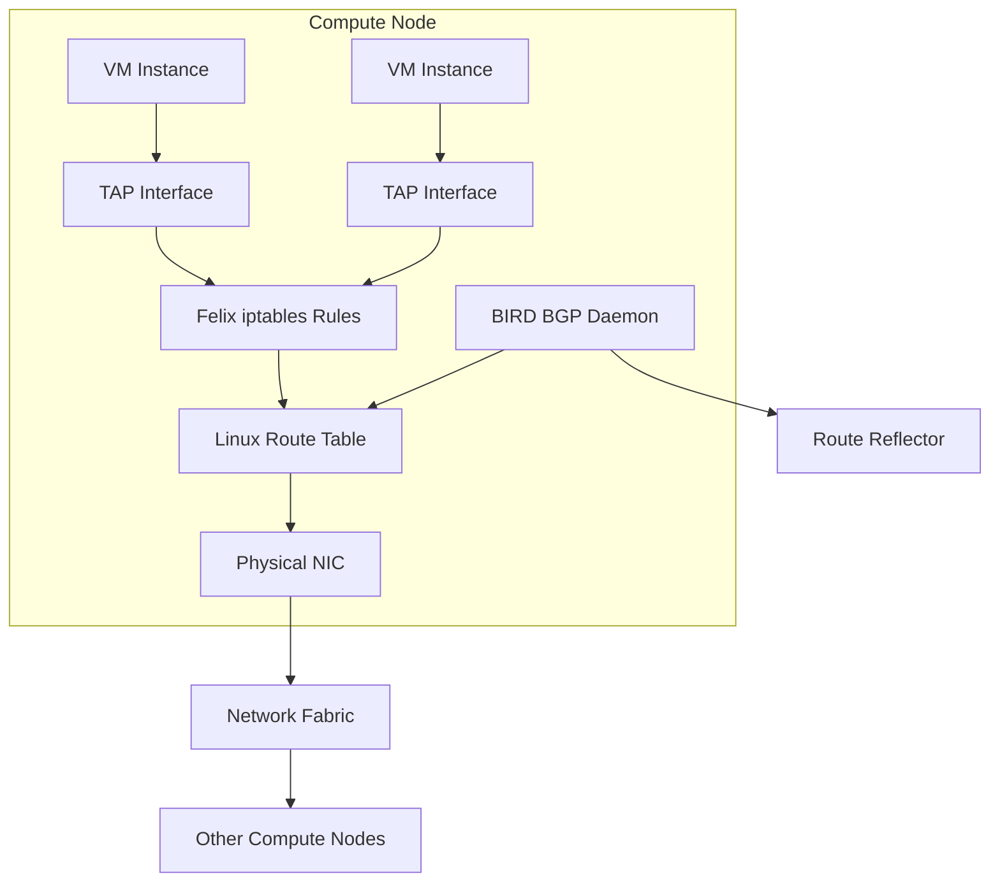

# How to Document OpenStack Connectivity with Calico for Operations Teams

Author: [nawazdhandala](https://github.com/nawazdhandala)

Tags: OpenStack, Calico, Documentation, Operations, Networking

Description: A guide to creating effective operational documentation for OpenStack networking with Calico, including architecture diagrams, troubleshooting runbooks, and on-call reference materials.

---

## Introduction

Operational documentation for OpenStack networking with Calico is essential because Calico fundamentally changes the networking model that most OpenStack operators are familiar with. Instead of OVS bridges and overlay networks, Calico uses direct Layer 3 routing with iptables or eBPF for security enforcement. Operations teams need documentation that explains this architecture and provides actionable troubleshooting procedures.

This guide helps you create documentation that covers the architecture, common operational procedures, troubleshooting guides, and on-call reference cards. The goal is to enable any qualified operator to understand and troubleshoot the networking layer without requiring deep Calico expertise.

Good operational documentation reduces mean time to resolution (MTTR) during incidents and prevents knowledge from being concentrated in a single team member.

## Prerequisites

- An operational OpenStack deployment with Calico networking
- Understanding of your deployment's specific Calico configuration
- Access to your organization's documentation platform
- Input from the team that designed and deployed the Calico integration
- Network architecture diagrams of your OpenStack environment

## Documenting the Architecture

Create a clear architecture document that explains how Calico replaces traditional OpenStack networking.



Document the key architectural differences from traditional OpenStack networking:

```markdown
# Calico OpenStack Architecture

## How Traffic Flows

### VM-to-VM on Same Compute Node
1. Traffic exits source VM via TAP interface
2. Felix iptables rules apply security group policies
3. Linux kernel routes packet to destination TAP interface
4. No OVS bridge or overlay involved

### VM-to-VM on Different Compute Nodes
1. Traffic exits source VM via TAP interface
2. Felix iptables rules apply security group policies
3. Linux route table forwards to destination compute node
4. Routing uses BGP-learned routes (via BIRD daemon)
5. Destination compute node applies ingress security rules
6. Packet delivered to destination VM TAP interface

### VM-to-External
1. Traffic exits VM via TAP interface
2. Felix iptables rules apply egress security policies
3. NAT applied (if configured in IP pool)
4. Packet routed to external gateway via fabric
```

## Creating Operational Runbooks

Write runbooks for common operational tasks.

```bash
#!/bin/bash
# runbook-check-calico-health.sh
# Operational runbook: Check Calico health on all compute nodes

echo "=== Calico Health Check Runbook ==="
echo "Date: $(date)"
echo ""

# Step 1: Check Felix status on all compute nodes
echo "--- Step 1: Felix Status ---"
for node in $(openstack compute service list -f value -c Host | sort -u); do
  status=$(ssh ${node} 'sudo calicoctl node status 2>/dev/null | head -3')
  echo "Node: ${node}"
  echo "${status}"
  echo ""
done

# Step 2: Check BGP session health
echo "--- Step 2: BGP Sessions ---"
for node in $(openstack compute service list -f value -c Host | sort -u); do
  sessions=$(ssh ${node} 'sudo calicoctl node status 2>/dev/null | grep -c Established')
  total=$(ssh ${node} 'sudo calicoctl node status 2>/dev/null | grep -c "BGP"' )
  echo "${node}: ${sessions}/${total} BGP sessions established"
done

# Step 3: Check for workload endpoint errors
echo ""
echo "--- Step 3: Workload Endpoints ---"
total=$(calicoctl get workloadendpoints --all-namespaces 2>/dev/null | wc -l)
echo "Total workload endpoints: ${total}"
```

## Troubleshooting Guide

Document specific troubleshooting procedures for common issues.

```bash
# Troubleshooting: VM cannot reach another VM on the same network
# This runbook guides through diagnosing intra-network connectivity issues

echo "=== Troubleshoot: Same-Network VM Connectivity ==="

# Step 1: Verify both VMs are active
echo "Step 1: Check VM status"
openstack server show SOURCE_VM_ID -c status
openstack server show DEST_VM_ID -c status

# Step 2: Check which compute nodes host the VMs
echo ""
echo "Step 2: Check VM placement"
openstack server show SOURCE_VM_ID -c OS-EXT-SRV-ATTR:host
openstack server show DEST_VM_ID -c OS-EXT-SRV-ATTR:host

# Step 3: Verify Felix is running on both compute nodes
echo ""
echo "Step 3: Check Felix on source compute node"
ssh SOURCE_COMPUTE "sudo calicoctl node status"

# Step 4: Check routes on the source compute node
echo ""
echo "Step 4: Check routes to destination VM IP"
ssh SOURCE_COMPUTE "ip route get DEST_VM_IP"

# Step 5: Check security group rules via iptables
echo ""
echo "Step 5: Check iptables rules for source VM"
ssh SOURCE_COMPUTE "sudo iptables-save | grep SOURCE_VM_TAP"

# Step 6: Check Felix logs for errors
echo ""
echo "Step 6: Check Felix logs"
ssh SOURCE_COMPUTE "sudo journalctl -u calico-felix --since '10 minutes ago' | tail -20"
```

## On-Call Reference Card

Create a quick-reference card for on-call operators.

```markdown
# Calico OpenStack On-Call Reference

## Key Commands

| Task | Command |
|------|---------|
| Check node status | `sudo calicoctl node status` |
| List all endpoints | `calicoctl get workloadendpoints -o wide` |
| Check Felix logs | `sudo journalctl -u calico-felix -f` |
| Check BIRD logs | `sudo journalctl -u calico-bird -f` |
| List IP pools | `calicoctl get ippools -o wide` |
| Check route table | `ip route show` |
| Check iptables rules | `sudo iptables-save | grep cali` |

## Key File Locations

| File | Purpose |
|------|---------|
| /etc/calico/felix.cfg | Felix configuration |
| /etc/cni/net.d/10-calico.conflist | CNI configuration |
| /opt/cni/bin/calico | CNI plugin binary |
| /var/log/calico/felix.log | Felix logs (if file logging enabled) |

## Escalation Contacts

| Severity | Contact | Response Time |
|----------|---------|---------------|
| P1 - Total connectivity loss | Platform Team Lead | 15 minutes |
| P2 - Partial connectivity | Platform Team | 30 minutes |
| P3 - Single VM issue | Compute Team | 2 hours |
```

## Verification

Validate your documentation with a peer review:

```bash
# Documentation verification checklist
echo "=== Documentation Review Checklist ==="
echo "[ ] Architecture diagrams match current deployment"
echo "[ ] All commands in runbooks are tested and correct"
echo "[ ] Troubleshooting guides cover the top 5 incident types"
echo "[ ] On-call reference card is printed and available"
echo "[ ] All team members have access to documentation"
echo "[ ] Documentation version matches Calico version deployed"
```

## Troubleshooting

- **Documentation does not match actual deployment**: Audit the deployed Calico configuration with `calicoctl get` commands and update documentation accordingly.
- **Runbooks reference wrong file paths**: Different Calico installation methods place files in different locations. Verify paths on your specific compute nodes.
- **Team members find documentation unhelpful**: Conduct a post-incident review and identify which documentation gaps contributed to longer resolution times. Update accordingly.
- **Documentation maintenance burden too high**: Automate parts of the documentation by generating architecture diagrams from live configuration. Use scripts to validate runbook commands.

## Conclusion

Well-structured operational documentation for OpenStack with Calico reduces incident response time and distributes networking knowledge across your team. By documenting the architecture, creating operational runbooks, and maintaining an on-call reference card, you ensure that any operator can effectively manage and troubleshoot the Calico networking layer. Review and update documentation after every Calico upgrade or significant topology change.
