# How to Document OpenStack Host Routes with Calico for Operations Teams

Author: [nawazdhandala](https://github.com/nawazdhandala)

Tags: OpenStack, Calico, Host Routes, Documentation, Operations

Description: A guide to documenting host route management in OpenStack with Calico for operations teams, covering route architecture, troubleshooting procedures, and maintenance runbooks.

---

## Introduction

Host routes are the most fundamental networking component in a Calico-based OpenStack deployment, yet they are often the least documented. When a VM cannot communicate, the first thing an operator needs to check is whether the correct routes exist on the relevant compute nodes. Without clear documentation of how routes work in Calico, troubleshooting becomes guesswork.

This guide helps you create documentation that explains the host route architecture, provides step-by-step troubleshooting procedures, and includes maintenance runbooks for common route management tasks. The documentation is aimed at operations teams who may not be BGP experts but need to diagnose and resolve routing issues.

Effective route documentation reduces the time operators spend investigating connectivity issues and prevents misguided troubleshooting that can make problems worse.

## Prerequisites

- An operational OpenStack deployment with Calico networking
- Understanding of your specific BGP topology (full mesh or route reflectors)
- Access to compute nodes for route verification
- A documentation platform accessible to all operations team members

## Documenting the Route Architecture

Start with a clear explanation of how routes flow through the system.

```mermaid
graph TD
    subgraph "Route Lifecycle"
        A[VM Created] --> B[IP Assigned from IPAM Pool]
        B --> C[Route Added to Host Kernel]
        C --> D[BIRD Advertises via BGP]
        D --> E[Route Reflector Distributes]
        E --> F[All Nodes Learn Route]
    end
    subgraph "Route Removal"
        G[VM Deleted] --> H[Felix Removes Endpoint]
        H --> I[Route Removed from Kernel]
        I --> J[BIRD Withdraws BGP Route]
        J --> K[All Nodes Remove Route]
    end
```



Document the key route types operators will see:

```bash
# Example route table entries and their meanings
# Document these for your operations team

# Local VM route - traffic to a VM on this compute node
# 10.0.0.5 dev cali1234abcd scope link
# Meaning: VM with IP 10.0.0.5 is connected via Calico interface cali1234abcd on this node

# Remote VM route via IPIP tunnel
# 10.0.1.0/26 via 192.168.1.20 dev tunl0 proto bird
# Meaning: Block of VM IPs reachable via compute node 192.168.1.20 through IPIP tunnel

# Remote VM route via VXLAN
# 10.0.2.0/26 via 192.168.1.30 dev vxlan.calico proto bird
# Meaning: Block of VM IPs reachable via compute node 192.168.1.30 through VXLAN tunnel

# Blackhole route for unused IPAM block
# blackhole 10.0.3.0/26 proto bird
# Meaning: This IPAM block is allocated to this node but no VMs are using these IPs
```

## Creating Route Troubleshooting Procedures

Write step-by-step troubleshooting guides for common route issues.

```bash
#!/bin/bash
# troubleshoot-missing-route.sh
# Troubleshoot: Route to VM IP is missing on a compute node

VM_IP="${1:?Usage: $0 <vm-ip>}"

echo "=== Troubleshooting Missing Route for ${VM_IP} ==="

# Step 1: Find which compute node hosts the VM
echo ""
echo "--- Step 1: Locate the VM ---"
VM_HOST=$(openstack server list --all-projects --ip ${VM_IP} -f value -c Host 2>/dev/null)
echo "VM is hosted on: ${VM_HOST}"

# Step 2: Check if the route exists on the hosting node
echo ""
echo "--- Step 2: Check route on hosting node ---"
ssh ${VM_HOST} "ip route show ${VM_IP}"

# Step 3: Check BGP session status on the hosting node
echo ""
echo "--- Step 3: BGP status on hosting node ---"
ssh ${VM_HOST} "sudo calicoctl node status"

# Step 4: Check if Felix has the endpoint registered
echo ""
echo "--- Step 4: Check Calico endpoint ---"
calicoctl get workloadendpoints --all-namespaces -o wide 2>/dev/null | grep ${VM_IP}

# Step 5: Check BIRD logs for route advertisement
echo ""
echo "--- Step 5: BIRD logs on hosting node ---"
ssh ${VM_HOST} "sudo journalctl -u calico-bird --since '5 minutes ago' | grep ${VM_IP}" 2>/dev/null || ssh ${VM_HOST} "sudo docker logs calico-node 2>&1 | tail -50 | grep -i bird"
```

## Maintenance Runbooks

Document procedures for common route maintenance tasks.

```bash
#!/bin/bash
# runbook-add-compute-node.sh
# Runbook: Adding a new compute node to the Calico routing mesh

echo "=== Runbook: Add Compute Node to Routing Mesh ==="
echo ""
echo "Pre-checks:"
echo "  1. Verify the new node has Calico Felix installed and running"
echo "  2. Verify BIRD is running on the new node"
echo "  3. Confirm the node's BGP AS number matches the cluster"
echo ""
echo "Steps:"
echo "  1. Check the node has registered with Calico:"
echo "     calicoctl get node NEW_NODE_NAME -o yaml"
echo ""
echo "  2. Verify BGP sessions are establishing:"
echo "     ssh NEW_NODE 'sudo calicoctl node status'"
echo ""
echo "  3. Verify routes from existing nodes are learned:"
echo "     ssh NEW_NODE 'ip route show proto bird | wc -l'"
echo ""
echo "  4. Deploy a test VM on the new node and verify connectivity"
echo ""
echo "Rollback:"
echo "  If BGP sessions do not establish within 5 minutes,"
echo "  check Felix and BIRD logs before escalating."
```

## Quick Reference Card

```markdown
# Host Route Quick Reference

## Route Diagnosis Commands

| What to Check | Command |
|----------------|---------|
| All routes | `ip route show` |
| BGP-learned routes | `ip route show proto bird` |
| Route to specific IP | `ip route get <IP>` |
| BGP peer status | `sudo calicoctl node status` |
| IPAM block allocation | `calicoctl ipam show --show-blocks` |
| Calico endpoints | `calicoctl get workloadendpoints -o wide` |

## Common Route Patterns

| Route Type | Example | Meaning |
|------------|---------|---------|
| Local VM | `10.0.0.5 dev cali1234` | VM on this node |
| Remote block | `10.0.1.0/26 via 192.168.1.20 dev tunl0` | VMs on node .20 |
| Blackhole | `blackhole 10.0.3.0/26` | Allocated but unused block |
```

## Verification

Validate documentation accuracy against the live environment.

```bash
#!/bin/bash
# verify-route-docs.sh
# Verify documentation matches actual route behavior

echo "=== Documentation Verification ==="

# Verify route types documented match reality
echo "Route types on compute-01:"
ssh compute-01 'ip route show | head -20'

echo ""
echo "BGP peer count matches documentation:"
ssh compute-01 'sudo calicoctl node status' | grep "IPv4 BGP"
```

## Troubleshooting

- **Documentation references wrong interface names**: Different encapsulation modes use different interfaces (tunl0 for IPIP, vxlan.calico for VXLAN). Update documentation to match your configuration.
- **Route troubleshooting procedures are too slow**: Create automated diagnostic scripts that run all checks at once. Package them as a single command operators can run.
- **Operations team unfamiliar with BGP concepts**: Add a glossary section explaining BGP terms (AS number, route reflector, peering, convergence) in simple language.
- **Documentation maintenance**: Generate route architecture diagrams from live `calicoctl` output rather than maintaining them manually.

## Conclusion

Documenting host routes for operations teams transforms routing from a black box into a manageable component. By explaining the route lifecycle, providing troubleshooting procedures, and creating maintenance runbooks, you enable operators to diagnose and resolve connectivity issues quickly. Keep documentation updated when BGP topology or IP pool configuration changes.
