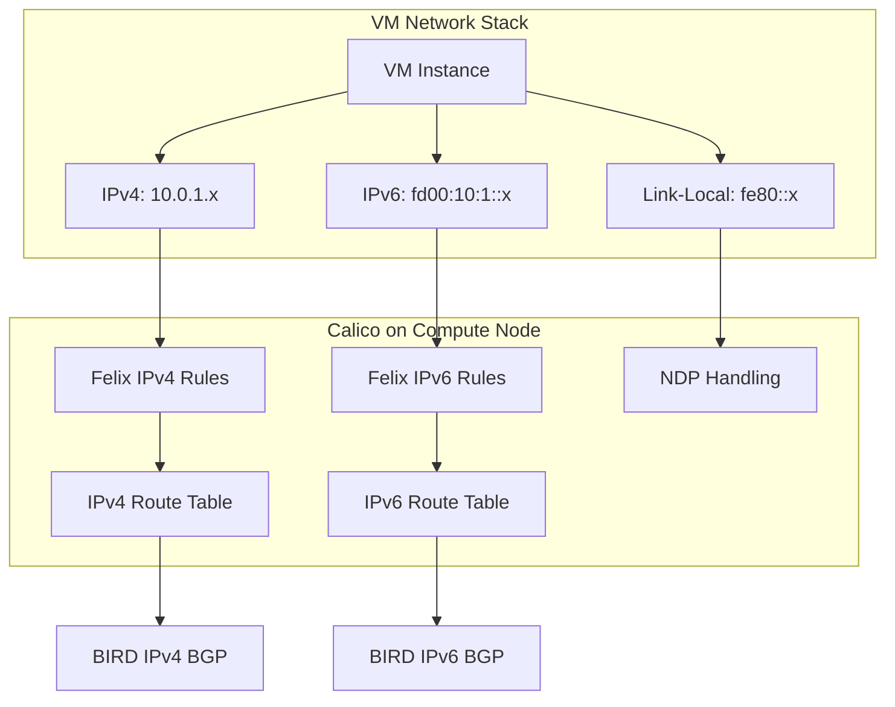

# How to Document OpenStack IPv6 with Calico for Operations Teams

Author: [nawazdhandala](https://github.com/nawazdhandala)

Tags: OpenStack, Calico, IPv6, Documentation, Operations

Description: A guide to creating operational documentation for IPv6 networking in OpenStack with Calico, covering dual-stack architecture, IPv6-specific troubleshooting, and operational procedures.

---

## Introduction

IPv6 documentation for operations teams needs to go beyond what IPv4 documentation covers. IPv6 introduces concepts like neighbor discovery, router advertisements, and address types (link-local, unique local, global unicast) that operators may not be familiar with. When IPv6 issues arise in a Calico-based OpenStack deployment, operators need clear guidance that accounts for these differences.

This guide helps you create IPv6-specific operational documentation that supplements your existing IPv4 documentation. We cover the dual-stack architecture, IPv6-specific troubleshooting procedures, and common IPv6 operational tasks.

Good IPv6 documentation prevents operators from applying IPv4 debugging techniques to IPv6 problems, which is a common source of wasted troubleshooting time.

## Prerequisites

- An operational dual-stack OpenStack deployment with Calico
- Existing IPv4 operational documentation
- Understanding of your IPv6 address plan
- Access to compute nodes for verification
- Input from the team that designed the IPv6 deployment

## Documenting the Dual-Stack Architecture

Create documentation that clearly shows how IPv4 and IPv6 coexist.



Document the IPv6 address types operators will encounter:

```markdown
# IPv6 Address Types in Our Deployment

| Address Type | Range | Purpose | Example |
|-------------|-------|---------|---------|
| Link-Local | fe80::/10 | Node-local communication, NDP | fe80::1 |
| Unique Local (ULA) | fd00::/8 | Internal VM communication | fd00:10:96::5 |
| Global Unicast (GUA) | 2000::/3 | Public-facing services | 2001:db8::1 |
| Multicast | ff00::/8 | NDP, group communication | ff02::1 |

## Key Difference from IPv4
- Every interface has a link-local address automatically
- ICMPv6 MUST be allowed for IPv6 to function (NDP depends on it)
- No broadcast in IPv6; multicast is used instead
- No NAT required (every VM can have a globally routable address)
```

## IPv6 Troubleshooting Procedures

```bash
#!/bin/bash
# troubleshoot-ipv6.sh
# IPv6-specific troubleshooting procedures

VM_V6="${1:?Usage: $0 <vm-ipv6-address>}"

echo "=== IPv6 Troubleshooting: ${VM_V6} ==="

# Step 1: Verify IPv6 is enabled on the compute node
echo ""
echo "--- Step 1: IPv6 Enabled ---"
COMPUTE_HOST=$(openstack server list --all-projects -f value | grep "${VM_V6}" | awk '{print $NF}')
ssh ${COMPUTE_HOST} 'sysctl net.ipv6.conf.all.disable_ipv6'
# Should return 0 (IPv6 enabled)

# Step 2: Check IPv6 routes
echo ""
echo "--- Step 2: IPv6 Routes ---"
ssh ${COMPUTE_HOST} "ip -6 route show | head -20"
ssh ${COMPUTE_HOST} "ip -6 route get ${VM_V6}"

# Step 3: Check IPv6 neighbor table
echo ""
echo "--- Step 3: IPv6 Neighbors ---"
ssh ${COMPUTE_HOST} "ip -6 neigh show"

# Step 4: Check Felix IPv6 rules
echo ""
echo "--- Step 4: Felix ip6tables Rules ---"
ssh ${COMPUTE_HOST} "sudo ip6tables-save | grep cali | head -20"

# Step 5: Check BIRD IPv6 BGP sessions
echo ""
echo "--- Step 5: BGP IPv6 Status ---"
ssh ${COMPUTE_HOST} "sudo calicoctl node status" | grep -A5 "IPv6 BGP"
```

## IPv6 Operational Procedures

Document common IPv6 operational tasks.

```bash
# Check IPv6 IP pool utilization
calicoctl ipam show --ip-version=6

# List all IPv6 workload endpoints
calicoctl get workloadendpoints --all-namespaces -o wide | grep -i "fd00"

# Verify IPv6 security policies
calicoctl get globalnetworkpolicies -o yaml | grep -A5 "ICMPv6"
```

Create a dual-stack health check script:

```bash
#!/bin/bash
# dual-stack-health.sh
# Quick health check for dual-stack environment

echo "=== Dual-Stack Health Check ==="

echo ""
echo "IPv4 IP Pool:"
calicoctl get ippools -o wide | grep -v fd00

echo ""
echo "IPv6 IP Pool:"
calicoctl get ippools -o wide | grep fd00

echo ""
echo "Per-Node Route Counts:"
for node in $(openstack compute service list -f value -c Host | sort -u); do
  v4=$(ssh ${node} 'ip route show proto bird | wc -l')
  v6=$(ssh ${node} 'ip -6 route show proto bird | wc -l')
  echo "  ${node}: IPv4=${v4} IPv6=${v6}"
done
```

## Quick Reference

```markdown
# IPv6 Quick Reference for Operations

## Essential IPv6 Commands
| Task | Command |
|------|---------|
| Show IPv6 addresses | `ip -6 addr show` |
| Show IPv6 routes | `ip -6 route show` |
| Show IPv6 neighbors (NDP) | `ip -6 neigh show` |
| Ping IPv6 | `ping6 <address>` |
| Check ip6tables | `sudo ip6tables-save` |
| Trace IPv6 route | `traceroute6 <address>` |

## Critical Rule: Never Block ICMPv6
ICMPv6 types 133-137 are required for Neighbor Discovery.
Blocking all ICMPv6 breaks IPv6 connectivity entirely.
```

## Verification

```bash
# Verify documentation accuracy
echo "=== IPv6 Documentation Verification ==="
echo "1. Check IPv6 pools match documentation:"
calicoctl get ippools -o wide | grep fd00
echo ""
echo "2. Check IPv6 security rules exist:"
calicoctl get globalnetworkpolicies -o yaml | grep -c ICMPv6
echo ""
echo "3. Verify dual-stack VMs have both addresses:"
openstack server list --project ipv6-test -f value -c Networks
```

## Troubleshooting

- **Operators forget to check IPv6**: Add IPv6 checks to existing monitoring dashboards alongside IPv4 metrics. Do not rely on separate IPv6 monitoring.
- **ICMPv6 rules missing from security groups**: Create a default security group template that always includes ICMPv6 allow rules. Document this as a mandatory requirement.
- **IPv6 documentation maintained separately from IPv4**: Integrate IPv6 information into existing documentation rather than creating parallel documents. Operators should not need to switch between docs.
- **Team lacks IPv6 knowledge**: Schedule a focused training session covering IPv6 fundamentals relevant to your deployment. Focus on practical differences, not protocol theory.

## Conclusion

Documenting IPv6 operations in a Calico-based OpenStack environment requires covering concepts that do not exist in IPv4, particularly NDP, ICMPv6 requirements, and address type management. By integrating IPv6 documentation with existing operational procedures and providing IPv6-specific troubleshooting guides, you ensure that operators can manage dual-stack environments effectively. Update documentation whenever IPv6 configuration or address plans change.
