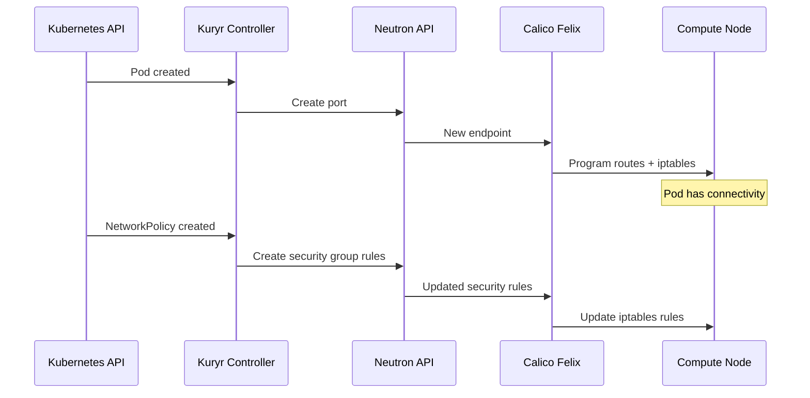

# How to Document OpenStack Kuryr with Calico for Operations Teams

Author: [nawazdhandala](https://github.com/nawazdhandala)

Tags: OpenStack, Calico, Kuryr, Documentation, Operations

Description: A guide to creating operational documentation for Kuryr-Kubernetes integration with Calico in OpenStack, covering the integration architecture, troubleshooting procedures, and maintenance runbooks.

---

## Introduction

Kuryr-Kubernetes adds a layer of complexity to OpenStack networking documentation because it bridges two distinct networking worlds: Kubernetes and OpenStack Neutron. Operations teams need to understand how pod networking flows through Kuryr to Neutron and ultimately to Calico for route programming and policy enforcement.

This guide helps you create documentation that explains the Kuryr-Calico integration architecture, provides troubleshooting procedures for the most common issues, and includes maintenance runbooks for day-to-day operations. The documentation should enable operators familiar with either OpenStack or Kubernetes to troubleshoot issues at the integration boundary.

Without Kuryr-specific documentation, operators waste time troubleshooting in the wrong system when networking issues span the Kubernetes-OpenStack boundary.

## Prerequisites

- An operational OpenStack deployment with Kuryr-Kubernetes and Calico
- Understanding of both Kubernetes and OpenStack networking
- Access to Kuryr controller logs and configuration
- Existing documentation for both OpenStack and Kubernetes operations

## Documenting the Integration Architecture



Document the component responsibilities:

```markdown
# Kuryr-Calico Integration Components

## Kuryr Controller
- Watches Kubernetes API for pod and service events
- Creates Neutron ports for each pod
- Translates Kubernetes NetworkPolicy to Neutron security groups
- Runs as a Kubernetes deployment in kube-system namespace

## Neutron (with Calico Plugin)
- Manages network and port abstractions
- Translates port information to Calico workload endpoints
- Provides the API layer between Kuryr and Calico

## Calico Felix
- Programs routes on compute nodes for both VM and pod endpoints
- Enforces security rules via iptables or eBPF
- Manages route distribution via BIRD BGP

## Key Interaction Points
1. Pod creation: Kuryr -> Neutron -> Calico (route + policy)
2. Pod deletion: Kuryr -> Neutron -> Calico (cleanup)
3. Policy change: Kuryr -> Neutron -> Calico (rule update)
4. Service creation: Kuryr -> Neutron -> Load Balancer
```

## Troubleshooting Guide

```bash
#!/bin/bash
# troubleshoot-kuryr-calico.sh
# Diagnose issues at the Kuryr-Calico boundary

POD_NAME="${1:?Usage: $0 <pod-name> <namespace>}"
NAMESPACE="${2:-default}"

echo "=== Kuryr-Calico Troubleshooting ==="

# Step 1: Check pod status in Kubernetes
echo ""
echo "--- Step 1: Pod Status ---"
kubectl get pod ${POD_NAME} -n ${NAMESPACE} -o wide

# Step 2: Check Kuryr controller logs for this pod
echo ""
echo "--- Step 2: Kuryr Controller Logs ---"
kubectl logs -n kube-system -l app=kuryr-controller --tail=50 | grep -i "${POD_NAME}"

# Step 3: Find the Neutron port for this pod
echo ""
echo "--- Step 3: Neutron Port ---"
POD_IP=$(kubectl get pod ${POD_NAME} -n ${NAMESPACE} -o jsonpath='{.status.podIP}' 2>/dev/null)
if [ -n "${POD_IP}" ]; then
  openstack port list --fixed-ip ip-address=${POD_IP} -f table
  PORT_ID=$(openstack port list --fixed-ip ip-address=${POD_IP} -f value -c ID)
  if [ -n "${PORT_ID}" ]; then
    echo "Port status:"
    openstack port show ${PORT_ID} -f value -c status
  fi
else
  echo "Pod has no IP assigned yet"
fi

# Step 4: Check Calico endpoint
echo ""
echo "--- Step 4: Calico Endpoint ---"
calicoctl get workloadendpoints --all-namespaces -o wide 2>/dev/null | grep "${POD_IP}"

# Step 5: Check routes on compute node
echo ""
echo "--- Step 5: Route on Compute Node ---"
NODE=$(kubectl get pod ${POD_NAME} -n ${NAMESPACE} -o jsonpath='{.spec.nodeName}')
if [ -n "${NODE}" ] && [ -n "${POD_IP}" ]; then
  ssh ${NODE} "ip route get ${POD_IP}" 2>/dev/null
fi
```

## Maintenance Runbooks

```bash
#!/bin/bash
# runbook-kuryr-restart.sh
# Runbook: Restarting Kuryr components safely

echo "=== Kuryr Restart Runbook ==="
echo ""
echo "Pre-checks:"
echo "  1. Check current Kuryr controller health:"
echo "     kubectl get pods -n kube-system -l app=kuryr-controller"
echo ""
echo "  2. Count current Neutron ports managed by Kuryr:"
echo "     openstack port list --device-owner kuryr:bound -f value | wc -l"
echo ""
echo "Steps:"
echo "  1. Rolling restart of Kuryr controller:"
echo "     kubectl rollout restart deployment/kuryr-controller -n kube-system"
echo ""
echo "  2. Monitor restart progress:"
echo "     kubectl rollout status deployment/kuryr-controller -n kube-system"
echo ""
echo "  3. Verify Kuryr is processing events:"
echo "     kubectl logs -n kube-system -l app=kuryr-controller --tail=20"
echo ""
echo "Post-checks:"
echo "  1. Verify existing pods still have connectivity"
echo "  2. Create a test pod and verify it gets an IP"
echo "  3. Check Neutron port count matches pod count"
```

## Verification

```bash
echo "=== Documentation Verification ==="
echo "1. Kuryr controller running:"
kubectl get pods -n kube-system -l app=kuryr-controller
echo ""
echo "2. Neutron ports match pods:"
echo "   Pods: $(kubectl get pods --all-namespaces --no-headers | wc -l)"
echo "   Kuryr ports: $(openstack port list --device-owner kuryr:bound -f value -c ID 2>/dev/null | wc -l)"
```

## Troubleshooting

- **Documentation covers wrong Kuryr version**: Kuryr behavior changes between versions. Always document the specific Kuryr version deployed and update docs when upgrading.
- **Operators do not know where to start troubleshooting**: Create a flowchart that guides operators to the correct system (Kubernetes, Neutron, or Calico) based on symptoms.
- **Integration-specific issues not covered**: Maintain a shared incident log where operators record new issues and their resolutions. Use this to update documentation regularly.

## Conclusion

Documenting the Kuryr-Calico integration requires covering the interaction between Kubernetes, OpenStack Neutron, and Calico. By explaining the integration architecture, providing cross-system troubleshooting procedures, and creating maintenance runbooks, you enable operations teams to manage this complex integration effectively. Keep documentation aligned with the deployed versions of all three components.
