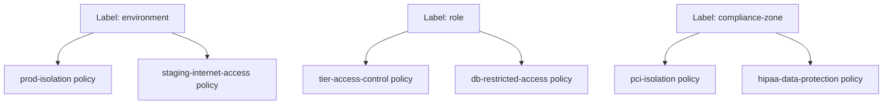

# How to Document OpenStack Labels with Calico for Operations Teams

Author: [nawazdhandala](https://github.com/nawazdhandala)

Tags: OpenStack, Calico, Labels, Documentation, Operations

Description: A guide to documenting label management and label-based policies in OpenStack with Calico, covering taxonomy standards, policy mappings, and label governance procedures.

---

## Introduction

Labels in Calico are the invisible wiring behind every network policy. In an OpenStack environment, operators and application teams need clear documentation about which labels exist, what values are valid, which policies depend on each label, and how to request label changes. Without this documentation, label management becomes ad hoc and policy enforcement becomes unpredictable.

This guide helps you create label documentation that serves both policy authors and operations teams. We cover documenting the label taxonomy, mapping labels to policies, creating label governance procedures, and building reference materials for day-to-day operations.

The goal is to make labels a well-understood, well-managed part of your infrastructure rather than a mysterious metadata layer that only one person understands.

## Prerequisites

- An operational OpenStack deployment with Calico and label-based policies
- An established or planned label taxonomy
- Access to all Calico network policies and their selectors
- A documentation platform accessible to all relevant teams

## Documenting the Label Taxonomy

Create a comprehensive reference for all labels used in your environment.

```markdown
# Calico Label Taxonomy

## Policy-Critical Labels
These labels directly affect network policy enforcement.
Changing these labels changes which traffic is allowed.

### environment
- **Type**: Policy-critical
- **Valid values**: production, staging, development
- **Default**: development
- **Policies that use this label**:
  - prod-isolation: Restricts production to production traffic
  - staging-internet-access: Controls staging egress
- **Who can change**: Platform team only (requires change ticket)

### role
- **Type**: Policy-critical
- **Valid values**: web, app, db, cache, monitoring
- **Default**: (none - must be explicitly set)
- **Policies that use this label**:
  - tier-access-control: Controls inter-tier communication
  - db-restricted-access: Limits database access to app tier
- **Who can change**: Platform team only

### compliance-zone
- **Type**: Policy-critical
- **Valid values**: pci, hipaa, standard
- **Default**: standard
- **Policies that use this label**:
  - pci-isolation: PCI zone boundary enforcement
  - hipaa-data-protection: HIPAA compliance boundaries
- **Who can change**: Security team only (requires compliance review)

## Operational Labels
These labels are for filtering and organization only.
They do not affect network policy.

### team
- **Valid values**: Any team identifier
- **Purpose**: Cost tracking, ownership identification

### cost-center
- **Valid values**: Department cost center codes
- **Purpose**: Financial allocation
```

## Mapping Labels to Policies

Create a cross-reference showing which policies use which labels.

```yaml
# Document the policy-label relationship
# This serves as a reference for understanding policy impact

# Example: pci-isolation policy
apiVersion: projectcalico.org/v3
kind: GlobalNetworkPolicy
metadata:
  name: pci-isolation
  annotations:
    # Document the labels this policy depends on
    docs.example.com/required-labels: "compliance-zone"
    docs.example.com/owner: "security-team"
    docs.example.com/last-reviewed: "2026-03-01"
spec:
  selector: compliance-zone == 'pci'
  types:
    - Ingress
    - Egress
  ingress:
    - action: Allow
      source:
        selector: compliance-zone == 'pci'
  egress:
    - action: Allow
      destination:
        selector: compliance-zone == 'pci'
    - action: Allow
      protocol: UDP
      destination:
        ports:
          - 53
```



## Label Governance Procedures

Document the process for managing label lifecycle.

```markdown
# Label Governance Procedures

## Adding a New Label
1. Submit a label proposal with: name, purpose, valid values, owning team
2. Review against existing taxonomy for conflicts
3. Determine if the label is policy-critical or operational
4. If policy-critical: security team review required
5. Update taxonomy documentation
6. Communicate to all teams

## Changing a Label Value on a Workload
1. Identify all policies that reference the label
2. Assess impact: will the change block or allow new traffic?
3. If policy-critical label: create a change ticket
4. Apply the change during maintenance window (for policy-critical)
5. Verify policy enforcement after the change

## Deprecating a Label
1. Identify all policies and endpoints using the label
2. Create a migration plan to replacement label (if any)
3. Update policies to remove references
4. Remove label from endpoints
5. Update taxonomy documentation
```

## Operational Reference

```bash
#!/bin/bash
# label-ops-reference.sh
# Quick label reference commands for operations

echo "=== Label Operations Quick Reference ==="

# List all labels on a specific VM endpoint
echo "Labels on a VM:"
echo "  calicoctl get workloadendpoints --all-namespaces -o yaml | grep -A20 '<vm-name>'"

# Find all VMs with a specific label
echo ""
echo "Find VMs by label:"
echo "  calicoctl get workloadendpoints --all-namespaces -o json | python3 -c "import json,sys; [print(i['metadata']['name']) for i in json.load(sys.stdin).get('items',[]) if i.get('metadata',{}).get('labels',{}).get('role')=='web']""

# Check which policies apply to a label combination
echo ""
echo "Policies for a label set:"
echo "  calicoctl get globalnetworkpolicies -o yaml | grep -B5 'role.*web'"
```

## Verification

```bash
#!/bin/bash
# verify-label-docs.sh
echo "=== Label Documentation Verification ==="

echo "Labels in use vs documented:"
echo "In use:"
calicoctl get workloadendpoints --all-namespaces -o json 2>/dev/null | \
  python3 -c "
import json, sys, collections
data = json.load(sys.stdin)
labels = set()
for item in data.get('items', []):
    for k in item.get('metadata', {}).get('labels', {}).keys():
        labels.add(k)
for l in sorted(labels):
    print(f'  {l}')
"
```

## Troubleshooting

- **Undocumented labels found on endpoints**: Run a label audit script and compare against the taxonomy. Add missing labels to documentation or remove unauthorized labels from endpoints.
- **Policy changes break workloads**: Before any policy change, use the label-to-policy mapping to identify all affected workloads. Test in staging first.
- **Teams using wrong label values**: Implement label validation in the VM provisioning pipeline. Reject VMs with invalid label values at creation time.
- **Documentation out of sync with actual labels**: Schedule monthly label audits. Automate the comparison between documented labels and actual endpoint labels.

## Conclusion

Documenting labels and their relationship to policies makes network security transparent and manageable. By maintaining a clear taxonomy, cross-referencing labels to policies, and establishing governance procedures, you ensure that label-based policy management scales with your deployment. Treat the label taxonomy as infrastructure code and manage it with the same rigor as any other critical configuration.
