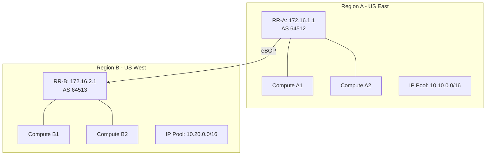

# How to Document OpenStack Multiple Regions with Calico for Operations Teams

Author: [nawazdhandala](https://github.com/nawazdhandala)

Tags: OpenStack, Calico, Multi-Region, Documentation, Operations

Description: A guide to creating operational documentation for multi-region OpenStack networking with Calico, covering region topology maps, cross-region troubleshooting, and incident response procedures.

---

## Introduction

Multi-region OpenStack documentation must cover scenarios that do not exist in single-region deployments. Operators need to understand which region owns which IP ranges, how cross-region routes propagate, where to investigate when cross-region connectivity fails, and how to handle region-specific incidents without impacting other regions.

This guide helps you create documentation that maps the multi-region topology, provides cross-region troubleshooting procedures, and establishes region-specific operational responsibilities. The documentation should be structured so that operators in any region can diagnose issues that may originate in another region.

Effective multi-region documentation prevents the common problem of operators in one region blaming another region for connectivity issues, leading to time wasted on finger-pointing instead of diagnosis.

## Prerequisites

- An operational multi-region OpenStack deployment with Calico
- Completed topology diagrams for each region
- Understanding of cross-region BGP peering configuration
- Access to all regions for verification
- Input from teams operating each region

## Documenting the Multi-Region Topology



Document the region reference table:

```markdown
# Multi-Region Reference

| Region | Location | AS Number | VM CIDR | Route Reflector | Gateway IP |
|--------|----------|-----------|---------|-----------------|------------|
| Region A | US East | 64512 | 10.10.0.0/16 | 172.16.1.1 | 172.16.0.1 |
| Region B | US West | 64513 | 10.20.0.0/16 | 172.16.2.1 | 172.16.0.2 |
| Region C | EU West | 64514 | 10.30.0.0/16 | 172.16.3.1 | 172.16.0.3 |

## IP-to-Region Quick Lookup
- 10.10.x.x -> Region A (US East)
- 10.20.x.x -> Region B (US West)
- 10.30.x.x -> Region C (EU West)
```

## Cross-Region Troubleshooting Procedures

```bash
#!/bin/bash
# troubleshoot-cross-region.sh
# Troubleshoot cross-region connectivity issues

SRC_IP="${1:?Usage: $0 <source-ip> <dest-ip>}"
DST_IP="${2:?Usage: $0 <source-ip> <dest-ip>}"

echo "=== Cross-Region Troubleshooting ==="
echo "Source: ${SRC_IP}"
echo "Destination: ${DST_IP}"

# Step 1: Identify which regions are involved
echo ""
echo "--- Step 1: Region Identification ---"
# Determine regions from IP ranges
case ${SRC_IP} in
  10.10.*) SRC_REGION="region-a" ;;
  10.20.*) SRC_REGION="region-b" ;;
  10.30.*) SRC_REGION="region-c" ;;
  *) SRC_REGION="unknown" ;;
esac
case ${DST_IP} in
  10.10.*) DST_REGION="region-a" ;;
  10.20.*) DST_REGION="region-b" ;;
  10.30.*) DST_REGION="region-c" ;;
  *) DST_REGION="unknown" ;;
esac
echo "Source region: ${SRC_REGION}"
echo "Destination region: ${DST_REGION}"

# Step 2: Check BGP peering between regions
echo ""
echo "--- Step 2: Cross-Region BGP Status ---"
echo "Check route reflector in ${SRC_REGION}:"
echo "  ssh ${SRC_REGION}-rr-01 'sudo calicoctl node status'"
echo "Check route reflector in ${DST_REGION}:"
echo "  ssh ${DST_REGION}-rr-01 'sudo calicoctl node status'"

# Step 3: Verify routes exist
echo ""
echo "--- Step 3: Route Verification ---"
echo "On source compute node, check route to ${DST_IP}:"
echo "  ip route get ${DST_IP}"
echo "On destination compute node, check route to ${SRC_IP}:"
echo "  ip route get ${SRC_IP}"

# Step 4: Check policies in both regions
echo ""
echo "--- Step 4: Policy Check ---"
echo "Verify no policy blocks cross-region traffic in either region"
```

## Incident Response for Multi-Region Issues

```markdown
# Multi-Region Incident Response

## Severity Classification
- **P1**: Entire region unreachable from other regions
- **P2**: Intermittent cross-region connectivity
- **P3**: Single workload cross-region issue

## P1 Response: Region Unreachable
1. Verify the WAN/VPN link between regions is up
2. Check route reflector BGP sessions: `calicoctl node status` on affected RR
3. Check if the route reflector process is running
4. If BGP sessions are down, check firewall rules on port 179
5. Escalate to network team if WAN link is the issue

## P2 Response: Intermittent Connectivity
1. Check for BGP route flapping: `journalctl -u calico-bird | grep "route changed"`
2. Verify route reflector is not overloaded (CPU/memory)
3. Check inter-region link utilization for congestion
4. Review recent BGP configuration changes

## P3 Response: Single Workload Issue
1. Follow single-region troubleshooting for the source VM
2. Follow single-region troubleshooting for the destination VM
3. If both VMs are healthy, check cross-region routing
```

## Verification

```bash
#!/bin/bash
# verify-multi-region-docs.sh
echo "=== Multi-Region Documentation Verification ==="

echo "Region IP ranges match documentation:"
for region in region-a region-b; do
  KUBECONFIG="/etc/calico/regions/${region}/kubeconfig"
  echo "${region}:"
  DATASTORE_TYPE=kubernetes KUBECONFIG=${KUBECONFIG} \
    calicoctl get ippools -o wide 2>/dev/null
done

echo ""
echo "BGP AS numbers match documentation:"
for region in region-a region-b; do
  KUBECONFIG="/etc/calico/regions/${region}/kubeconfig"
  as=$(DATASTORE_TYPE=kubernetes KUBECONFIG=${KUBECONFIG} \
    calicoctl get bgpconfiguration default -o yaml 2>/dev/null | grep asNumber)
  echo "  ${region}: ${as}"
done
```

## Troubleshooting

- **Documentation references wrong region for an IP range**: Maintain the IP-to-region lookup table in a single authoritative location. Update immediately when IP pools change.
- **Operators in one region cannot access another region's tools**: Set up cross-region access with appropriate credentials. Document SSH jump hosts or VPN endpoints for each region.
- **Incident response unclear about which team to contact**: Maintain a region-to-team mapping with current contact information. Include this in the on-call reference card.
- **Cross-region debugging requires too many manual steps**: Build a diagnostic script that automates the cross-region troubleshooting procedure. Distribute it to all regions.

## Conclusion

Documenting multi-region OpenStack with Calico requires mapping the region topology, providing cross-region troubleshooting procedures, and establishing clear incident response workflows. By creating a comprehensive region reference, IP-to-region lookup guides, and cross-region diagnostic scripts, you enable operators in any region to diagnose and resolve issues efficiently. Keep the region reference table updated as regions are added or IP pools change.
