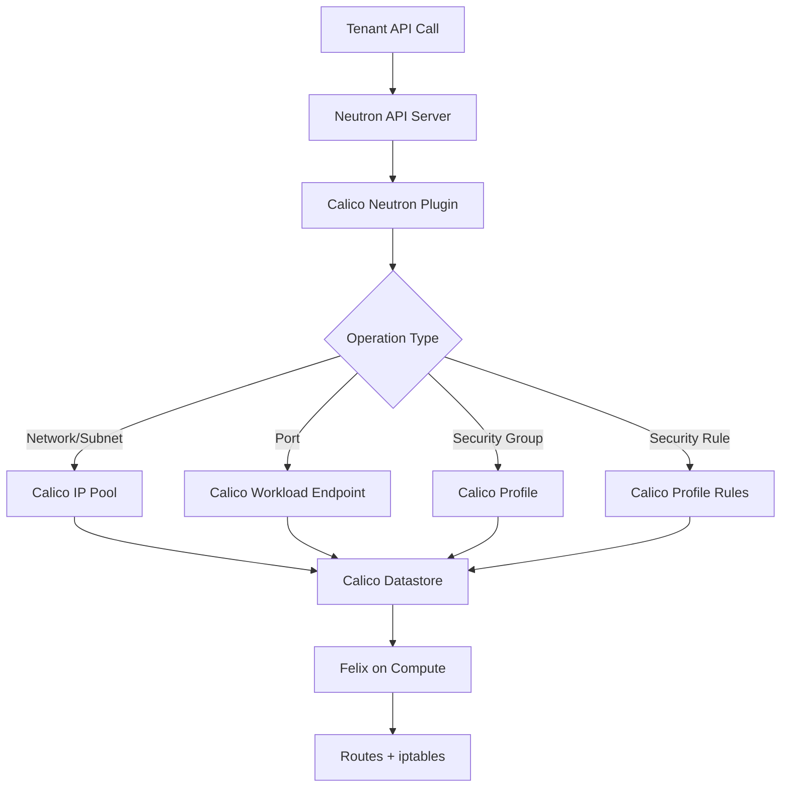

# How to Document OpenStack Neutron API Integration with Calico for Operations

Author: [nawazdhandala](https://github.com/nawazdhandala)

Tags: OpenStack, Calico, Neutron, API, Documentation

Description: A guide to documenting the Neutron API integration with Calico for operations teams, covering the integration architecture, API-to-dataplane mapping, and troubleshooting procedures.

---

## Introduction

The Neutron API is the interface that all tenants and automation tools use to manage OpenStack networking. When Calico is the backend, every Neutron API call translates to Calico datastore operations that ultimately configure routes and security rules on compute nodes. Operations teams need documentation that maps this entire path so they can diagnose issues at any point in the chain.

This guide helps you create documentation that explains the Neutron-to-Calico translation layer, maps API operations to their Calico equivalents, and provides troubleshooting procedures for integration-specific issues. The documentation should help operators understand what happens behind the scenes when a tenant creates a network or security group.

Without this documentation, operators treat Neutron and Calico as separate systems and miss issues that occur at the integration boundary.

## Prerequisites

- An operational OpenStack deployment with the Calico Neutron plugin
- Understanding of both Neutron API operations and Calico data model
- Access to Neutron server configuration and logs
- Access to Calico datastore for verification

## Documenting the Integration Architecture



Document the API-to-Calico mapping:

```markdown
# Neutron-to-Calico Resource Mapping

| Neutron Resource | Calico Resource | Notes |
|-----------------|-----------------|-------|
| Network | (logical grouping) | Networks are logical in Calico |
| Subnet | IPPool allocation | Subnet CIDR maps to IP allocation |
| Port | WorkloadEndpoint | Each port creates an endpoint |
| Security Group | Profile | SG ID becomes profile name |
| SG Rule (ingress) | Profile ingress rule | Translated per-rule |
| SG Rule (egress) | Profile egress rule | Translated per-rule |
| Router | (L3 routing) | Calico handles routing natively |
| Floating IP | (NAT rule) | Implemented via iptables NAT |
```

## Operational Procedures

```bash
#!/bin/bash
# ops-neutron-calico.sh
# Common operational tasks for Neutron-Calico integration

echo "=== Neutron-Calico Operations Reference ==="

echo ""
echo "--- Check Integration Health ---"
echo "1. Neutron server status:"
echo "   systemctl status neutron-server"
echo ""
echo "2. Verify Calico plugin is loaded:"
echo "   grep core_plugin /etc/neutron/neutron.conf"
echo ""
echo "3. Test API responsiveness:"
echo "   openstack network list"
echo ""
echo "4. Verify datastore sync:"
echo "   # Compare Neutron port count with Calico endpoint count"
echo "   openstack port list --all-projects -f value | wc -l"
echo "   calicoctl get workloadendpoints --all-namespaces -o name | wc -l"

echo ""
echo "--- Troubleshoot Port Creation ---"
echo "1. Check Neutron logs: tail -f /var/log/neutron/server.log"
echo "2. Check Calico datastore connectivity from Neutron server"
echo "3. Verify compute node Felix is syncing endpoints"
```

## Troubleshooting Guide

```bash
#!/bin/bash
# troubleshoot-neutron-calico.sh
# Diagnose Neutron-Calico integration issues

ISSUE="${1:-general}"

case ${ISSUE} in
  "port-creation-fails")
    echo "=== Port Creation Failure Diagnosis ==="
    echo "1. Check Neutron server logs:"
    echo "   sudo tail -100 /var/log/neutron/server.log | grep ERROR"
    echo ""
    echo "2. Check Calico datastore (etcd) health:"
    echo "   etcdctl endpoint health"
    echo ""
    echo "3. Check database connections:"
    echo "   mysql -e 'SHOW STATUS LIKE "Threads_connected";'"
    echo ""
    echo "4. Test manual port creation with debug:"
    echo "   openstack --debug port create --network <net> test-debug-port"
    ;;

  "sg-not-enforced")
    echo "=== Security Group Not Enforced Diagnosis ==="
    echo "1. Get the security group ID:"
    echo "   openstack security group show <sg-name> -f value -c id"
    echo ""
    echo "2. Check Calico profile exists:"
    echo "   calicoctl get profiles <sg-id> -o yaml"
    echo ""
    echo "3. Check Felix has programmed iptables:"
    echo "   ssh <compute-node> 'sudo iptables-save | grep <sg-id>'"
    echo ""
    echo "4. Verify the VM port is assigned this security group:"
    echo "   openstack port show <port-id> -f value -c security_group_ids"
    ;;

  *)
    echo "Usage: $0 [port-creation-fails|sg-not-enforced]"
    ;;
esac
```

## Configuration Reference

```markdown
# Neutron-Calico Configuration Reference

## Key Configuration Files

| File | Purpose |
|------|---------|
| /etc/neutron/neutron.conf | Main Neutron config (core_plugin = calico) |
| /etc/neutron/dhcp_agent.ini | DHCP agent config (Calico driver) |
| /etc/calico/felix.cfg | Felix config on compute nodes |
| /etc/calico/calicoctl.cfg | calicoctl datastore connection |

## Key Log Files

| File | Purpose |
|------|---------|
| /var/log/neutron/server.log | Neutron API and plugin logs |
| /var/log/neutron/dhcp-agent.log | DHCP agent logs |
| Felix logs (journald) | Compute node networking logs |

## Health Check Commands

| Check | Command |
|-------|---------|
| Neutron API | `openstack network list` |
| Plugin loaded | `grep core_plugin /etc/neutron/neutron.conf` |
| DB connections | `mysql -e 'SHOW PROCESSLIST'` |
| etcd health | `etcdctl endpoint health` |
| Felix sync | `curl localhost:9091/metrics | grep felix` |
```

## Verification

```bash
echo "=== Documentation Verification ==="
echo "Config files exist:"
ls -la /etc/neutron/neutron.conf
ls -la /etc/neutron/dhcp_agent.ini

echo ""
echo "Plugin configured:"
grep "core_plugin" /etc/neutron/neutron.conf | grep -v "#"

echo ""
echo "API responsive:"
openstack network list > /dev/null 2>&1 && echo "OK" || echo "FAIL"
```

## Troubleshooting

- **Documentation references wrong log paths**: Different deployment methods (packaged, containerized) place logs in different locations. Verify paths on your specific deployment.
- **API-to-Calico mapping incomplete**: Add entries as new Neutron features are enabled. Not all Neutron features map directly to Calico resources.
- **Operators unfamiliar with Calico concepts**: Include a glossary mapping Neutron terms to Calico equivalents (security group = profile, port = workload endpoint).

## Conclusion

Documenting the Neutron-Calico integration bridges the gap between OpenStack operations and Calico networking. By mapping API operations to Calico resources, providing integration-specific troubleshooting procedures, and maintaining a configuration reference, you enable operators to diagnose and resolve issues that span both systems. Update documentation when either Neutron or Calico is upgraded.
