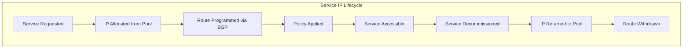

# How to Document OpenStack Service IPs with Calico for Operations Teams

Author: [nawazdhandala](https://github.com/nawazdhandala)

Tags: OpenStack, Calico, Service IPs, Documentation, Operations

Description: A guide to documenting service IP management in OpenStack with Calico for operations teams, covering allocation procedures, monitoring guidelines, and troubleshooting reference materials.

---

## Introduction

Service IPs in OpenStack with Calico provide stable network endpoints for services, and operations teams need clear documentation about how these IPs are allocated, routed, and managed. Unlike VM IPs that tenants manage directly, service IPs often have special requirements for stability, access control, and monitoring that need to be documented separately.

This guide helps you create documentation for service IP management that covers allocation procedures, routing architecture, monitoring guidelines, and troubleshooting reference materials. The documentation targets operations teams who manage the infrastructure that services depend on.

Well-documented service IP management prevents the common problem of IP pool exhaustion going unnoticed until a critical service deployment fails.

## Prerequisites

- An operational OpenStack deployment with Calico and dedicated service IP pools
- Understanding of your service IP allocation strategy
- Access to Calico IPAM and monitoring tools
- Input from teams that deploy services using these IPs

## Documenting the Service IP Architecture



Document the service IP pools and their purpose:

```markdown
# Service IP Pool Reference

| Pool Name | CIDR | Purpose | Node Selector |
|-----------|------|---------|---------------|
| openstack-service-ips | 10.200.0.0/16 | General service endpoints | service-host=true |
| openstack-mgmt-ips | 10.201.0.0/24 | Management plane services | mgmt-node=true |

## Allocation Rules
- Services MUST use the service IP pool, not the VM IP pool
- Each service gets a single IP from the pool
- IPs are not reserved; they return to the pool on service deletion
- Pool utilization alerts trigger at 80% capacity
```

## Creating Operational Procedures

```bash
#!/bin/bash
# ops-service-ip.sh
# Operational procedures for service IP management

echo "=== Service IP Operations ==="

echo ""
echo "--- Check Pool Utilization ---"
echo "Command: calicoctl ipam show"
echo "Alert threshold: 80% utilization"

echo ""
echo "--- Find Which Service Uses an IP ---"
echo "1. Check Calico endpoint:"
echo "   calicoctl get workloadendpoints --all-namespaces -o wide | grep <IP>"
echo ""
echo "2. Check OpenStack port:"
echo "   openstack port list --fixed-ip ip-address=<IP>"
echo ""
echo "3. Check OpenStack VM:"
echo "   openstack server list --all-projects --ip <IP>"

echo ""
echo "--- Verify Service IP Route ---"
echo "On any compute node:"
echo "  ip route get <service-ip>"
echo "Expected: route via the compute node hosting the service"
```

## Monitoring Guidelines

```bash
#!/bin/bash
# service-ip-monitoring.sh
# Monitoring checks for service IPs

echo "=== Service IP Monitoring Checks ==="

# Check 1: Pool utilization
echo "Pool utilization:"
calicoctl ipam show 2>/dev/null

# Check 2: Stale allocations (IPs with no active endpoint)
echo ""
echo "Checking for potential stale allocations..."
# Compare allocated IPs with active endpoints
ALLOCATED=$(calicoctl ipam show --show-blocks 2>/dev/null | grep -c "allocated")
ACTIVE=$(calicoctl get workloadendpoints --all-namespaces -o name 2>/dev/null | wc -l)
echo "  IPAM allocations: ${ALLOCATED}"
echo "  Active endpoints: ${ACTIVE}"

# Check 3: Route health for service IPs
echo ""
echo "Service IP route health:"
echo "  Check with: ip route show | grep 10.200"
```

## Troubleshooting Reference

```markdown
# Service IP Troubleshooting Quick Reference

## Symptom: Service IP pool exhausted
**Impact**: New services cannot be deployed
**Steps**:
1. Check utilization: `calicoctl ipam show`
2. Look for stale allocations: compare endpoints with IPAM blocks
3. Clean up stale allocations: `calicoctl ipam release --ip=<stale-ip>`
4. If pool is genuinely full: plan pool expansion or add new pool

## Symptom: Service IP unreachable
**Impact**: Service consumers cannot connect
**Steps**:
1. Verify service VM is running: `openstack server show <vm>`
2. Check route on consumer's compute node: `ip route get <service-ip>`
3. Check Felix on service's compute node: `calicoctl node status`
4. Check iptables/policy: `iptables-save | grep <service-ip>`

## Symptom: Service IP reachable but policy not enforced
**Impact**: Unauthorized access to service
**Steps**:
1. Check endpoint labels: `calicoctl get workloadendpoints -o yaml | grep <ip>`
2. Verify policy selector matches: `calicoctl get globalnetworkpolicies -o yaml`
3. Check Felix logs for policy errors on compute node
```

## Verification

```bash
#!/bin/bash
# verify-service-ip-docs.sh
echo "=== Service IP Documentation Verification ==="

echo "Pools match documentation:"
calicoctl get ippools -o wide

echo ""
echo "Current utilization:"
calicoctl ipam show 2>/dev/null

echo ""
echo "Active service endpoints:"
calicoctl get workloadendpoints --all-namespaces -o wide 2>/dev/null | head -10
```

## Troubleshooting

- **Documentation does not cover new service IP pools**: Update the pool reference table whenever new pools are created. Include the creation date and requesting team.
- **Operators cannot find which service uses an IP**: Enhance the lookup procedure to check all systems (Calico, Neutron, OpenStack). Create a single lookup script.
- **Pool exhaustion not detected early enough**: Lower the monitoring alert threshold. If 80% is too late, set it to 70%.
- **Stale IP cleanup process unclear**: Document the exact steps to safely release a stale IP, including verification that no active workload is using it.

## Conclusion

Documenting service IP management in OpenStack with Calico ensures that operations teams can monitor, troubleshoot, and maintain service IP infrastructure effectively. By providing pool references, allocation procedures, monitoring guidelines, and troubleshooting quick references, you prevent service IP issues from becoming service outages. Review and update this documentation whenever service IP pools are modified.
