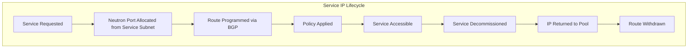

# How to Document OpenStack Service IPs with Calico for Operations Teams

Author: [nawazdhandala](https://github.com/nawazdhandala)

Tags: OpenStack, Calico, Service IPs, Documentation, Operation

Description: A guide to documenting service IP management in OpenStack with Calico for operations teams, covering allocation procedures, monitoring guidelines, and troubleshooting reference materials.

---

## Introduction

Service IPs in OpenStack with Calico provide stable network endpoints for services, and operations teams need clear documentation about how these IPs are allocated, routed, and managed. Unlike VM IPs that tenants manage directly, service IPs often have special requirements for stability, access control, and monitoring that need to be documented separately.

This guide helps you create documentation for service IP management that covers allocation procedures, routing architecture, monitoring guidelines, and troubleshooting reference materials. The documentation targets operations teams who manage the infrastructure that services depend on.

Well-documented service IP management prevents the common problem of IP pool exhaustion going unnoticed until a critical service deployment fails.

## Prerequisites

- An operational OpenStack deployment with Calico and dedicated service IP pools
- Understanding of your service IP allocation strategy
- Access to OpenStack Networking and Calico monitoring tools
- Input from teams that deploy services using these IPs

## Documenting the Service IP Architecture


```mermaid
graph TD
    subgraph "Service IP Lifecycle"
        A[Service Requested] --> B[Neutron Port Allocated from Service Subnet]
        B --> C[Route Programmed via BGP]
        C --> D[Policy Applied]
        D --> E[Service Accessible]
        E --> F[Service Decommissioned]
        F --> G[IP Returned to Pool]
        G --> H[Route Withdrawn]
    end
```

Document the service IP pools and their purpose:

```markdown
# Service IP Pool Reference

| Network | Subnet CIDR | Purpose | Allocation Pool |
|---------|-------------|---------|-----------------|
| openstack-service-net | 10.200.0.0/16 | General service endpoints | 10.200.0.10-10.200.255.254 |
| openstack-mgmt-net | 10.201.0.0/24 | Management plane services | 10.201.0.10-10.201.0.254 |

## Allocation Rules
- Services MUST use the service network/subnet, not the VM tenant network
- Each service gets a Neutron port with a single fixed IP from the service subnet
- IPs are not reserved; they return to the subnet allocation pool when the service port is deleted
- Pool utilization alerts trigger at 80% capacity
```

## Creating Operational Procedures

```bash
#!/bin/bash
# ops-service-ip.sh

# Operational procedures for service IP management

echo "=== Service IP Operations ==="

echo ""
echo "--- Check Pool Utilization ---"
echo "Command: openstack ip availability show <service-network>"
echo "Alert threshold: 80% utilization"

echo ""
echo "--- Find Which Service Uses an IP ---"
echo "1. Check Calico endpoint:"
echo "   calicoctl get workloadendpoints --all-namespaces -o wide | grep <IP>"
echo ""
echo "2. Check OpenStack port:"
echo "   openstack port list --fixed-ip ip-address=<IP>"
echo ""
echo "3. Check OpenStack VM:"
echo "   openstack server list --all-projects --ip <IP>"

echo ""
echo "--- Verify Service IP Route ---"
echo "On any compute node:"
echo "  ip route get <service-ip>"
echo "Expected: route toward the compute node hosting the service"
```

## Monitoring Guidelines

```bash
#!/bin/bash
# service-ip-monitoring.sh
# Monitoring checks for service IPs

echo "=== Service IP Monitoring Checks ==="

# Check 1: Pool utilization
echo "Pool utilization:"
openstack ip availability show <service-network>

# Check 2: Ports without an attached service workload
echo ""
echo "Checking for potential stale service ports..."
echo "  Review ports on the service network with no device_id or unexpected device_owner:"
openstack port list --network <service-network> --long

# Check 3: Route health for service IPs
echo ""
echo "Service IP route health:"
echo "  Check with: ip route show | grep 10.200"
```

## Troubleshooting Reference

```markdown
# Service IP Troubleshooting Quick Reference

## Symptom: Service IP pool exhausted
**Impact**: New services cannot be deployed
**Steps**:
1. Check utilization: `openstack ip availability show <service-network>`
2. Look for stale ports: `openstack port list --network <service-network> --long`
3. Delete confirmed stale ports: `openstack port delete <stale-port-id>`
4. If pool is genuinely full: plan pool expansion or add new pool

## Symptom: Service IP unreachable
**Impact**: Service consumers cannot connect
**Steps**:
1. Verify service VM is running: `openstack server show <vm>`
2. Check route on consumer's compute node: `ip route get <service-ip>`
3. Check Calico BGP peer status on the service's compute node: `calicoctl node status`
4. Check iptables/policy: `iptables-save | grep <service-ip>`

## Symptom: Service IP reachable but policy not enforced
**Impact**: Unauthorized access to service
**Steps**:
1. Check the service port security groups: `openstack port show <port-id>`
2. Verify security group rules: `openstack security group rule list <security-group-id>`
3. Check Calico/Felix logs for policy programming errors on the compute node
```

## Verification

```bash
#!/bin/bash
# verify-service-ip-docs.sh
echo "=== Service IP Documentation Verification ==="

echo "Pools match documentation:"
openstack subnet list --network <service-network>

echo ""
echo "Current utilization:"
openstack ip availability show <service-network>

echo ""
echo "Active service endpoints:"
calicoctl get workloadendpoints --all-namespaces -o wide 2>/dev/null | head -10
```

## Troubleshooting

- **Documentation does not cover new service IP pools**: Update the pool reference table whenever new pools are created. Include the creation date and requesting team.
- **Operators cannot find which service uses an IP**: Enhance the lookup procedure to check all systems (Calico, Neutron, OpenStack). Create a single lookup script.
- **Pool exhaustion not detected early enough**: Lower the monitoring alert threshold. If 80% is too late, set it to 70%.
- **Stale IP cleanup process unclear**: Document the exact steps to safely delete a stale service port, including verification that no active workload is using it.

## Conclusion

Documenting service IP management in OpenStack with Calico ensures that operations teams can monitor, troubleshoot, and maintain service IP infrastructure effectively. By providing pool references, allocation procedures, monitoring guidelines, and troubleshooting quick references, you prevent service IP issues from becoming service outages. Review and update this documentation whenever service IP pools are modified.
