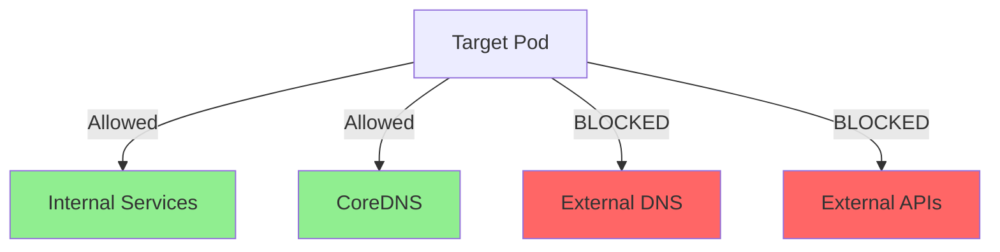

# How to Emulate Network Failures in a Kubernetes Cluster Running Cilium

Author: [nawazdhandala](https://github.com/nawazdhandala)

Tags: Cilium, Kubernetes, Chaos Engineering, Network Failures, Testing

Description: Learn how to emulate network failures in a Kubernetes cluster running Cilium using CiliumNetworkPolicies, traffic control, and chaos engineering techniques to test application resilience.

---

## Introduction

Testing how your applications behave during network failures is critical for building resilient systems. In a Kubernetes cluster running Cilium, you have unique advantages for network failure emulation because Cilium's eBPF-based datapath gives you fine-grained control over packet handling at the kernel level.

Unlike traditional chaos engineering tools that inject failures at the application or container level, Cilium allows you to emulate failures directly in the network datapath. You can selectively drop packets, introduce latency, block specific traffic patterns, and simulate DNS failures -- all using native Cilium features.

This guide covers practical techniques for emulating various types of network failures in a Cilium-powered cluster, from simple connectivity drops to sophisticated partial failure scenarios.

## Prerequisites

- Kubernetes cluster with Cilium installed
- kubectl and cilium CLI access
- Test workloads deployed in the cluster
- Hubble enabled for observing failure effects
- Familiarity with CiliumNetworkPolicy syntax

## Emulating Complete Network Isolation

Use CiliumNetworkPolicies to completely isolate a pod from the network:

```yaml
# network-isolation.yaml
# This policy drops ALL traffic to and from the target pod
apiVersion: cilium.io/v2
kind: CiliumNetworkPolicy
metadata:
  name: isolate-target-pod
  namespace: default
spec:
  endpointSelector:
    matchLabels:
      app: target-service
  # Empty ingress/egress lists = deny all traffic
  ingress: []
  egress: []
```

```bash
# Apply the isolation policy
kubectl apply -f network-isolation.yaml

# Verify the pod is isolated using Hubble
hubble observe --namespace default --pod default/target-service --verdict DROPPED --last 20

# Test connectivity (should fail)
kubectl run curl-test --image=curlimages/curl --rm -it --restart=Never -- \
  curl -s --connect-timeout 5 http://target-service.default/ 2>&1

# Clean up
kubectl delete -f network-isolation.yaml
```

## Emulating Partial Connectivity Failures

Simulate more realistic failures by blocking specific traffic patterns:

```yaml
# partial-failure.yaml
# Block only external DNS while allowing internal communication
apiVersion: cilium.io/v2
kind: CiliumNetworkPolicy
metadata:
  name: block-external-dns
  namespace: default
spec:
  endpointSelector:
    matchLabels:
      app: target-service
  egress:
    # Allow all internal cluster traffic
    - toEntities:
        - cluster
    # Block external DNS by not including world entity for port 53
  egressDeny:
    - toEntities:
        - world
      toPorts:
        - ports:
            - port: "53"
              protocol: UDP
```

```bash
kubectl apply -f partial-failure.yaml

# The pod can still communicate within the cluster
kubectl exec -it target-service -- wget -qO- --timeout=5 http://other-service.default/
# But external DNS resolution fails
kubectl exec -it target-service -- nslookup external-api.example.com
```



## Emulating DNS Failures

DNS failures are one of the most common real-world failure modes:

```yaml
# dns-failure.yaml
# Block access to kube-dns/CoreDNS
apiVersion: cilium.io/v2
kind: CiliumNetworkPolicy
metadata:
  name: block-dns
  namespace: default
spec:
  endpointSelector:
    matchLabels:
      app: target-service
  egressDeny:
    - toEndpoints:
        - matchLabels:
            k8s-app: kube-dns
            io.kubernetes.pod.namespace: kube-system
      toPorts:
        - ports:
            - port: "53"
              protocol: UDP
            - port: "53"
              protocol: TCP
```

```bash
kubectl apply -f dns-failure.yaml

# DNS queries should fail
kubectl exec target-service -- nslookup kubernetes.default 2>&1
# Expected: connection timed out

# But direct IP access still works
SVC_IP=$(kubectl get svc kubernetes -o jsonpath='{.spec.clusterIP}')
kubectl exec target-service -- wget -qO- --timeout=5 https://$SVC_IP/healthz --no-check-certificate 2>&1

kubectl delete -f dns-failure.yaml
```

## Emulating Port-Specific Failures

Block specific ports to simulate service degradation:

```yaml
# port-failure.yaml
# Block access to a specific backend port while allowing others
apiVersion: cilium.io/v2
kind: CiliumNetworkPolicy
metadata:
  name: block-database-port
  namespace: default
spec:
  endpointSelector:
    matchLabels:
      app: target-service
  egressDeny:
    - toPorts:
        - ports:
            - port: "5432"  # PostgreSQL
              protocol: TCP
            - port: "6379"  # Redis
              protocol: TCP
```

```bash
kubectl apply -f port-failure.yaml

# Observe the dropped connections
hubble observe --namespace default --from-pod default/target-service --verdict DROPPED --to-port 5432

kubectl delete -f port-failure.yaml
```

## Monitoring Failure Impact with Hubble

Use Hubble to observe how your applications respond to failures:

```bash
# Watch all dropped traffic in real time during a failure test
hubble observe --verdict DROPPED --namespace default -o compact

# Analyze the failure pattern
hubble observe --verdict DROPPED --namespace default --last 1000 -o json | python3 -c "
import json, sys
from collections import Counter

reasons = Counter()
destinations = Counter()
for line in sys.stdin:
    f = json.loads(line)
    flow = f.get('flow', {})
    reason = flow.get('drop_reason_desc', 'unknown')
    dst = flow.get('destination', {})
    dst_name = f\"{dst.get('namespace','?')}/{dst.get('pod_name','?')}:{dst.get('port',0)}\"
    reasons[reason] += 1
    destinations[dst_name] += 1

print('Drop reasons:')
for reason, count in reasons.most_common(5):
    print(f'  {reason}: {count}')
print('Top blocked destinations:')
for dst, count in destinations.most_common(5):
    print(f'  {dst}: {count}')
"
```

## Verification

Validate that failure emulation is working as intended:

```bash
# 1. Policy is applied
kubectl get cnp -n default

# 2. Traffic is being dropped
hubble observe --verdict DROPPED --namespace default --last 10

# 3. Application behavior matches expectations
kubectl logs -n default -l app=target-service --tail=20 | grep -i "error\|timeout\|refused"

# 4. Clean up after testing
kubectl delete cnp --all -n default
# Verify traffic flows again
hubble observe --namespace default --verdict FORWARDED --last 10
```

## Troubleshooting

- **Policy not taking effect**: Verify the label selector matches the target pod: `kubectl get pods -n default --show-labels | grep target`.

- **All traffic blocked instead of specific patterns**: Check if you have a default deny policy applied. CiliumNetworkPolicies combine with AND logic for the same endpoint.

- **Cannot observe drops in Hubble**: Ensure Hubble is enabled and the `drop` metric is configured. Run `hubble observe --verdict DROPPED --last 5`.

- **Application does not recover after removing policy**: Some applications cache DNS or connection state. Restart the application pod after removing the failure policy.

## Conclusion

Cilium provides powerful, native tools for network failure emulation in Kubernetes. By using CiliumNetworkPolicies, you can create precise failure scenarios -- from complete isolation to selective port blocking and DNS failures. Combined with Hubble's real-time flow monitoring, you can observe exactly how your applications respond to each type of failure. Use these techniques in staging environments to validate resilience before failures happen in production.
