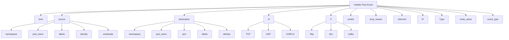

# How to Use Field Mask in Cilium Hubble

Author: [nawazdhandala](https://github.com/nawazdhandala)

Tags: Cilium, Hubble, Field Mask, Observability, Performance

Description: Learn how to configure Hubble field masks to control which flow data fields are exported, reducing storage overhead and protecting sensitive information.

---

## Introduction

Hubble flow events contain dozens of fields including timestamps, source and destination identities, IP addresses, ports, protocol details, L7 metadata, and verdict information. Not all of these fields are relevant for every use case, and exporting all of them increases storage costs and potential data exposure.

Field masks let you specify exactly which fields are included in exported flow data. This is a powerful tool for both performance optimization and data governance, allowing you to strip out unnecessary fields while retaining the information your teams need.

This guide covers how field masks work in Hubble, which fields are available, and how to design masks for common use cases.

## Prerequisites

- Kubernetes cluster with Cilium 1.15+ and Hubble enabled
- Hubble exporter configured
- Helm 3 for configuration management
- Understanding of Hubble flow data structure

## Understanding Hubble Flow Fields

A complete Hubble flow event contains these field groups:

```bash
# View a complete flow event to see all available fields
hubble observe --last 1 -o json | python3 -m json.tool
```



## Configuring Field Masks

Field masks are applied at the exporter level through Helm values:

```yaml
# field-mask-config.yaml
hubble:
  export:
    static:
      enabled: true
      filePath: /var/run/cilium/hubble/events.log
      fileMaxSizeMb: 10
      fileMaxBackups: 5
      fieldMask:
        # Timing
        - time

        # Source identity (without IP)
        - source.namespace
        - source.pod_name
        - source.labels
        - source.workloads

        # Destination identity (without IP)
        - destination.namespace
        - destination.pod_name
        - destination.labels
        - destination.workloads
        - destination.port

        # Transport layer
        - l4.TCP
        - l4.UDP

        # Verdict and classification
        - verdict
        - drop_reason
        - Type
        - event_type
        - Summary
```

```bash
helm upgrade cilium cilium/cilium -n kube-system \
  --reuse-values \
  --values field-mask-config.yaml

kubectl -n kube-system rollout status daemonset/cilium
```

## Field Mask Recipes for Common Use Cases

### Minimal Security Monitoring

```yaml
# Only capture verdict and identity information
fieldMask:
  - time
  - source.namespace
  - source.pod_name
  - destination.namespace
  - destination.pod_name
  - destination.port
  - verdict
  - drop_reason
```

### Network Debugging

```yaml
# Include L4 details for connection analysis
fieldMask:
  - time
  - source.namespace
  - source.pod_name
  - source.identity
  - destination.namespace
  - destination.pod_name
  - destination.identity
  - destination.port
  - l4.TCP
  - l4.UDP
  - l4.ICMPv4
  - verdict
  - drop_reason
  - Type
  - IP.source
  - IP.destination
```

### Full L7 Observability

```yaml
# Include L7 protocol details (larger events)
fieldMask:
  - time
  - source.namespace
  - source.pod_name
  - source.workloads
  - destination.namespace
  - destination.pod_name
  - destination.workloads
  - destination.port
  - l4.TCP
  - l7
  - verdict
  - Type
  - Summary
```

## Measuring Field Mask Impact

Field masks directly affect export file size and I/O overhead:

```bash
# Measure average event size with current field mask
kubectl -n kube-system exec ds/cilium -- sh -c '
  FILE=/var/run/cilium/hubble/events.log
  if [ -f "$FILE" ]; then
    SIZE=$(stat -c %s $FILE 2>/dev/null || stat -f %z $FILE)
    LINES=$(wc -l < $FILE)
    if [ "$LINES" -gt 0 ]; then
      echo "File size: $SIZE bytes"
      echo "Events: $LINES"
      echo "Avg event size: $((SIZE / LINES)) bytes"
    fi
  fi
'

# Compare: full events are typically 500-2000 bytes
# With minimal field mask: 100-300 bytes
# That is a 3-10x reduction in storage

# Check I/O rate on the export file
kubectl -n kube-system exec ds/cilium -- sh -c '
  SIZE1=$(stat -c %s /var/run/cilium/hubble/events.log 2>/dev/null || stat -f %z /var/run/cilium/hubble/events.log)
  sleep 10
  SIZE2=$(stat -c %s /var/run/cilium/hubble/events.log 2>/dev/null || stat -f %z /var/run/cilium/hubble/events.log)
  echo "I/O rate: $(( (SIZE2 - SIZE1) / 10 )) bytes/second"
'
```

## Verification

Confirm field masks are applied correctly:

```bash
# 1. Check that only specified fields are present
kubectl -n kube-system exec ds/cilium -- head -1 /var/run/cilium/hubble/events.log | python3 -c "
import json, sys

def get_all_keys(d, prefix=''):
    keys = []
    for k, v in d.items():
        full_key = f'{prefix}.{k}' if prefix else k
        keys.append(full_key)
        if isinstance(v, dict):
            keys.extend(get_all_keys(v, full_key))
    return keys

flow = json.load(sys.stdin)
all_keys = get_all_keys(flow.get('flow', {}))
print('Fields present:')
for key in sorted(all_keys):
    print(f'  {key}')
"

# 2. Verify excluded fields are not present
kubectl -n kube-system exec ds/cilium -- head -1 /var/run/cilium/hubble/events.log | python3 -c "
import json, sys
flow = json.load(sys.stdin).get('flow', {})
excluded_check = {
    'IP': 'IP' in flow,
    'ethernet': 'ethernet' in flow,
    'l7': 'l7' in flow,
}
for field, present in excluded_check.items():
    status = 'PRESENT (may be unexpected)' if present else 'ABSENT (expected)'
    print(f'{field}: {status}')
"

# 3. Verify data is still useful
kubectl -n kube-system exec ds/cilium -- tail -3 /var/run/cilium/hubble/events.log | python3 -c "
import json, sys
for line in sys.stdin:
    f = json.loads(line)
    flow = f.get('flow', {})
    src = flow.get('source', {})
    dst = flow.get('destination', {})
    print(f\"{src.get('namespace','?')}/{src.get('pod_name','?')} -> {dst.get('namespace','?')}/{dst.get('pod_name','?')} [{flow.get('verdict','?')}]\")
"
```

## Troubleshooting

- **Field mask not applied**: Ensure the Cilium agent pods have been restarted after the Helm upgrade. Field mask changes require a restart.

- **Exported events are empty**: The field mask may reference non-existent field paths. Check the exact field names by viewing a flow without a mask first.

- **Some fields appear despite being masked**: Parent fields may include child fields. For example, masking `source` includes all sub-fields of source. Field masks are inclusive, not exclusive.

- **Export file much larger than expected**: If `l7` is included in the field mask and L7 policies are active, HTTP/DNS data can be large. Remove `l7` from the mask if not needed.

- **Log aggregator cannot parse masked events**: If your downstream pipeline expects specific fields, ensure those fields are included in the mask. Update the pipeline parser if needed.

## Conclusion

Field masks give you precise control over what data Hubble exports. By selecting only the fields relevant to your use case, you reduce storage costs, minimize I/O overhead, and limit data exposure. Start with a minimal mask for security monitoring and progressively add fields as your observability needs grow. Always verify the mask output to ensure the exported data serves your operational requirements.
