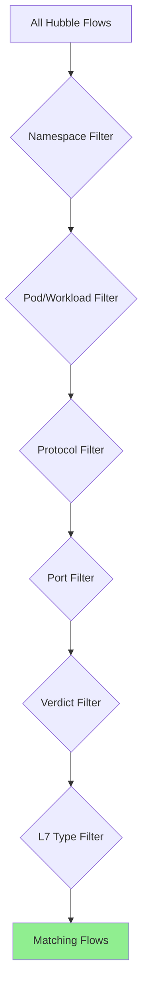

# How to Use Filters in Cilium Hubble

Author: [nawazdhandala](https://github.com/nawazdhandala)

Tags: Cilium, Hubble, Filters, Observability, Network Monitoring

Description: A comprehensive guide to using Hubble filters for targeted network flow observation, covering CLI filters, API filters, and exporter filters for precise traffic analysis.

---

## Introduction

Hubble generates a massive volume of network flow data in active Kubernetes clusters. Without filters, finding the specific flows you need is like searching for a needle in a haystack. Hubble provides a rich filtering system that lets you narrow down flows by namespace, pod, protocol, verdict, port, and many other criteria.

Filters work at multiple levels: the Hubble CLI for interactive debugging, the Hubble API for programmatic access, and the exporter for controlling what data is persisted. Understanding how to compose effective filters is essential for efficient troubleshooting and monitoring.

This guide covers all the major filter types available in Hubble, with practical examples for common use cases.

## Prerequisites

- Kubernetes cluster with Cilium and Hubble enabled
- cilium CLI and hubble CLI installed
- Hubble relay deployed and accessible
- Familiarity with Kubernetes networking concepts

## Hubble CLI Filter Basics

The Hubble CLI supports filtering through command-line flags:

```bash
# Start port-forward to Hubble relay
cilium hubble port-forward &

# Filter by namespace
hubble observe --namespace production

# Filter by specific pod
hubble observe --pod production/frontend-abc123

# Filter by pod label using workload name
hubble observe --to-workload backend

# Filter by source and destination
hubble observe --from-namespace staging --to-namespace production

# Filter by verdict (FORWARDED, DROPPED, ERROR, AUDIT)
hubble observe --verdict DROPPED

# Filter by protocol
hubble observe --protocol TCP
hubble observe --protocol UDP
hubble observe --protocol ICMPv4

# Filter by port
hubble observe --to-port 443
hubble observe --to-port 53

# Combine multiple filters (AND logic)
hubble observe --namespace production --verdict DROPPED --protocol TCP
```

## Advanced Filter Combinations

Complex debugging scenarios require combining multiple filter criteria:

```bash
# Find dropped DNS traffic in production
hubble observe --namespace production --to-port 53 --verdict DROPPED

# Track HTTP traffic to a specific service
hubble observe --to-service default/my-api --protocol TCP --to-port 8080

# Find all traffic from a specific workload to external destinations
hubble observe --from-workload frontend --to-identity world

# Monitor traffic between two specific namespaces
hubble observe --from-namespace frontend-ns --to-namespace backend-ns

# Filter by L7 type (requires L7 visibility policies)
hubble observe --type l7 --protocol http
hubble observe --type l7 --protocol dns

# Filter by HTTP method and status (requires L7 visibility)
hubble observe --http-method GET --http-status 500
```



## Using JSON Output for Programmatic Filtering

For complex analysis, use JSON output with external tools:

```bash
# Export flows as JSON and filter with python
hubble observe --namespace default --last 1000 -o json | python3 -c "
import json, sys

# Find flows with latency > 100ms (if timing data available)
for line in sys.stdin:
    f = json.loads(line)
    flow = f.get('flow', {})
    src = flow.get('source', {})
    dst = flow.get('destination', {})
    verdict = flow.get('verdict', '')

    # Example: find all dropped traffic to port 443
    dst_port = flow.get('l4', {}).get('TCP', {}).get('destination_port', 0)
    if verdict == 'DROPPED' and dst_port == 443:
        print(f\"{src.get('namespace','?')}/{src.get('pod_name','?')} -> {dst.get('namespace','?')}/{dst.get('pod_name','?')}:{dst_port} [{verdict}]\")
"

# Count flows by destination service
hubble observe --namespace production --last 5000 -o json | python3 -c "
import json, sys
from collections import Counter
services = Counter()
for line in sys.stdin:
    f = json.loads(line)
    dst = f.get('flow',{}).get('destination',{})
    svc = f'{dst.get(\"namespace\",\"?\")}/{dst.get(\"pod_name\",\"?\")}'
    services[svc] += 1
for svc, count in services.most_common(10):
    print(f'{count:>6} {svc}')
"
```

## Exporter Filters

Control which flows are persisted by the Hubble exporter:

```yaml
# Exporter filter configuration
hubble:
  export:
    static:
      enabled: true
      filePath: /var/run/cilium/hubble/events.log

      # Allow list: only export flows matching these criteria
      allowList:
        # Export all dropped packets
        - '{"verdict":["DROPPED"]}'
        # Export flows from production namespace
        - '{"source_pod":["production/"]}'
        # Export DNS queries
        - '{"destination_port":["53"]}'

      # Deny list: exclude flows matching these criteria
      denyList:
        # Exclude health checks
        - '{"source_pod":["kube-system/kube-probe"]}'
        # Exclude node-to-node traffic
        - '{"source_pod":["kube-system/cilium"],"destination_pod":["kube-system/cilium"]}'
```

```bash
helm upgrade cilium cilium/cilium -n kube-system \
  --reuse-values \
  --set hubble.export.static.enabled=true \
  --set-json 'hubble.export.static.allowList=["{\"verdict\":[\"DROPPED\"]}"]'
```

## Real-World Filter Recipes

Common filter patterns for specific use cases:

```bash
# Security: Find policy violations
hubble observe --verdict DROPPED --type policy-verdict

# Debugging: Track DNS resolution for a specific service
hubble observe --from-workload my-app --to-port 53 --type l7

# Performance: Find TCP retransmissions
hubble observe --type trace --protocol TCP -o json | python3 -c "
import json, sys
for line in sys.stdin:
    f = json.loads(line)
    flags = f.get('flow',{}).get('l4',{}).get('TCP',{}).get('flags',{})
    if flags.get('RST') or flags.get('SYN') and flags.get('ACK'):
        src = f.get('flow',{}).get('source',{})
        dst = f.get('flow',{}).get('destination',{})
        print(f\"RST/SYNACK: {src.get('pod_name','?')} -> {dst.get('pod_name','?')}\")
"

# Compliance: Audit all external traffic
hubble observe --to-identity world --last 1000

# Incident response: All traffic to/from a compromised pod
hubble observe --pod default/compromised-pod-abc123
```

## Verification

Verify your filters are working as expected:

```bash
# 1. Test a simple filter
hubble observe --namespace default --last 5
# Should only show flows involving the default namespace

# 2. Test verdict filter
hubble observe --verdict DROPPED --last 5
# Should only show dropped flows

# 3. Verify exporter filters
kubectl -n kube-system exec ds/cilium -- tail -5 /var/run/cilium/hubble/events.log | python3 -c "
import json, sys
for line in sys.stdin:
    f = json.loads(line)
    verdict = f.get('flow',{}).get('verdict','')
    print(f'Exported verdict: {verdict}')
"

# 4. Count flows per filter to validate
hubble observe --namespace production --last 1000 -o json 2>/dev/null | wc -l
hubble observe --verdict DROPPED --last 1000 -o json 2>/dev/null | wc -l
```

## Troubleshooting

- **Filters return no results**: Generate traffic matching the filter criteria. Use `kubectl run curl --image=curlimages/curl --rm -it -- curl http://kubernetes.default` to generate test flows.

- **Namespace filter shows flows from other namespaces**: The filter matches flows where either source or destination is in the specified namespace. Use `--from-namespace` or `--to-namespace` for directional filtering.

- **L7 filters not working**: L7 visibility requires either a CiliumNetworkPolicy with L7 rules or explicit visibility annotations. Without these, only L3/L4 data is available.

- **Exporter filters too aggressive**: If the export file is empty, your allow list may be too restrictive. Remove the allow list temporarily to verify flows are being generated.

## Conclusion

Mastering Hubble filters transforms your debugging workflow from scrolling through thousands of flows to pinpointing exact traffic patterns in seconds. Use CLI filters for interactive debugging, JSON output for programmatic analysis, and exporter filters for long-term data management. The key is to start broad and progressively narrow your filters until you find the specific flows relevant to your investigation.
