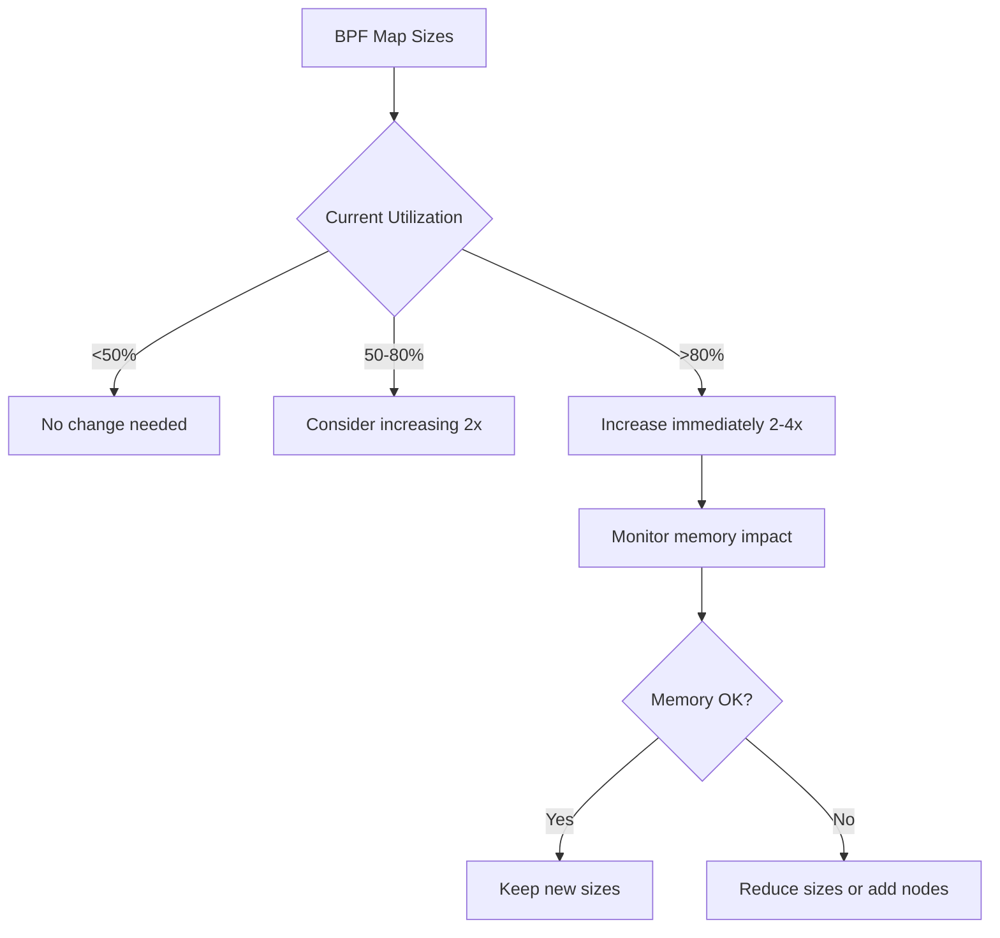

# How to Fix Performance Issues in Cilium

Author: [nawazdhandala](https://github.com/nawazdhandala)

Tags: Cilium, Performance, Optimization, eBPF, Kubernetes

Description: Practical fixes for common Cilium performance issues, including BPF map tuning, policy optimization, datapath mode selection, and resource allocation adjustments.

---

## Introduction

Once you have diagnosed a Cilium performance issue, applying the right fix is critical. Performance optimizations in Cilium range from simple configuration changes -- like adjusting monitor aggregation -- to architectural decisions like changing the datapath mode from tunneling to native routing.

Each fix has trade-offs. Increasing BPF map sizes consumes more memory. Changing datapath modes requires careful planning. Simplifying policies may reduce security granularity. The key is to choose the optimization that addresses your specific bottleneck without introducing new problems.

This guide provides concrete fixes for the most common Cilium performance issues, with clear instructions and trade-off analysis for each.

## Prerequisites

- Cilium performance issue diagnosed (see the diagnosis guide)
- Helm 3 for configuration changes
- kubectl and cilium CLI access
- Ability to restart Cilium agents (causes brief connectivity interruption)

## Fix: Enable Monitor Aggregation

The single most impactful performance fix for most clusters:

```yaml
# performance-fix-aggregation.yaml
# Reduces the volume of events Hubble processes
monitorAggregation: medium
monitorAggregationInterval: 5s
monitorAggregationFlags: "all"
```

```bash
helm upgrade cilium cilium/cilium -n kube-system \
  --reuse-values \
  --set monitorAggregation=medium \
  --set monitorAggregationInterval=5s

kubectl -n kube-system rollout status daemonset/cilium
```

Expected impact: 30-60% CPU reduction on Cilium agents in high-traffic environments.

## Fix: Increase BPF Map Sizes

When connection tracking or NAT tables are full, packets are dropped:

```bash
# Check current map utilization
kubectl -n kube-system exec ds/cilium -- cilium bpf ct list global | wc -l
kubectl -n kube-system exec ds/cilium -- cilium status | grep -A10 "BPF"
```

```yaml
# performance-fix-bpf-maps.yaml
bpf:
  # Connection tracking table sizes
  ctTcpMax: 524288    # Default: 524288, increase for high-connection workloads
  ctAnyMax: 262144    # Default: 262144
  # NAT table size
  natMax: 524288      # Default: 524288
  # Neighbor table size
  neighMax: 524288    # Default: 524288
  # Policy map size (per endpoint)
  policyMapMax: 16384 # Default: 16384
```

```bash
helm upgrade cilium cilium/cilium -n kube-system \
  --reuse-values \
  --set bpf.ctTcpMax=524288 \
  --set bpf.ctAnyMax=262144 \
  --set bpf.natMax=524288
```



## Fix: Optimize Datapath Mode

Switching from VXLAN tunneling to native routing reduces overhead:

```bash
# Check current datapath mode
cilium status | grep "Datapath Mode"

# If using VXLAN and your infrastructure supports direct routing:
```

```yaml
# performance-fix-native-routing.yaml
tunnel: disabled
ipam:
  mode: kubernetes
routingMode: native
autoDirectNodeRoutes: true
ipv4NativeRoutingCIDR: "10.0.0.0/8"  # Adjust to your pod CIDR
```

```bash
# WARNING: Changing tunnel mode requires careful planning
# This will cause network interruption during rollout
helm upgrade cilium cilium/cilium -n kube-system \
  --reuse-values \
  --set tunnel=disabled \
  --set routingMode=native \
  --set autoDirectNodeRoutes=true \
  --set ipv4NativeRoutingCIDR="10.0.0.0/8"
```

Expected impact: 10-20% throughput improvement, reduced latency for cross-node traffic.

## Fix: Optimize Network Policies

Complex policies increase BPF program size and evaluation time:

```bash
# Count policies and their complexity
kubectl get cnp -A -o json | python3 -c "
import json, sys
policies = json.load(sys.stdin)
for p in policies.get('items', []):
    name = f\"{p['metadata']['namespace']}/{p['metadata']['name']}\"
    spec = p.get('spec', {})
    ingress_rules = len(spec.get('ingress', []))
    egress_rules = len(spec.get('egress', []))
    print(f'{name}: ingress={ingress_rules}, egress={egress_rules}')
"
```

Optimization strategies:

```yaml
# Instead of many specific rules, use broader selectors:

# BEFORE (many rules, large BPF program):
# 10 separate ingress rules for 10 different source pods

# AFTER (one rule with label selector):
apiVersion: cilium.io/v2
kind: CiliumNetworkPolicy
metadata:
  name: optimized-policy
  namespace: production
spec:
  endpointSelector:
    matchLabels:
      app: backend
  ingress:
    - fromEndpoints:
        - matchLabels:
            tier: frontend  # One label covers all frontend pods
      toPorts:
        - ports:
            - port: "8080"
              protocol: TCP
```

## Fix: Adjust Resource Limits

Ensure Cilium has enough resources:

```yaml
# performance-fix-resources.yaml
resources:
  requests:
    cpu: 500m
    memory: 512Mi
  limits:
    cpu: 4000m     # Allow bursting for endpoint regeneration
    memory: 4Gi    # Enough for large BPF maps
```

```bash
helm upgrade cilium cilium/cilium -n kube-system \
  --reuse-values \
  --set resources.requests.cpu=500m \
  --set resources.requests.memory=512Mi \
  --set resources.limits.cpu=4000m \
  --set resources.limits.memory=4Gi
```

## Fix: Reduce Hubble Metric Cardinality

```bash
# Check current metric cardinality
kubectl -n kube-system exec ds/cilium -- \
  wget -qO- http://localhost:9965/metrics 2>/dev/null | \
  grep "^hubble_" | wc -l

# Reduce by removing IP-level labels
helm upgrade cilium cilium/cilium -n kube-system \
  --reuse-values \
  --set-json 'hubble.metrics.enabled=["dns","drop","tcp","flow","httpV2:labelsContext=source_namespace,destination_namespace"]'
```

## Verification

After applying fixes, measure improvement:

```bash
# 1. CPU usage should be lower
kubectl -n kube-system top pod -l k8s-app=cilium --sort-by=cpu

# 2. No packet drops from map pressure
kubectl -n kube-system exec ds/cilium -- \
  wget -qO- http://localhost:9962/metrics 2>/dev/null | \
  grep "cilium_drop_count_total" | grep "map"

# 3. Throughput benchmark
kubectl run iperf3-client --image=networkstatic/iperf3 --rm -it --restart=Never -- \
  -c iperf3-server.default -t 30 -P 4

# 4. Endpoint regeneration time
kubectl -n kube-system exec ds/cilium -- \
  wget -qO- http://localhost:9962/metrics 2>/dev/null | \
  grep "cilium_endpoint_regeneration_time_stats"
```

## Troubleshooting

- **Performance worse after fix**: Roll back with `helm rollback cilium -n kube-system`. Check if the fix introduced new issues.

- **Native routing not working**: Your infrastructure must support direct routing between nodes. Cloud providers may require specific network configurations.

- **BPF map increase causes OOM**: Increase the Cilium agent memory limit proportionally. Each doubling of map size adds approximately 256MB memory.

- **Policy optimization breaks connectivity**: Test policy changes in a staging environment first. Use `cilium policy trace` to verify connectivity before and after.

## Conclusion

Fixing Cilium performance issues is about applying targeted changes based on your diagnosis. Monitor aggregation and Hubble metric cardinality are the safest quick wins. BPF map sizing addresses capacity issues. Datapath mode changes provide significant improvement but require careful planning. Always measure before and after each fix to confirm the improvement and watch for regressions.
