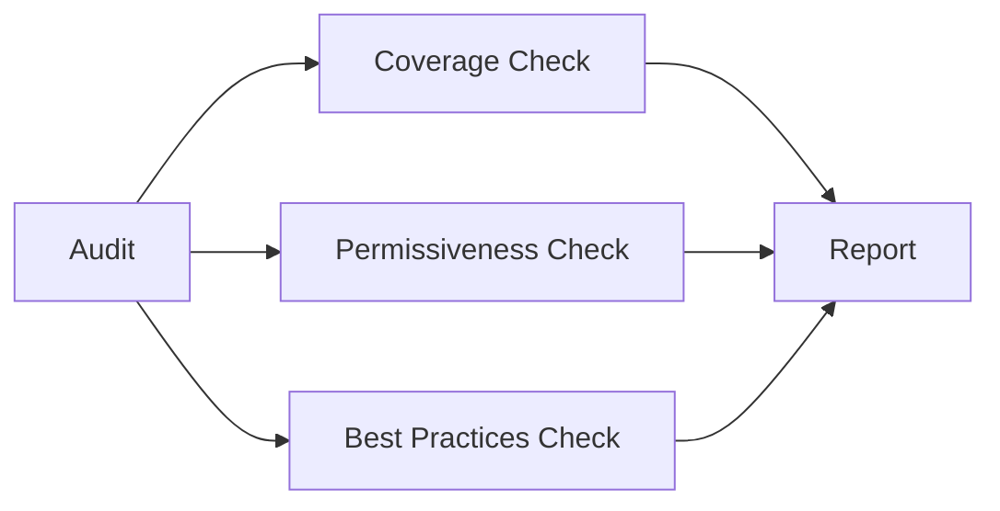

# Auditing a Demo Application Secured with Cilium

Author: [nawazdhandala](https://github.com/nawazdhandala)

Tags: Cilium, Kubernetes, Auditing, Demo Application, Security

Description: How to audit the security posture of a demo application protected by CiliumNetworkPolicy for compliance and best practice adherence.

---

## Introduction

Auditing a secured application checks that policies follow security best practices, cover all pods, and do not contain overly permissive rules. This is important for compliance and security review.

## Prerequisites

- Kubernetes cluster with Cilium and secured application
- kubectl configured

## Policy Coverage Audit

```bash
#!/bin/bash
echo "=== Demo App Security Audit ==="

NAMESPACE="demo"

# Check all pods have policies
PODS=$(kubectl get pods -n $NAMESPACE --no-headers -o custom-columns=":metadata.name,:metadata.labels")
echo "Pods in namespace:"
kubectl get pods -n $NAMESPACE --show-labels

echo ""
echo "Policies:"
kubectl get ciliumnetworkpolicies -n $NAMESPACE

echo ""
echo "Endpoint policy status:"
kubectl get ciliumendpoints -n $NAMESPACE -o json | jq '.items[] | {
  name: .metadata.name,
  ingress_enforcing: .status.policy.ingress.enforcing,
  egress_enforcing: .status.policy.egress.enforcing
}'
```

## Checking for Overly Permissive Rules

```bash
# Check for allow-all ingress
kubectl get ciliumnetworkpolicies -n demo -o json | jq '.items[] | select(.spec.ingress[]? | .fromEndpoints[]? == {}) | .metadata.name'

# Check for missing egress restrictions
kubectl get ciliumnetworkpolicies -n demo -o json | jq '.items[] | select(.spec.egress == null) | .metadata.name'
```

## Generating Audit Report

```bash
echo "=== Audit Report ==="
echo "Namespace: demo"
echo "Date: $(date)"
echo "Total policies: $(kubectl get ciliumnetworkpolicies -n demo --no-headers | wc -l)"
echo "Default deny present: $(kubectl get ciliumnetworkpolicies -n demo -o name | grep -c deny)"
echo "Pods with enforcement: $(kubectl get ciliumendpoints -n demo -o json | jq '[.items[] | select(.status.policy.ingress.enforcing == true)] | length')"
```



## Verification

```bash
kubectl get ciliumnetworkpolicies -n demo
```

## Troubleshooting

- **Pods without enforcement**: Check that policies select those pods.
- **Overly permissive rules found**: Replace with specific selectors.

## Conclusion

Audit secured applications for policy coverage, rule specificity, and best practice compliance. Regular audits maintain security posture as applications evolve.