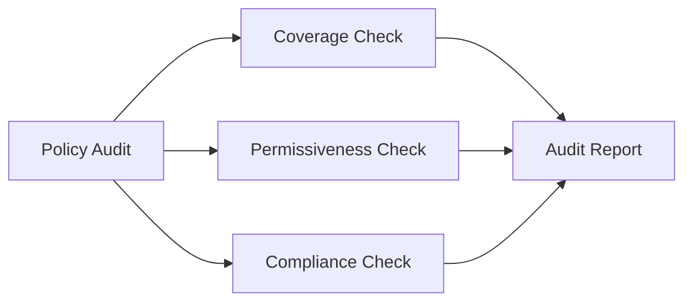

# Auditing Sample Network Policies in Cilium

Author: [nawazdhandala](https://github.com/nawazdhandala)

Tags: Cilium, Kubernetes, Network Policy, Auditing, Security

Description: How to audit CiliumNetworkPolicy configurations for security compliance, least-privilege enforcement, and policy coverage across namespaces.

---

## Introduction

Auditing network policies checks that your security posture is maintained: all namespaces have appropriate policies, policies follow least-privilege principles, and there are no gaps in coverage.

## Prerequisites

- Kubernetes cluster with Cilium
- kubectl configured

## Auditing Policy Coverage

```bash
#!/bin/bash
echo "=== Network Policy Audit ==="

for ns in $(kubectl get namespaces -o jsonpath='{.items[*].metadata.name}'); do
  if [[ "$ns" == kube-* ]]; then continue; fi
  
  POLICY_COUNT=$(kubectl get ciliumnetworkpolicies -n "$ns" --no-headers 2>/dev/null | wc -l)
  POD_COUNT=$(kubectl get pods -n "$ns" --no-headers 2>/dev/null | wc -l)
  
  if [ "$POD_COUNT" -gt 0 ] && [ "$POLICY_COUNT" -eq 0 ]; then
    echo "AUDIT FAIL: Namespace '$ns' has $POD_COUNT pods but NO policies"
  else
    echo "OK: Namespace '$ns' has $POLICY_COUNT policies for $POD_COUNT pods"
  fi
done
```

## Auditing Policy Rules

```bash
# Check for overly permissive policies
kubectl get ciliumnetworkpolicies --all-namespaces -o json | jq '.items[] | select(
  .spec.ingress == [{"fromEndpoints": [{}]}] or
  .spec.egress == [{"toEndpoints": [{}]}]
) | "WARN: \(.metadata.namespace)/\(.metadata.name) has allow-all rule"'

# Check for policies without egress restrictions
kubectl get ciliumnetworkpolicies --all-namespaces -o json | jq '.items[] | select(.spec.egress == null) | "INFO: \(.metadata.namespace)/\(.metadata.name) has no egress rules"'
```



## Generating Audit Report

```bash
#!/bin/bash
echo "=== Cilium Network Policy Audit Report ==="
echo "Date: $(date)"
echo "Total policies: $(kubectl get ciliumnetworkpolicies --all-namespaces --no-headers | wc -l)"
echo "Cluster-wide policies: $(kubectl get ciliumclusterwidenetworkpolicies --no-headers 2>/dev/null | wc -l)"
echo ""
echo "Namespaces without policies:"
for ns in $(kubectl get namespaces -o jsonpath='{.items[*].metadata.name}'); do
  if [[ "$ns" == kube-* ]]; then continue; fi
  COUNT=$(kubectl get ciliumnetworkpolicies -n "$ns" --no-headers 2>/dev/null | wc -l)
  PODS=$(kubectl get pods -n "$ns" --no-headers 2>/dev/null | wc -l)
  if [ "$PODS" -gt 0 ] && [ "$COUNT" -eq 0 ]; then
    echo "  - $ns ($PODS pods)"
  fi
done
```

## Verification

```bash
kubectl get ciliumnetworkpolicies --all-namespaces
kubectl get ciliumclusterwidenetworkpolicies
```

## Troubleshooting

- **Namespaces without policies**: Apply default deny and add specific allow rules.
- **Allow-all rules found**: Replace with specific selectors and port rules.
- **Audit script slow**: Process namespaces in parallel for large clusters.

## Conclusion

Audit network policies regularly for coverage, permissiveness, and compliance. Ensure every namespace with pods has appropriate policies and that no allow-all rules exist without justification.