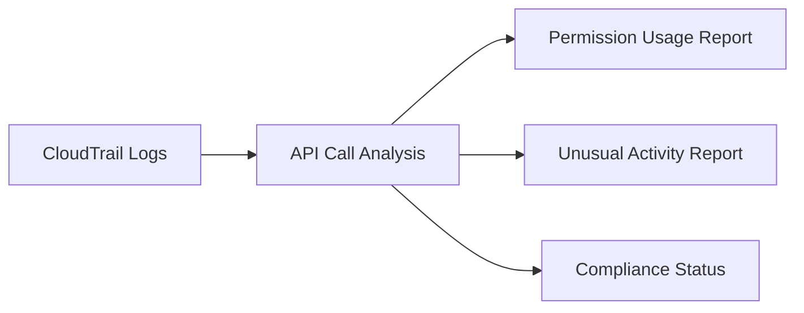

# Auditing AWS Access Keys and IAM Roles in Cilium

Author: [nawazdhandala](https://github.com/nawazdhandala)

Tags: Cilium, Kubernetes, AWS, IAM, Auditing

Description: How to audit AWS access key and IAM role usage in Cilium for compliance, security review, and credential hygiene.

---

## Introduction

Auditing AWS IAM in Cilium tracks credential usage patterns, identifies permission creep, and ensures compliance with security policies. Regular audits catch issues like unused permissions, credential age, and unusual API call patterns.

## Prerequisites

- EKS cluster with Cilium
- AWS CloudTrail enabled
- AWS CLI configured

## Auditing Credential Age and Rotation

```bash
# Check when the IAM role was last used
aws iam get-role --role-name cilium-role \
  --query 'Role.RoleLastUsed'

# Check access key age (if using static keys)
aws iam list-access-keys --user-name cilium-user \
  --query 'AccessKeyMetadata[].CreateDate'
```

## Auditing API Call Patterns

```bash
# Review Cilium API calls in the last 7 days
aws cloudtrail lookup-events \
  --lookup-attributes AttributeKey=Username,AttributeValue=cilium-role \
  --start-time $(date -d '7 days ago' +%Y-%m-%dT%H:%M:%S) \
  --query 'Events[].EventName' --output text | tr '\t' '\n' | sort | uniq -c | sort -rn

# Look for denied API calls
aws cloudtrail lookup-events \
  --lookup-attributes AttributeKey=Username,AttributeValue=cilium-role \
  --start-time $(date -d '7 days ago' +%Y-%m-%dT%H:%M:%S) | \
  jq '.Events[] | select(.CloudTrailEvent | fromjson | .errorCode != null) | {event: .EventName, error: (.CloudTrailEvent | fromjson | .errorCode)}'
```



## Generating Audit Report

```bash
#!/bin/bash
echo "=== Cilium AWS IAM Audit Report ==="
echo "Date: $(date)"

echo ""
echo "--- Role Information ---"
aws iam get-role --role-name cilium-role --query 'Role.{Arn: Arn, Created: CreateDate, LastUsed: RoleLastUsed}'

echo ""
echo "--- Attached Policies ---"
aws iam list-attached-role-policies --role-name cilium-role

echo ""
echo "--- API Call Summary (7 days) ---"
aws cloudtrail lookup-events \
  --lookup-attributes AttributeKey=Username,AttributeValue=cilium-role \
  --start-time $(date -d '7 days ago' +%Y-%m-%dT%H:%M:%S) \
  --query 'Events[].EventName' --output text | tr '\t' '\n' | sort | uniq -c | sort -rn
```

## Verification

```bash
aws iam get-role --role-name cilium-role
cilium status
```

## Troubleshooting

- **CloudTrail not showing events**: Ensure trail is enabled for the correct region.
- **Cannot identify Cilium calls**: Check the assumed role name in CloudTrail.

## Conclusion

Audit AWS IAM for Cilium regularly. Review API call patterns, check for denied calls that indicate permission issues, and verify credentials are rotated. Document audit findings for compliance.