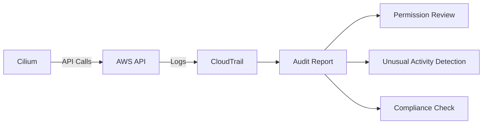

# Auditing AWS Secrets in Cilium Security Configurations

Author: [nawazdhandala](https://github.com/nawazdhandala)

Tags: Cilium, Kubernetes, AWS, Auditing, Security

Description: How to audit AWS credential usage and security in Cilium deployments using CloudTrail, IAM analysis, and Kubernetes audit logs.

---

## Introduction

Auditing AWS secrets in Cilium means reviewing how credentials are stored, used, and rotated. Regular audits catch security issues like overly broad IAM policies, stale credentials, and credential exposure in logs or ConfigMaps.

## Prerequisites

- EKS or AWS Kubernetes cluster with Cilium
- AWS CLI with CloudTrail access
- kubectl configured

## Auditing IAM Policy Scope

```bash
# List all policies attached to the Cilium role
aws iam list-attached-role-policies --role-name cilium-role

# Get the policy document
aws iam get-role-policy --role-name cilium-role --policy-name CiliumPolicy

# Check for overly broad permissions
aws iam simulate-principal-policy \
  --policy-source-arn arn:aws:iam::123456789012:role/cilium-role \
  --action-names s3:ListBuckets iam:CreateUser ec2:TerminateInstances
```

## Auditing Credential Usage via CloudTrail

```bash
# Find all API calls made by Cilium
aws cloudtrail lookup-events \
  --lookup-attributes AttributeKey=Username,AttributeValue=cilium-role \
  --start-time $(date -d '7 days ago' +%Y-%m-%dT%H:%M:%S) \
  --max-items 50

# Check for unusual API calls
aws cloudtrail lookup-events \
  --lookup-attributes AttributeKey=Username,AttributeValue=cilium-role \
  --start-time $(date -d '24 hours ago' +%Y-%m-%dT%H:%M:%S) | \
  jq '.Events[].EventName' | sort | uniq -c | sort -rn
```



## Auditing Kubernetes Secret Storage

```bash
# Check for AWS credentials in secrets
kubectl get secrets -n kube-system -o json | \
  jq '.items[] | select(.data | keys[] | test("aws|key|secret"; "i")) | .metadata.name'

# Check for credentials in environment variables
kubectl get deployment cilium-operator -n kube-system -o json | \
  jq '.spec.template.spec.containers[].env[] | select(.name | test("AWS"; "i"))'

# Audit RBAC for secret access
kubectl get rolebindings,clusterrolebindings -A -o json | \
  jq '.items[] | select(.roleRef.name | test("secret"; "i")) | .metadata.name'
```

## Verification

```bash
# Verify audit findings
aws iam get-role --role-name cilium-role
kubectl exec -n kube-system -l k8s-app=cilium -- aws sts get-caller-identity
```

## Troubleshooting

- **CloudTrail not logging Cilium calls**: Check CloudTrail is enabled for the region.
- **Cannot identify Cilium calls**: The caller identity depends on IRSA vs instance profile.
- **Stale credentials found**: Rotate immediately and switch to IRSA.

## Conclusion

Regular auditing of AWS secrets in Cilium catches permission creep, credential exposure, and usage anomalies. Use CloudTrail for API call auditing, IAM analysis for permission review, and Kubernetes audit for secret storage checks.