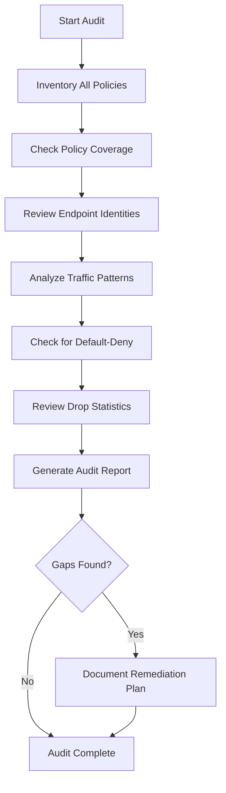

# Auditing DNS, Port, and L7 Combined Rules in Cilium

Author: [nawazdhandala](https://github.com/nawazdhandala)

Tags: Cilium, Kubernetes, Network Security, DNS, Security Auditing

Description: Learn how to audit combined DNS, port, and L7 rules in Cilium for Kubernetes. This guide covers practical compliance verification with real examples and commands.

---

## Introduction

Auditing combined DNS, port, and L7 rules in Cilium is essential for maintaining compliance, tracking policy changes, and ensuring that your security controls meet organizational requirements. Regular audits help identify gaps, unused policies, and potential misconfigurations.

A comprehensive audit examines policy coverage, endpoint identity assignments, traffic patterns, and configuration consistency across all cluster nodes. This guide provides a structured auditing framework for your multi-layer security policies.

By establishing regular audit procedures, your security team can maintain continuous visibility into the cluster's network security posture and demonstrate compliance with internal and external standards.

## Prerequisites

- Kubernetes cluster with Cilium (v1.14+) installed
- `cilium` CLI and Hubble CLI available
- `kubectl` and `jq` installed
- Access to cluster audit logs
- Knowledge of your compliance requirements

## Policy Inventory Audit

Start by creating a complete inventory of all Cilium network policies:

```bash
# Inventory all policies across the cluster
kubectl get cnp --all-namespaces -o json | jq '.items[] | {ns: .metadata.namespace, name: .metadata.name}'
```



### Checking Policy Coverage

```bash
# Check policy coverage for all endpoints
cilium endpoint list -o json | jq '[.[] | .status.policy.realized] | length'

# Identify endpoints without any policy
cilium endpoint list -o json | \
  jq '.[] | select(
    .status.policy.realized."l4-ingress" == null and
    .status.policy.realized."l4-egress" == null
  ) | {id: .id, labels: .status.labels.id}'
```

## Configuration Audit

Verify that Cilium is configured with the expected security settings:

```bash
# Review Cilium configuration for security settings
cilium config view | grep -E 'policy|audit|monitor'

# Check for consistent configuration across nodes
kubectl -n kube-system get pods -l k8s-app=cilium -o name | while read pod; do
  echo "=== $pod ==="
  kubectl -n kube-system exec "$pod" -c cilium-agent -- \
    cilium config view | grep -E "policy-enforcement|enable-l7|enable-hubble"
done
```

## Auditing Existing Policies

Review the policies currently in place for completeness and correctness:

```yaml
# Example of a well-documented policy with audit annotations
apiVersion: "cilium.io/v2"
kind: CiliumNetworkPolicy
metadata:
  name: combined-l7-policy
  namespace: production
spec:
  endpointSelector:
    matchLabels:
      app: api-gateway
  egress:
    - toEndpoints:
        - matchLabels:
            io.kubernetes.pod.namespace: kube-system
            k8s-app: kube-dns
      toPorts:
        - ports:
            - port: "53"
              protocol: ANY
          rules:
            dns:
              - matchPattern: "*.backend.local"
    - toFQDNs:
        - matchPattern: "*.backend.local"
      toPorts:
        - ports:
            - port: "8080"
              protocol: TCP
          rules:
            http:
              - method: "GET"
                path: "/api/v1/.*"
              - method: "POST"
                path: "/api/v1/data"
                headers:
                  - 'Content-Type: application/json'
```

```bash
# Check for policies without proper annotations
kubectl get cnp --all-namespaces -o json | \
  jq '.items[] | select(.metadata.annotations == null) | {
    namespace: .metadata.namespace,
    name: .metadata.name,
    warning: "Missing audit annotations"
  }'
```

## Generating Audit Reports

Create structured audit reports for compliance documentation:

```bash
#!/bin/bash
# generate-audit-report.sh
# Creates a comprehensive Cilium audit report

REPORT_DATE=$(date -u +%Y-%m-%dT%H:%M:%SZ)
OUTPUT="cilium-audit-$(date +%Y%m%d).json"

# Gather audit data
TOTAL_ENDPOINTS=$(cilium endpoint list -o json | jq 'length')
TOTAL_POLICIES=$(kubectl get cnp --all-namespaces -o json | jq '.items | length')
TOTAL_CCNP=$(kubectl get ccnp -o json 2>/dev/null | jq '.items | length' 2>/dev/null || echo 0)

# Count endpoints with policies
COVERED=$(cilium endpoint list -o json | \
  jq '[.[] | select(.status.policy.realized."l4-ingress" != null)] | length')

# Build JSON report
jq -n \
  --arg date "$REPORT_DATE" \
  --argjson endpoints "$TOTAL_ENDPOINTS" \
  --argjson policies "$TOTAL_POLICIES" \
  --argjson ccnp "$TOTAL_CCNP" \
  --argjson covered "$COVERED" \
  '{
    audit_date: $date,
    summary: {
      total_endpoints: $endpoints,
      total_namespace_policies: $policies,
      total_clusterwide_policies: $ccnp,
      endpoints_with_policy: $covered,
      coverage_percentage: (if $endpoints > 0 then ($covered * 100 / $endpoints) else 0 end)
    }
  }' > "$OUTPUT"

echo "Audit report saved to $OUTPUT"
cat "$OUTPUT" | jq .
```

## Verification

```bash
# Generate audit summary
cilium policy get -o json | jq '.[].metadata.name'
```

```bash
# Review drop statistics
hubble observe --verdict DROPPED --last 100 -o json | jq -r '.flow.drop_reason_desc' | sort | uniq -c | sort -rn
```

```bash
# Verify endpoint identity assignments
cilium identity list | head -30
```

## Troubleshooting

- **Audit script times out on large clusters**: Process namespaces in batches and increase kubectl request timeout.
- **Inconsistent data across nodes**: Ensure all Cilium agents are running the same version with `cilium version`.
- **Cannot access Hubble metrics**: Verify Hubble is enabled and the relay is healthy.
- **Policy count mismatch**: Some policies may be in a failed state. Check with `kubectl describe cnp -A | grep "Enforcement"`.

## Conclusion

Regular auditing of combined DNS, port, and L7 rules in Cilium provides the visibility needed to maintain a strong security posture. By automating audit report generation and integrating it into your compliance workflows, you can ensure that policy coverage remains comprehensive and that no gaps go undetected. Schedule audits at regular intervals, review findings with your security team, and use the results to drive continuous improvement in your network security configuration.
