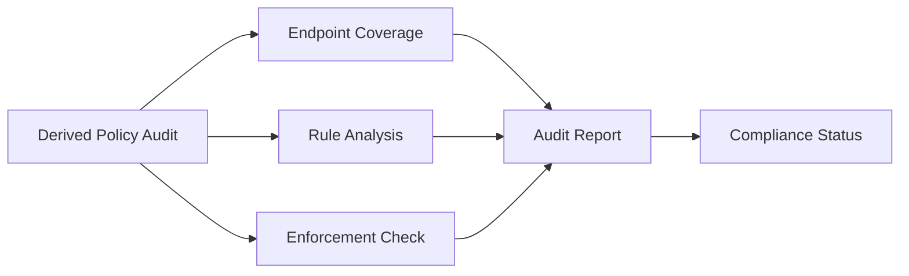

# Auditing Derived Policy Creation in Cilium

Author: [nawazdhandala](https://github.com/nawazdhandala)

Tags: Cilium, Kubernetes, Derived Policy, Auditing, Security

Description: How to audit Cilium derived policy creation for security compliance, policy coverage, and enforcement consistency across all cluster endpoints.

---

## Introduction

Auditing derived policy creation provides a complete picture of the effective security rules across your cluster. This audit ensures every endpoint has appropriate policies, no endpoints are unprotected, and the derived rules match organizational security requirements.

## Prerequisites

- Kubernetes cluster with Cilium and policies applied
- kubectl and Cilium CLI configured

## Comprehensive Policy Audit

```bash
#!/bin/bash
echo "=== Derived Policy Audit Report ==="
echo "Date: $(date)"
echo ""

# Overall statistics
TOTAL_ENDPOINTS=$(cilium endpoint list -o json | jq '. | length')
READY_ENDPOINTS=$(cilium endpoint list -o json | jq '[.[] | select(.status.state == "ready")] | length')
TOTAL_POLICIES=$(kubectl get ciliumnetworkpolicies --all-namespaces --no-headers | wc -l)
CW_POLICIES=$(kubectl get ciliumclusterwidenetworkpolicies --no-headers 2>/dev/null | wc -l)

echo "Total endpoints: $TOTAL_ENDPOINTS"
echo "Ready endpoints: $READY_ENDPOINTS"
echo "Total policies: $TOTAL_POLICIES"
echo "Cluster-wide policies: $CW_POLICIES"
echo ""

# Endpoints without policy enforcement
echo "--- Endpoints without policy enforcement ---"
cilium endpoint list -o json | jq '.[] | select(.status.policy.spec."policy-enabled" != true) | {id: .id, labels: .status.labels["security-relevant"]}'
echo ""

# Policy coverage by namespace
echo "--- Policy coverage by namespace ---"
for ns in $(kubectl get namespaces -o jsonpath='{.items[*].metadata.name}'); do
  if [[ "$ns" == kube-* ]]; then continue; fi
  PODS=$(kubectl get pods -n "$ns" --no-headers 2>/dev/null | wc -l)
  POLICIES=$(kubectl get ciliumnetworkpolicies -n "$ns" --no-headers 2>/dev/null | wc -l)
  if [ "$PODS" -gt 0 ]; then
    echo "  $ns: $PODS pods, $POLICIES policies"
  fi
done
```

## Auditing Specific Security Requirements

```bash
# Check all endpoints enforce ingress policy
cilium endpoint list -o json | jq '[.[] | select(.status.policy.realized."allowed-ingress-identities" == null or (.status.policy.realized."allowed-ingress-identities" | length) == 0)] | length' 

# Check for endpoints allowing all identities
cilium endpoint list -o json | jq '.[] | select(.status.policy.realized."allowed-ingress-identities" // [] | length > 100) | {id: .id, allowed_count: (.status.policy.realized."allowed-ingress-identities" | length)}'
```



## Generating Machine-Readable Report

```bash
# Generate JSON audit report
cilium endpoint list -o json | jq '[.[] | {
  id: .id,
  state: .status.state,
  identity: .status.identity.id,
  labels: .status.labels["security-relevant"],
  ingress_rules: (.status.policy.realized."allowed-ingress-identities" // [] | length),
  egress_rules: (.status.policy.realized."allowed-egress-identities" // [] | length)
}]' > /tmp/policy-audit-report.json

echo "Audit report saved to /tmp/policy-audit-report.json"
```

## Verification

```bash
cilium endpoint list
cilium policy get
cat /tmp/policy-audit-report.json | jq '. | length'
```

## Troubleshooting

- **Many endpoints without policies**: Apply default deny to namespaces missing policies.
- **Endpoints with too many allowed identities**: Review policies for overly broad selectors.
- **Audit report shows inconsistencies**: Re-run after agent regeneration completes.

## Conclusion

Audit derived policy creation to ensure comprehensive security coverage. Check endpoint policy state, verify rule counts are reasonable, and generate reports for compliance documentation. Regular audits catch policy drift and ensure every endpoint is protected.