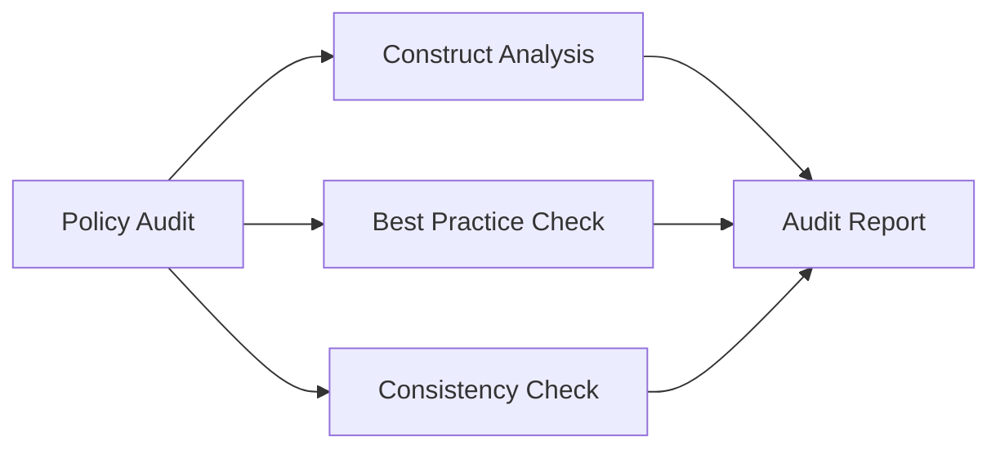

# Auditing Cilium Policy Language Usage

Author: [nawazdhandala](https://github.com/nawazdhandala)

Tags: Cilium, Kubernetes, Policy Language, Auditing, Security

Description: How to audit CiliumNetworkPolicy language usage across a cluster for consistency, best practices, and security compliance.

---

## Introduction

Auditing policy language usage checks that policies across the cluster follow consistent patterns, use appropriate constructs, and do not contain risky configurations. This is important for maintaining a coherent security posture.

## Prerequisites

- Kubernetes cluster with Cilium
- kubectl configured

## Auditing Policy Constructs

```bash
#!/bin/bash
echo "=== Policy Language Audit ==="

# Count policies by type
echo "Policy statistics:"
echo "  CiliumNetworkPolicy: $(kubectl get ciliumnetworkpolicies --all-namespaces --no-headers | wc -l)"
echo "  CiliumClusterwideNetworkPolicy: $(kubectl get ciliumclusterwidenetworkpolicies --no-headers 2>/dev/null | wc -l)"

# Check for L7 rules
L7_COUNT=$(kubectl get ciliumnetworkpolicies --all-namespaces -o json | jq '[.items[] | select(.spec.ingress[]?.toPorts[]?.rules.http != null or .spec.egress[]?.toPorts[]?.rules.http != null)] | length')
echo "  Policies with L7 rules: $L7_COUNT"

# Check for FQDN rules
FQDN_COUNT=$(kubectl get ciliumnetworkpolicies --all-namespaces -o json | jq '[.items[] | select(.spec.egress[]?.toFQDNs != null)] | length')
echo "  Policies with FQDN rules: $FQDN_COUNT"

# Check for entity selectors
ENTITY_COUNT=$(kubectl get ciliumnetworkpolicies --all-namespaces -o json | jq '[.items[] | select(.spec.ingress[]?.fromEntities != null or .spec.egress[]?.toEntities != null)] | length')
echo "  Policies with entity selectors: $ENTITY_COUNT"
```

## Best Practice Checks

```bash
# Check for default deny in each namespace
for ns in $(kubectl get namespaces -o jsonpath='{.items[*].metadata.name}'); do
  if [[ "$ns" == kube-* ]]; then continue; fi
  DENY=$(kubectl get ciliumnetworkpolicies -n "$ns" -o json 2>/dev/null | jq '[.items[] | select(.spec.ingress == [] or .spec.egress == [])] | length')
  if [ "$DENY" -gt 0 ]; then
    echo "OK: $ns has default deny"
  else
    echo "WARN: $ns missing default deny"
  fi
done
```



## Verification

```bash
kubectl get ciliumnetworkpolicies --all-namespaces
```

## Troubleshooting

- **Inconsistent policy patterns**: Standardize policy templates across teams.
- **Missing L7 rules**: Consider adding L7 filtering for HTTP services.
- **No FQDN rules for external access**: Use FQDN instead of CIDR where possible for better security.

## Conclusion

Audit policy language usage to ensure consistency and best practice adherence across the cluster. Track the use of advanced features like L7 filtering and FQDN rules to measure security maturity.