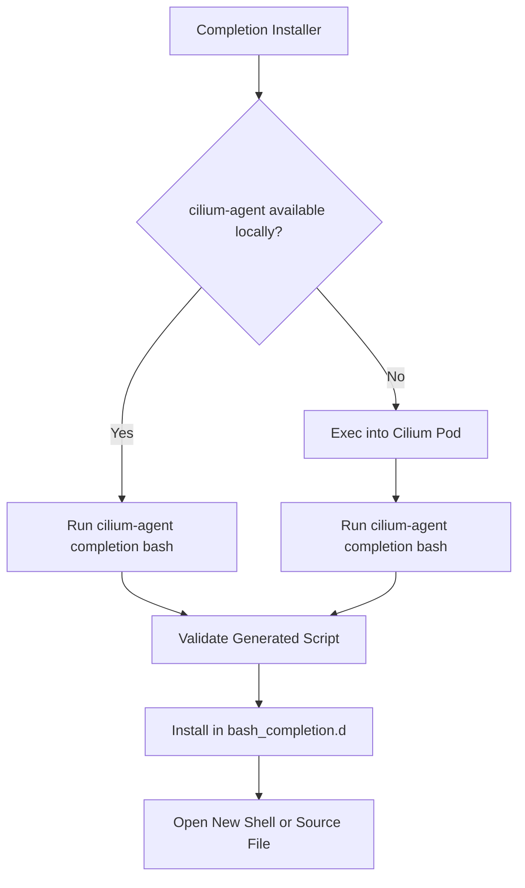

# How to Automate cilium-agent completion bash

Author: [nawazdhandala](https://github.com/nawazdhandala)

Tags: Cilium, Automation, CLI

Description: A practical guide covering how to automate cilium-agent completion bash with step-by-step instructions and real-world examples for production Kubernetes clusters.

---

## Introduction

Shell completion dramatically improves CLI productivity by providing tab-completion for commands, subcommands, flags, and arguments. Setting up completion for Bash takes only a few minutes and saves significant time in daily operations.

In this guide, we cover cilium-agent shell completion for Bash in a Kubernetes environment. Cilium leverages eBPF technology to provide high-performance networking, security, and observability for cloud-native workloads. The eBPF programs are loaded into the Linux kernel, enabling efficient packet processing for cloud-native networking.

Whether you are running a small development cluster or a large production environment with thousands of pods, the techniques in this guide will help you keep cilium-agent completion scripts consistent across workstations and automation environments. We provide step-by-step instructions with real commands and configuration examples that you can adapt to your environment.

## Prerequisites

- A Kubernetes cluster with Cilium installed (v1.14+)
- `kubectl` configured for cluster access
- Bash with the `bash-completion` package installed
- `cilium-agent` binary available locally or access to running Cilium pods
- Basic familiarity with Kubernetes networking concepts
- Access to cluster nodes for troubleshooting (recommended)

## Automation Approach

Automating cilium-agent shell completion for Bash reduces operational overhead and ensures consistency across environments. The cilium-agent binary includes a built-in `completion bash` subcommand that prints the Bash completion script to stdout.

```bash
# Create an automation script for installing cilium-agent Bash completion

cat > /tmp/install-cilium-agent-bash-completion.sh << 'SCRIPT'
#!/bin/bash
# Automated installer for cilium-agent Bash completion

set -euo pipefail

COMPLETION_DIR="${BASH_COMPLETION_DIR:-/etc/bash_completion.d}"
COMPLETION_FILE="cilium-agent"
TMP_FILE="$(mktemp)"

cleanup() {
    rm -f "$TMP_FILE"
}
trap cleanup EXIT

generate_completion() {
    if command -v cilium-agent >/dev/null 2>&1; then
        cilium-agent completion bash > "$TMP_FILE"
        return
    fi

    local cilium_pod
    cilium_pod="$(kubectl -n kube-system get pods -l k8s-app=cilium \
        -o jsonpath='{.items[0].metadata.name}')"

    kubectl -n kube-system exec "$cilium_pod" -c cilium-agent -- \
        cilium-agent completion bash > "$TMP_FILE"
}

install_completion() {
    mkdir -p "$COMPLETION_DIR"

    if grep -q "cilium-agent" "$TMP_FILE" && grep -q "complete" "$TMP_FILE"; then
        install -m 0644 "$TMP_FILE" "$COMPLETION_DIR/$COMPLETION_FILE"
        echo "Installed cilium-agent Bash completion to $COMPLETION_DIR/$COMPLETION_FILE"
    else
        echo "ERROR: generated file does not look like a Bash completion script" >&2
        exit 1
    fi
}

generate_completion
install_completion
SCRIPT
chmod +x /tmp/install-cilium-agent-bash-completion.sh
```

Run the installer with privileges if you write to the system completion directory:

```bash
sudo /tmp/install-cilium-agent-bash-completion.sh
```

For the current shell session, you can load the completion directly:

```bash
source <(cilium-agent completion bash)
```

If the `cilium-agent` binary is only available inside the Cilium container, generate the script from a running pod:

```bash
CILIUM_POD=$(kubectl -n kube-system get pods -l k8s-app=cilium \
  -o jsonpath='{.items[0].metadata.name}')

kubectl -n kube-system exec "$CILIUM_POD" -c cilium-agent -- \
  cilium-agent completion bash > cilium-agent
```

## CI/CD Integration

Integrate Cilium completion generation into your CI/CD pipeline:

```yaml
# .github/workflows/cilium-agent-completion.yaml
# GitHub Actions workflow for validating cilium-agent Bash completion generation
name: Cilium Agent Completion
on:
  push:
    paths:
      - 'k8s/cilium/**'
jobs:
  validate:
    runs-on: ubuntu-latest
    steps:
      - uses: actions/checkout@v4
      - name: Generate completion from Cilium pod
        run: |
          CILIUM_POD=$(kubectl -n kube-system get pods -l k8s-app=cilium -o jsonpath='{.items[0].metadata.name}')
          kubectl -n kube-system exec "$CILIUM_POD" -c cilium-agent -- \
            cilium-agent completion bash > cilium-agent
      - name: Validate generated completion
        run: |
          test -s cilium-agent
          grep -q 'cilium-agent' cilium-agent
          grep -q 'complete' cilium-agent
```

## Scheduled Automation

```bash
# Create a cron job to keep completion up to date after Cilium upgrades
# Add to crontab: sudo crontab -e
# Regenerate cilium-agent Bash completion daily at 2 AM
# 0 2 * * * /tmp/install-cilium-agent-bash-completion.sh >> /var/log/cilium-agent-completion.log 2>&1
```




## Verification

After completing the steps above, run a comprehensive verification to confirm everything is working as expected.

```bash
# Verify the completion file exists and is not empty
test -s /etc/bash_completion.d/cilium-agent

# Load bash-completion if your shell has not loaded it already
if [ -f /usr/share/bash-completion/bash_completion ]; then
  source /usr/share/bash-completion/bash_completion
fi

# Load the generated cilium-agent completion for the current shell
source /etc/bash_completion.d/cilium-agent

# Confirm Bash has a completion rule registered for cilium-agent
complete -p cilium-agent

# Test completion interactively by typing cilium-agent and pressing Tab
```

## Troubleshooting

If you encounter issues during or after the steps in this guide, use the following troubleshooting procedures:

- **`cilium-agent: command not found`**: The binary may only exist inside the Cilium container. Use the `kubectl exec` method above to generate the completion script from a running Cilium pod.

- **Completions not appearing after install**: Start a new shell or source the installed file with `source /etc/bash_completion.d/cilium-agent`. Confirm the `bash-completion` package is installed and loaded.

- **Permission denied writing to the completion directory**: Use `sudo` for system-wide installation or set `BASH_COMPLETION_DIR` to a user-writable directory and source the generated file from your `.bashrc`.

- **Stale completions after Cilium upgrade**: Re-run `/tmp/install-cilium-agent-bash-completion.sh` after upgrading Cilium so the generated completion script matches the current cilium-agent binary.

- **No Cilium pod found**: Verify Cilium is running in the expected namespace with `kubectl -n kube-system get pods -l k8s-app=cilium`. If you installed Cilium in a different namespace, update the namespace in the script.

To generate the completion file manually for further inspection:

```bash
# Generate a cilium-agent Bash completion script
cilium-agent completion bash > cilium-agent
```

## Conclusion

This guide covered cilium-agent shell completion for Bash with practical steps you can apply to your Kubernetes cluster. Regular automation keeps completion scripts aligned with your deployed Cilium version and avoids manual setup drift across environments.

Key takeaways from this guide:

- Generate Bash completion with `cilium-agent completion bash`
- Install the generated file in a Bash completion directory such as `/etc/bash_completion.d`
- Use `kubectl exec` when the cilium-agent binary is only available inside the Cilium pod
- Validate the generated script before installing it system-wide
- Regenerate completions after Cilium upgrades
- Document the completion installation path used by your team

As your cluster grows and evolves, revisit these configurations periodically and adjust them to match your current requirements. The Cilium community and documentation are excellent resources for staying current with best practices and new features.
