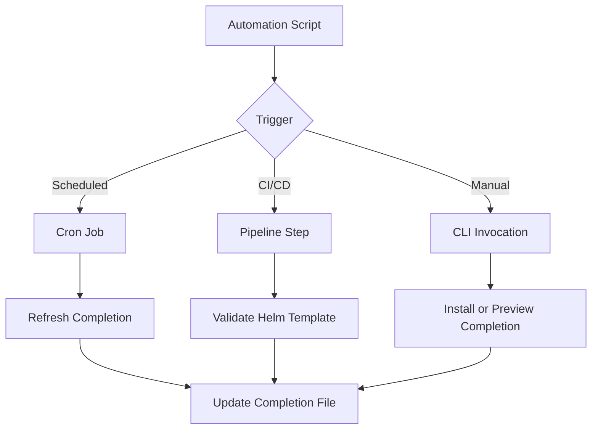

# How to Automate cilium-agent completion fish

Author: [nawazdhandala](https://github.com/nawazdhandala)

Tags: Cilium, Automation, CLI

Description: A practical guide covering how to automate cilium-agent completion fish with step-by-step instructions and real-world examples for production Kubernetes clusters.

---

## Introduction

Shell completion dramatically improves CLI productivity by providing tab-completion for commands, subcommands, flags, and arguments. Setting up completion for Fish takes only a few minutes and saves significant time in daily operations.

In this guide, we cover cilium-agent shell completion for Fish in a Kubernetes environment. Cilium leverages eBPF technology to provide high-performance networking, security, and observability for cloud-native workloads. The eBPF programs are loaded directly into the Linux kernel, enabling efficient packet processing without the overhead of traditional iptables-based networking stacks.

Whether you are running a small development cluster or a large production environment with thousands of pods, the techniques in this guide will help you maintain a reliable Cilium deployment. We provide step-by-step instructions with real commands and configuration examples that you can adapt to your environment.

## Prerequisites

- A running Kubernetes cluster (v1.21+) with Cilium installed (v1.14+)
- `kubectl` configured for cluster access
- `cilium` CLI installed (matching your Cilium version)
- Fish shell installed for validating the generated completion file
- Helm 3.x for configuration management
- Basic familiarity with Kubernetes networking concepts
- Access to cluster nodes for troubleshooting (recommended)
- Prometheus and Grafana for metrics visualization (recommended)

## Automation Approach

Automating cilium-agent shell completion for Fish reduces operational overhead and ensures consistency across environments.

```bash
# Create an automation script for cilium-agent Fish completion

cat > /tmp/cilium-automation.sh << 'SCRIPT'
#!/bin/bash
# Cilium automation script
# This script automates cilium-agent Fish shell completion setup

set -euo pipefail

CILIUM_NAMESPACE="${CILIUM_NAMESPACE:-kube-system}"
COMPLETION_DIR="${XDG_CONFIG_HOME:-$HOME/.config}/fish/completions"
COMPLETION_FILE="$COMPLETION_DIR/cilium-agent.fish"

get_cilium_pod() {
    kubectl -n "$CILIUM_NAMESPACE" get pods -l k8s-app=cilium \
        -o jsonpath='{.items[0].metadata.name}'
}

install_completion() {
    local pod
    pod="$(get_cilium_pod)"
    if [ -z "$pod" ]; then
        echo "No Cilium pod found in namespace $CILIUM_NAMESPACE" >&2
        exit 1
    fi

    mkdir -p "$COMPLETION_DIR"
    kubectl -n "$CILIUM_NAMESPACE" exec "$pod" -c cilium-agent -- \
        cilium-agent completion fish > "$COMPLETION_FILE"

    echo "Installed Fish completion to $COMPLETION_FILE"
    echo "Start a new Fish shell for the completion to take effect."
}

validate_completion() {
    test -s "$COMPLETION_FILE"
    grep -q "cilium-agent" "$COMPLETION_FILE"
    if command -v fish >/dev/null 2>&1; then
        fish -n "$COMPLETION_FILE"
    fi
    echo "Completion file is present and valid."
}

show_completion() {
    local pod
    pod="$(get_cilium_pod)"
    if [ -z "$pod" ]; then
        echo "No Cilium pod found in namespace $CILIUM_NAMESPACE" >&2
        exit 1
    fi

    kubectl -n "$CILIUM_NAMESPACE" exec "$pod" -c cilium-agent -- \
        cilium-agent completion fish | head -20
}

# Main
case "${1:-help}" in
    install) install_completion ;;
    validate) validate_completion ;;
    show) show_completion ;;
    *) echo "Usage: $0 {install|validate|show}" ;;
esac
SCRIPT
chmod +x /tmp/cilium-automation.sh
```

## CI/CD Integration

Integrate Cilium validation into your CI/CD pipeline:

```yaml
# .github/workflows/cilium-validation.yaml
# GitHub Actions workflow for Cilium validation
name: Cilium Validation
on:
  push:
    paths:
      - 'k8s/cilium/**'
jobs:
  validate:
    runs-on: ubuntu-latest
    steps:
      - uses: actions/checkout@v4
      - name: Install Cilium CLI
        run: |
          CILIUM_CLI_VERSION=$(curl -s https://raw.githubusercontent.com/cilium/cilium-cli/main/stable.txt)
          CLI_ARCH=amd64
          curl -L --fail --remote-name-all "https://github.com/cilium/cilium-cli/releases/download/${CILIUM_CLI_VERSION}/cilium-linux-${CLI_ARCH}.tar.gz"
          sudo tar xzvfC cilium-linux-${CLI_ARCH}.tar.gz /usr/local/bin
      - name: Validate Helm Template
        run: |
          helm repo add cilium https://helm.cilium.io/
          helm repo update
          helm template cilium cilium/cilium -f k8s/cilium/values.yaml > /dev/null
```

## Scheduled Automation

```bash
# Create a cron job for regular completion refresh
# Add to crontab: crontab -e
# Refresh the generated cilium-agent Fish completion daily
# 0 2 * * * /tmp/cilium-automation.sh install >> /var/log/cilium-agent-completion.log 2>&1

# Validate the generated completion file every hour
# 0 * * * * /tmp/cilium-automation.sh validate >> /var/log/cilium-agent-completion.log 2>&1
```




## Verification

After completing the steps above, run a comprehensive verification to confirm everything is working as expected.

```bash
# Generate and install the cilium-agent Fish completion
/tmp/cilium-automation.sh install

# Validate the generated completion file
/tmp/cilium-automation.sh validate

# Preview the generated completion content
/tmp/cilium-automation.sh show

# Confirm all Cilium pods are running and ready
kubectl get pods -n kube-system -l k8s-app=cilium -o wide

# Check overall Cilium deployment health
cilium status --verbose

# Verify the Cilium operator is healthy
kubectl get pods -n kube-system -l name=cilium-operator

# Check for recent error events
kubectl get events -n kube-system --sort-by='.lastTimestamp' | grep cilium | tail -10

# Run a connectivity test to validate the data plane
cilium connectivity test --single-node
```

## Troubleshooting

If you encounter issues during or after the steps in this guide, use the following troubleshooting procedures:

- **Cilium agent not starting**: Check resource limits and node capacity with `kubectl describe pod -n kube-system -l k8s-app=cilium`. Verify the BPF filesystem is mounted at `/sys/fs/bpf` and the kernel version is 4.19 or later. Check init container logs with `kubectl logs -n kube-system <pod> -c cilium-init`.

- **Connectivity failures**: Run `cilium connectivity test` and inspect the specific failing test case. Check for conflicting network policies with `kubectl get ciliumnetworkpolicies,ciliumclusterwidenetworkpolicies --all-namespaces`. For node-local datapath details, run `cilium-dbg` commands inside the relevant Cilium pod.

- **Configuration not applied**: Verify the Helm values or ConfigMap are correctly formatted. Run `kubectl rollout restart daemonset/cilium -n kube-system` and wait for the rollout to complete. Confirm with `cilium config view`.

- **High resource usage**: Review resource consumption with `kubectl top pods -n kube-system -l k8s-app=cilium`. Consider tuning label exclusion to reduce identity count. Increase agent memory limits if needed. Check agent metrics with `kubectl -n kube-system exec <pod> -c cilium-agent -- cilium-dbg metrics list | grep process_resident_memory`.

- **Endpoints stuck in regenerating state**: This usually indicates the agent is overloaded or encountering errors during BPF program compilation. Check agent logs with `kubectl logs -n kube-system -l k8s-app=cilium --tail=200 | grep -i error`.

- **Policy not being enforced**: Verify the policy selectors match the intended pods using `kubectl get pods --show-labels`. Confirm the policy is applied with `kubectl get ciliumnetworkpolicies,ciliumclusterwidenetworkpolicies --all-namespaces`. For endpoint identity details, run `kubectl -n kube-system exec <pod> -c cilium-agent -- cilium-dbg endpoint get <id>`.

To collect a comprehensive diagnostic bundle for further analysis:

```bash
# Generate a Cilium sysdump containing all diagnostic information
# This collects logs, configs, BPF maps, and cluster state
cilium sysdump --output-filename cilium-diag-$(date +%Y%m%d)
```

## Conclusion

This guide covered cilium-agent shell completion for Fish with practical steps you can apply to your Kubernetes cluster. Regular monitoring, systematic validation, and proactive management are essential for maintaining a healthy Cilium deployment at any scale.

Key takeaways from this guide:

- Always assess the current state before making changes to your Cilium configuration
- Use Helm for configuration management to ensure consistency and reproducibility across environments
- Monitor Cilium metrics through Prometheus to detect issues before they impact workloads
- Test changes in a staging environment before applying them to production clusters
- Maintain runbooks documenting your Cilium configuration decisions and operational procedures
- Use `cilium sysdump` to collect comprehensive diagnostic data when investigating issues

As your cluster grows and evolves, revisit these configurations periodically and adjust them to match your current requirements. The Cilium community and documentation are excellent resources for staying current with best practices and new features.
