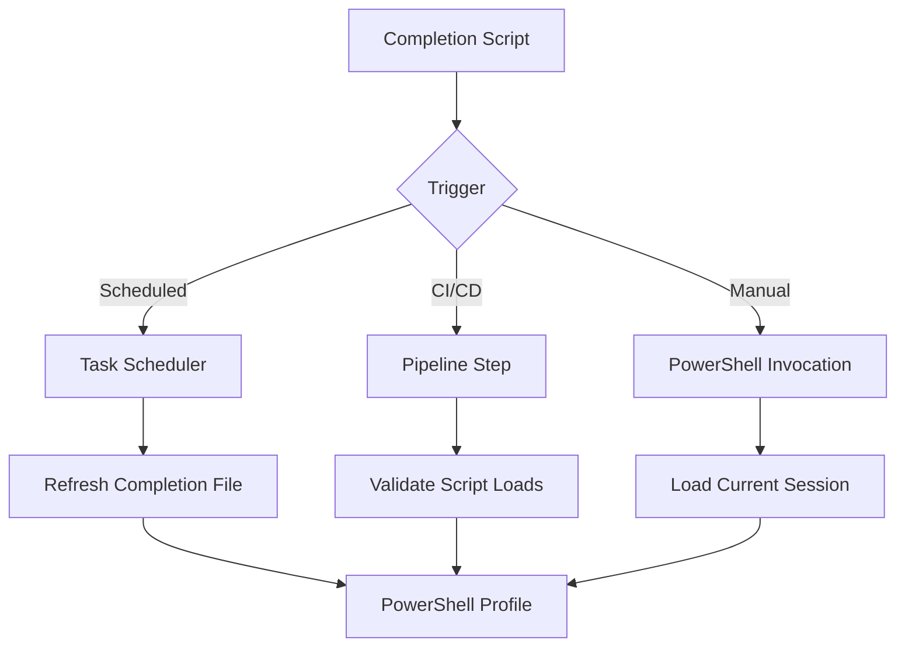

# How to Automate cilium-agent completion powershell

Author: [nawazdhandala](https://github.com/nawazdhandala)

Tags: Cilium, Automation, CLI

Description: A practical guide covering how to automate cilium-agent completion powershell with step-by-step instructions and real-world examples for production Kubernetes clusters.

---

## Introduction

Shell completion dramatically improves CLI productivity by providing tab-completion for commands, subcommands, flags, and arguments. Setting up completion for PowerShell takes only a few minutes and saves significant time in daily operations.

In this guide, we cover cilium-agent shell completion for PowerShell in a Kubernetes environment. Cilium leverages eBPF technology to provide high-performance networking, security, and observability for cloud-native workloads. The eBPF programs are loaded directly into the Linux kernel, enabling efficient packet processing without the overhead of traditional iptables-based networking stacks.

Whether you are running a small development cluster or a large production environment with thousands of pods, the techniques in this guide will help you maintain a reliable Cilium deployment. We provide step-by-step instructions with real commands and configuration examples that you can adapt to your environment.

## Prerequisites

- A running Kubernetes cluster with a supported Cilium version installed
- `kubectl` configured for cluster access if you generate the completion script from a Cilium pod
- `cilium-agent` available locally, or access to a Cilium pod that contains the matching `cilium-agent` binary
- PowerShell 7+ or Windows PowerShell 5.1
- Basic familiarity with Kubernetes networking concepts
- Access to cluster nodes for troubleshooting (recommended)

## Automation Approach

Automating cilium-agent shell completion for PowerShell reduces operational overhead and ensures consistency across environments.

```powershell
# Create or refresh the cilium-agent PowerShell completion script.
# Run this from a machine with cilium-agent installed, or from a workstation
# that can use kubectl to execute cilium-agent inside a Cilium pod.

$profileDir = Split-Path -Parent $PROFILE
$completionPath = Join-Path $profileDir 'cilium-agent-completion.ps1'
New-Item -ItemType Directory -Force -Path $profileDir | Out-Null

if (Get-Command cilium-agent -ErrorAction SilentlyContinue) {
    $completion = @(cilium-agent completion powershell)
}
else {
    $pod = kubectl -n kube-system get pods -l k8s-app=cilium -o jsonpath='{.items[0].metadata.name}'
    $completion = @(kubectl -n kube-system exec $pod -- cilium-agent completion powershell)
}

$start = -1
for ($i = 0; $i -lt $completion.Count; $i++) {
    if ($completion[$i] -like '# powershell completion for cilium-agent*') {
        $start = $i
        break
    }
}

if ($start -lt 0) {
    throw 'Unable to find cilium-agent PowerShell completion content in command output.'
}

$completion[$start..($completion.Count - 1)] | Out-File -Encoding utf8 $completionPath

$profileLine = ". '$completionPath'"
if (-not (Test-Path $PROFILE) -or -not (Select-String -Path $PROFILE -Pattern ([regex]::Escape($completionPath)) -Quiet)) {
    Add-Content -Path $PROFILE -Value $profileLine
}

. $completionPath
```

## CI/CD Integration

Integrate completion generation validation into your CI/CD pipeline:

```yaml
# .github/workflows/cilium-validation.yaml
# GitHub Actions workflow for cilium-agent completion validation
name: Cilium Validation
on:
  push:
    paths:
      - '.github/workflows/cilium-validation.yaml'
jobs:
  validate:
    runs-on: ubuntu-latest
    steps:
      - uses: actions/checkout@v4
      - name: Generate cilium-agent PowerShell completion
        run: |
          CILIUM_VERSION=v1.19.3
          docker run --rm --entrypoint cilium-agent quay.io/cilium/cilium:${CILIUM_VERSION} completion powershell \
            | sed -n '/^# powershell completion for cilium-agent/,$p' > cilium-agent-completion.ps1
          test -s cilium-agent-completion.ps1
      - name: Validate PowerShell script loads
        shell: pwsh
        run: |
          . ./cilium-agent-completion.ps1
          Get-Command TabExpansion2 | Out-Null
```

## Scheduled Automation

```powershell
# Save as $HOME\Refresh-CiliumAgentCompletion.ps1 and run daily from Task Scheduler.
$profileDir = Split-Path -Parent $PROFILE
$completionPath = Join-Path $profileDir 'cilium-agent-completion.ps1'
New-Item -ItemType Directory -Force -Path $profileDir | Out-Null

if (Get-Command cilium-agent -ErrorAction SilentlyContinue) {
    $completion = @(cilium-agent completion powershell)
}
else {
    $pod = kubectl -n kube-system get pods -l k8s-app=cilium -o jsonpath='{.items[0].metadata.name}'
    $completion = @(kubectl -n kube-system exec $pod -- cilium-agent completion powershell)
}

$start = -1
for ($i = 0; $i -lt $completion.Count; $i++) {
    if ($completion[$i] -like '# powershell completion for cilium-agent*') {
        $start = $i
        break
    }
}

if ($start -lt 0) {
    throw 'Unable to find cilium-agent PowerShell completion content in command output.'
}

$completion[$start..($completion.Count - 1)] | Out-File -Encoding utf8 $completionPath
```




## Verification

After completing the steps above, run a comprehensive verification to confirm everything is working as expected.

```powershell
# Verify cilium-agent is available locally
Get-Command cilium-agent

# Generate the completion script directly
cilium-agent completion powershell | Select-String -Pattern '^# powershell completion for cilium-agent'

# Confirm the generated script exists and can be loaded
Test-Path $completionPath
. $completionPath

# Confirm the profile imports the generated completion script
Select-String -Path $PROFILE -Pattern 'cilium-agent-completion.ps1'
```

## Troubleshooting

If you encounter issues during or after the steps in this guide, use the following troubleshooting procedures:

- **`cilium-agent` not found locally**: Generate the completion script from a Cilium pod with `kubectl -n kube-system exec <cilium-pod> -- cilium-agent completion powershell`, or install a matching Cilium agent binary on the workstation where you manage profiles.

- **Profile script not loading**: Check that `$PROFILE` exists and contains the line that dot-sources `cilium-agent-completion.ps1`. Restart PowerShell after updating the profile.

- **Execution policy blocks the profile**: Review the current policy with `Get-ExecutionPolicy -List` and set an appropriate user-scoped policy for your environment, such as `Set-ExecutionPolicy -Scope CurrentUser RemoteSigned`.

- **Completion script is stale after an upgrade**: Regenerate the completion file with the `cilium-agent` binary from the same Cilium version that is running in the cluster.

- **`kubectl exec` cannot find a Cilium pod**: Confirm the namespace and labels with `kubectl get pods -A -l k8s-app=cilium`. Some installations may run Cilium in a namespace other than `kube-system`.

- **Tabs still do not complete**: Make sure you loaded the generated script in the current session with `. $completionPath`, then try a new PowerShell session so the profile is loaded from disk.

To collect a comprehensive diagnostic bundle for further analysis:

```bash
# Generate a Cilium sysdump containing all diagnostic information
# This collects logs, configs, BPF maps, and cluster state
cilium sysdump --output-filename cilium-diag-$(date +%Y%m%d)
```

## Conclusion

This guide covered cilium-agent shell completion for PowerShell with practical steps you can apply to your Kubernetes cluster. Regularly refreshing the generated completion script keeps local automation aligned with the Cilium version you operate.

Key takeaways from this guide:

- Generate completions with `cilium-agent completion powershell`
- Load completions immediately with `cilium-agent completion powershell | Out-String | Invoke-Expression`
- Add the generated completion script to `$PROFILE` for every new PowerShell session
- Regenerate completions after Cilium upgrades so flags and subcommands stay current
- Use `kubectl exec` against a Cilium pod when `cilium-agent` is not installed locally
- Use `cilium sysdump` to collect comprehensive diagnostic data when investigating cluster issues

As your cluster grows and evolves, revisit these configurations periodically and adjust them to match your current requirements. The Cilium community and documentation are excellent resources for staying current with best practices and new features.
