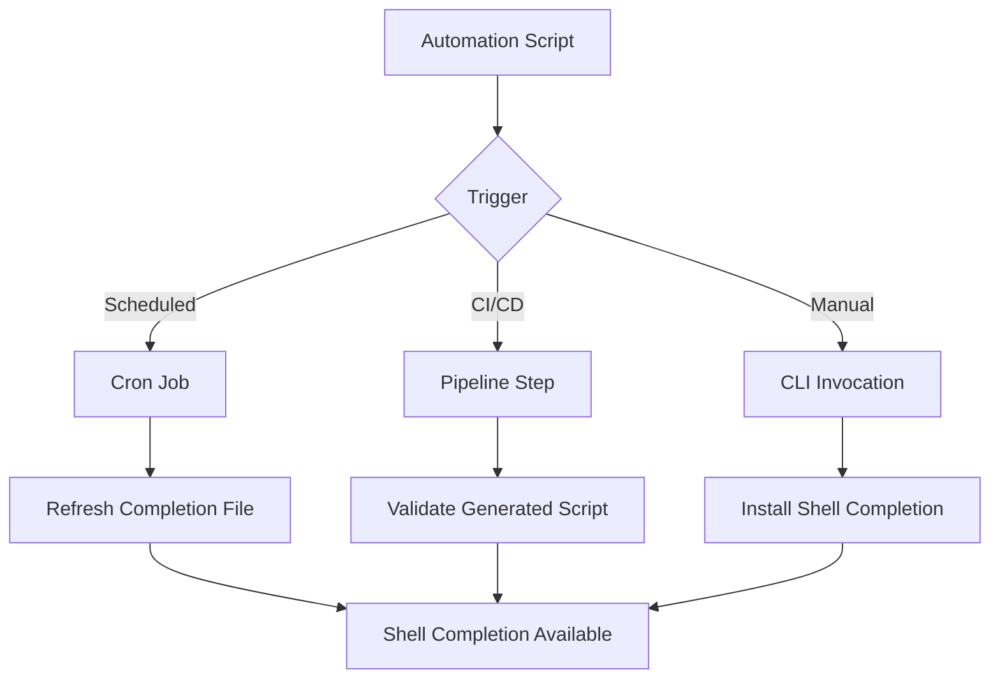

# How to Automate cilium-agent completion

Author: [nawazdhandala](https://github.com/nawazdhandala)

Tags: Cilium, Automation, CLI

Description: A practical guide covering how to automate cilium-agent completion with step-by-step instructions and real-world examples for production Kubernetes clusters.

---

## Introduction

Shell completion dramatically improves CLI productivity by providing tab-completion for commands, subcommands, flags, and arguments. Setting up completion for your shell takes only a few minutes and saves significant time in daily operations.

In this guide, we cover cilium-agent shell completion for your shell in a Kubernetes environment. Cilium leverages eBPF technology to provide high-performance networking, security, and observability for cloud-native workloads. The eBPF programs are loaded directly into the Linux kernel, enabling efficient packet processing and reducing reliance on traditional iptables-based networking paths.

Whether you are running a small development cluster or a large production environment with thousands of pods, the techniques in this guide will help you maintain a reliable Cilium deployment. We provide step-by-step instructions with real commands and configuration examples that you can adapt to your environment.

## Prerequisites

- A running Kubernetes cluster with Cilium installed
- `kubectl` configured for cluster access
- Access to a Cilium agent pod through `kubectl exec`, or a local `cilium-agent` binary that matches your Cilium version
- `bash`, `zsh`, or `fish` installed on the workstation where completion will be configured
- Basic familiarity with Kubernetes networking concepts
- Access to cluster nodes for troubleshooting (recommended)

## Automation Approach

Automating cilium-agent shell completion for your shell reduces operational overhead and ensures consistency across environments.

```bash
# Create an automation script for cilium-agent shell completion

cat > /tmp/cilium-agent-completion.sh << 'SCRIPT'
#!/bin/bash
# cilium-agent completion installer
# This script generates shell completion from a local cilium-agent binary
# or from the cilium-agent binary inside a running Cilium pod.

set -euo pipefail

CILIUM_NAMESPACE="${CILIUM_NAMESPACE:-kube-system}"
CILIUM_SELECTOR="${CILIUM_SELECTOR:-k8s-app=cilium}"

run_cilium_agent() {
    if command -v cilium-agent >/dev/null 2>&1; then
        cilium-agent "$@"
        return
    fi

    local pod
    pod="$(kubectl -n "$CILIUM_NAMESPACE" get pods -l "$CILIUM_SELECTOR" \
        -o jsonpath='{.items[0].metadata.name}')"

    if [ -z "$pod" ]; then
        echo "No Cilium agent pod found in namespace $CILIUM_NAMESPACE with selector $CILIUM_SELECTOR" >&2
        return 1
    fi

    kubectl -n "$CILIUM_NAMESPACE" exec "$pod" -c cilium-agent -- cilium-agent "$@"
}

install_completion() {
    local shell_name="${1:-bash}"

    case "$shell_name" in
        bash)
            local bash_dir="${BASH_COMPLETION_DIR:-$HOME/.local/share/bash-completion/completions}"
            mkdir -p "$bash_dir"
            run_cilium_agent completion bash > "$bash_dir/cilium-agent"
            echo "Installed bash completion to $bash_dir/cilium-agent"
            ;;
        zsh)
            local zsh_dir="${ZSH_COMPLETION_DIR:-$HOME/.zsh/completions}"
            mkdir -p "$zsh_dir"
            run_cilium_agent completion zsh > "$zsh_dir/_cilium-agent"
            echo "Installed zsh completion to $zsh_dir/_cilium-agent"
            echo "Ensure this directory is in fpath before compinit runs: fpath=($zsh_dir \$fpath)"
            ;;
        fish)
            local fish_dir="${FISH_COMPLETION_DIR:-$HOME/.config/fish/completions}"
            mkdir -p "$fish_dir"
            run_cilium_agent completion fish > "$fish_dir/cilium-agent.fish"
            echo "Installed fish completion to $fish_dir/cilium-agent.fish"
            ;;
        *)
            echo "Unsupported shell: $shell_name" >&2
            echo "Supported shells: bash, zsh, fish" >&2
            return 1
            ;;
    esac
}

print_completion() {
    local shell_name="${1:-bash}"
    run_cilium_agent completion "$shell_name"
}

# Main
case "${1:-install}" in
    install) install_completion "${2:-bash}" ;;
    print) print_completion "${2:-bash}" ;;
    *) echo "Usage: $0 {install|print} {bash|zsh|fish}" ;;
esac
SCRIPT
chmod +x /tmp/cilium-agent-completion.sh

# Install completion for your preferred shell
/tmp/cilium-agent-completion.sh install bash
```

## CI/CD Integration

Integrate completion validation into your CI/CD pipeline:

```yaml
# .github/workflows/cilium-agent-completion.yaml
# GitHub Actions workflow for cilium-agent completion validation
name: cilium-agent Completion
on:
  push:
    paths:
      - 'scripts/cilium-agent-completion.sh'
jobs:
  validate:
    runs-on: ubuntu-latest
    steps:
      - uses: actions/checkout@v4
      - name: Validate completion generation
        run: |
          CILIUM_VERSION=v1.19.3
          docker run --rm --entrypoint cilium-agent quay.io/cilium/cilium:${CILIUM_VERSION} completion bash > /tmp/cilium-agent.bash
          test -s /tmp/cilium-agent.bash
          bash -n /tmp/cilium-agent.bash
```

## Scheduled Automation

```bash
# Create a cron job to refresh completion after Cilium upgrades
# Add to crontab: crontab -e
# Run daily for bash completion
# 0 2 * * * /tmp/cilium-agent-completion.sh install bash >> /var/log/cilium-agent-completion.log 2>&1
```




## Verification

After completing the steps above, run a comprehensive verification to confirm everything is working as expected.

```bash
# Verify that cilium-agent can generate completion
/tmp/cilium-agent-completion.sh print bash > /tmp/cilium-agent.bash
test -s /tmp/cilium-agent.bash
bash -n /tmp/cilium-agent.bash

# Verify that the persistent completion file exists
test -s "$HOME/.local/share/bash-completion/completions/cilium-agent"

# Load completion in the current bash session
source "$HOME/.local/share/bash-completion/completions/cilium-agent"
```

## Troubleshooting

If you encounter issues during or after the steps in this guide, use the following troubleshooting procedures:

- **No Cilium agent pod found**: Confirm the namespace and label selector with `kubectl get pods -n kube-system -l k8s-app=cilium`. If your installation uses a different namespace or labels, set `CILIUM_NAMESPACE` or `CILIUM_SELECTOR` before running the script.

- **`kubectl exec` fails**: Verify that your Kubernetes credentials allow exec access to the Cilium pod and that the container name is `cilium-agent`. The script uses `kubectl exec <pod> -c cilium-agent -- cilium-agent completion <shell>`.

- **Completion file is installed but tab completion does not work**: Start a new shell session. For bash, make sure the `bash-completion` package is installed. For zsh, make sure the completion directory is in `fpath` before `compinit` runs.

- **Wrong shell selected**: Re-run the script with the shell name you use, for example `/tmp/cilium-agent-completion.sh install zsh` or `/tmp/cilium-agent-completion.sh install fish`.

To inspect the generated completion without installing it:

```bash
/tmp/cilium-agent-completion.sh print bash | head
```

## Conclusion

This guide covered cilium-agent shell completion for your shell with practical steps you can apply to your Kubernetes workstation. Keeping completion generated from the same cilium-agent version that runs in your cluster helps avoid stale flags and subcommands.

Key takeaways from this guide:

- Generate completion with the `cilium-agent completion` command for the shell you use
- Use a local `cilium-agent` binary when available, or run the command through `kubectl exec` against a Cilium pod
- Refresh completion after upgrading Cilium so shell suggestions match the deployed version
- Validate generated completion scripts in CI before publishing automation changes
- Document the namespace, selector, and shell-specific completion path used by your team

As your cluster grows and evolves, revisit these automation scripts periodically and adjust them to match your current Cilium version and workstation shell conventions. The Cilium community and documentation are excellent resources for staying current with best practices and new features.
