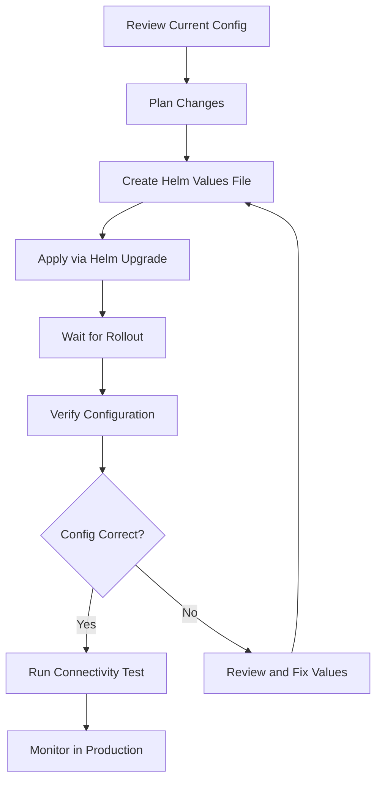

# How to Configure Argo CD show resources permanently out-of-sync in Cilium configuration

Author: [nawazdhandala](https://github.com/nawazdhandala)

Tags: Cilium, Argo CD, Configuration

Description: A practical guide covering how to configure argo cd show resources permanently out-of-sync in cilium configuration with step-by-step instructions and real-world examples for production Kubernetes c...

---

## Introduction

Managing Cilium through Argo CD requires specific configuration to handle dynamically-created resources like CiliumIdentity and CiliumEndpoint that are not part of Git-managed manifests but appear in the cluster.

In this guide, we cover Cilium and Argo CD integration in a Kubernetes environment. Cilium leverages eBPF technology to provide high-performance networking, security, and observability for cloud-native workloads. The eBPF programs are loaded directly into the Linux kernel, enabling efficient packet processing without the overhead of traditional iptables-based networking stacks.

Whether you are running a small development cluster or a large production environment with thousands of pods, the techniques in this guide will help you maintain a reliable Cilium deployment. We provide step-by-step instructions with real commands and configuration examples that you can adapt to your environment.

## Prerequisites

- A running Kubernetes cluster (v1.21+) with Cilium installed (v1.14+)
- `kubectl` configured for cluster access
- `cilium` CLI installed (matching your Cilium version)
- Helm 3.x for configuration management
- Basic familiarity with Kubernetes networking concepts
- Access to cluster nodes for troubleshooting (recommended)
- Prometheus and Grafana for metrics visualization (recommended)

## Planning the Configuration

Before making configuration changes, review the current state and plan the changes carefully.

```bash
# Review current Cilium configuration
cilium config view

# Check current Helm values
helm get values cilium -n kube-system

# Verify the Cilium version
cilium version
```

## Applying Configuration Changes

Use Helm for all configuration changes to maintain consistency and enable easy rollback.

```yaml
# cilium-config-values.yaml
# Configuration changes for Cilium and Argo CD integration
# These values should be adjusted for your specific environment

# Enable comprehensive monitoring
prometheus:
  enabled: true
  serviceMonitor:
    enabled: true

# Enable Hubble for flow observability
hubble:
  enabled: true
  relay:
    enabled: true
  ui:
    enabled: true

# Configure agent resources
resources:
  limits:
    cpu: "2000m"
    memory: "2Gi"
  requests:
    cpu: "500m"
    memory: "512Mi"

# Optimize identity management
labels:
  exclude:
    - "k8s:pod-template-hash"
    - "k8s:controller-revision-hash"
```

```bash
# Apply the configuration
helm upgrade cilium cilium/cilium \
  --namespace kube-system \
  --reuse-values \
  -f cilium-config-values.yaml

# Wait for all agents to restart with the new configuration
kubectl rollout status daemonset/cilium -n kube-system --timeout=300s

# Verify the configuration was applied
cilium config view | head -30
```

## Advanced Configuration

For production environments, consider these additional configuration options:

```yaml
# cilium-advanced-values.yaml
# Advanced settings for production clusters

# BPF configuration
bpf:
  # Enable BPF-based masquerading for better performance
  masquerade: true
  # Automatically size BPF maps based on node capacity
  mapDynamicSizeRatio: 0.0025
  # Connection tracking settings
  # Adjust based on connection patterns in your workloads
  ctTcpTimeout: "21600s"
  ctAnyTimeout: "60s"

# Identity management
identityAllocationMode: "crd"
identityGCInterval: "15m"
```

```bash
# Apply advanced configuration
helm upgrade cilium cilium/cilium \
  --namespace kube-system \
  --reuse-values \
  -f cilium-advanced-values.yaml
```



## Configuration Backup

Always back up your configuration before making changes:

```bash
# Export current Helm values
helm get values cilium -n kube-system > /tmp/cilium-values-backup-$(date +%Y%m%d).yaml

# Export the current ConfigMap
kubectl get configmap cilium-config -n kube-system -o yaml > /tmp/cilium-configmap-backup-$(date +%Y%m%d).yaml
```


## Verification

After completing the steps above, run a comprehensive verification to confirm everything is working as expected.

```bash
# Check overall Cilium deployment health
cilium status --verbose

# Verify inter-node connectivity
cilium health status

# Confirm all Cilium pods are running and ready
kubectl get pods -n kube-system -l k8s-app=cilium -o wide

# Verify the Cilium operator is healthy
kubectl get pods -n kube-system -l name=cilium-operator

# Check for recent error events
kubectl get events -n kube-system --sort-by='.lastTimestamp' | grep cilium | tail -10

# Run a connectivity test to validate the data plane
cilium connectivity test --single-node

# Verify endpoint count matches expected pod count
echo "Cilium endpoints: $(cilium endpoint list -o json 2>/dev/null | python3 -c 'import json,sys; print(len(json.load(sys.stdin)))' 2>/dev/null || echo 'N/A')"
```

## Troubleshooting

If you encounter issues during or after the steps in this guide, use the following troubleshooting procedures:

- **Cilium agent not starting**: Check resource limits and node capacity with `kubectl describe pod -n kube-system -l k8s-app=cilium`. Verify the BPF filesystem is mounted at `/sys/fs/bpf` and the kernel version is 4.19 or later. Check init container logs with `kubectl logs -n kube-system <pod> -c cilium-init`.

- **Connectivity failures**: Run `cilium connectivity test` and inspect the specific failing test case. Check for conflicting network policies with `cilium policy get`. Verify inter-node tunnel connectivity with `cilium bpf tunnel list`.

- **Configuration not applied**: Verify the Helm values or ConfigMap are correctly formatted. Run `kubectl rollout restart daemonset/cilium -n kube-system` and wait for the rollout to complete. Confirm with `cilium config view`.

- **High resource usage**: Review resource consumption with `kubectl top pods -n kube-system -l k8s-app=cilium`. Consider tuning label exclusion to reduce identity count. Increase agent memory limits if needed. Check `cilium metrics list | grep process_resident_memory`.

- **Endpoints stuck in regenerating state**: This usually indicates the agent is overloaded or encountering errors during BPF program compilation. Check agent logs with `kubectl logs -n kube-system -l k8s-app=cilium --tail=200 | grep -i error`.

- **Policy not being enforced**: Verify the policy selectors match the intended pods using `cilium endpoint list`. Confirm the policy is applied with `cilium policy get`. Check that the endpoint has the correct identity with `cilium endpoint get <id>`.

To collect a comprehensive diagnostic bundle for further analysis:

```bash
# Generate a Cilium sysdump containing all diagnostic information
# This collects logs, configs, BPF maps, and cluster state
cilium sysdump --output-filename cilium-diag-$(date +%Y%m%d)
```

## Conclusion

This guide covered Cilium and Argo CD integration with practical steps you can apply to your Kubernetes cluster. Regular monitoring, systematic validation, and proactive management are essential for maintaining a healthy Cilium deployment at any scale.

Key takeaways from this guide:

- Always assess the current state before making changes to your Cilium configuration
- Use Helm for configuration management to ensure consistency and reproducibility across environments
- Monitor Cilium metrics through Prometheus to detect issues before they impact workloads
- Test changes in a staging environment before applying them to production clusters
- Maintain runbooks documenting your Cilium configuration decisions and operational procedures
- Use `cilium sysdump` to collect comprehensive diagnostic data when investigating issues

As your cluster grows and evolves, revisit these configurations periodically and adjust them to match your current requirements. The Cilium community and documentation are excellent resources for staying current with best practices and new features.
