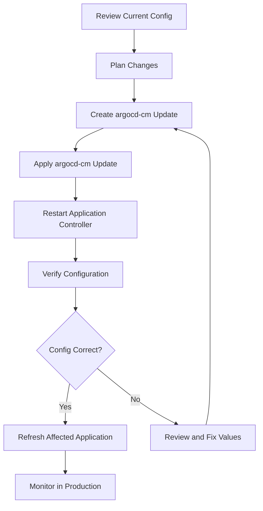

# How to Configure Argo CD show resources permanently out-of-sync

Author: [nawazdhandala](https://github.com/nawazdhandala)

Tags: Cilium, Argo CD, Configuration

Description: A practical guide covering how to configure argo cd show resources permanently out-of-sync in cilium configuration with step-by-step instructions and real-world examples for production Kubernetes c...

---

## Introduction

Managing Cilium through Argo CD requires specific configuration to handle dynamically-created resources like CiliumIdentity and CiliumEndpoint that are not part of Git-managed manifests but appear in the cluster.

In this guide, we cover Cilium and Argo CD integration in a Kubernetes environment. Cilium leverages eBPF technology to provide high-performance networking, security, and observability for cloud-native workloads. The eBPF programs are loaded directly into the Linux kernel, enabling efficient packet processing without the overhead of traditional iptables-based networking stacks.

Whether you are running a small development cluster or a large production environment with thousands of pods, the techniques in this guide will help you maintain a reliable Cilium deployment. We provide step-by-step instructions with real commands and configuration examples that you can adapt to your environment.

## Prerequisites

- A running Kubernetes cluster (v1.21+) with Cilium installed (v1.14+)
- `kubectl` configured for cluster access
- `cilium` CLI installed (matching your Cilium version)
- Access to edit the `argocd-cm` ConfigMap in the Argo CD namespace
- Basic familiarity with Kubernetes networking concepts
- Access to cluster nodes for troubleshooting (recommended)
- Prometheus and Grafana for metrics visualization (recommended)

## Planning the Configuration

Before making configuration changes, review the current state and plan the changes carefully.

```bash
# Confirm Cilium CRDs are installed
kubectl api-resources --api-group=cilium.io

# Review the current Argo CD ConfigMap
kubectl get configmap argocd-cm -n argocd -o yaml

# Check whether Argo CD is seeing Cilium-created resources
kubectl get ciliumidentities.cilium.io
kubectl get ciliumendpoints.cilium.io -A
```

## Applying Configuration Changes

Configure Argo CD resource exclusions so it does not discover or compare Cilium-managed runtime resources.

```yaml
# argocd-cm-cilium-exclusions.yaml
apiVersion: v1
kind: ConfigMap
metadata:
  name: argocd-cm
  namespace: argocd
  labels:
    app.kubernetes.io/part-of: argocd
data:
  resource.exclusions: |
    - apiGroups:
      - cilium.io
      kinds:
      - CiliumIdentity
      - CiliumEndpoint
      clusters:
      - "*"
```

```bash
# Apply the configuration
kubectl apply -f argocd-cm-cilium-exclusions.yaml

# Restart the application controller so it rebuilds its cluster cache
kubectl rollout restart statefulset/argocd-application-controller -n argocd
kubectl rollout status statefulset/argocd-application-controller -n argocd --timeout=300s

# Verify the configuration was applied
kubectl get configmap argocd-cm -n argocd -o jsonpath='{.data.resource\.exclusions}'
```

## Advanced Configuration

For production environments, keep any existing resource exclusions and add the Cilium resources to the same list instead of replacing the whole key.

```yaml
# Existing and Cilium-specific Argo CD exclusions
resource.exclusions: |
  - apiGroups:
    - events.k8s.io
    - metrics.k8s.io
    kinds:
    - "*"
    clusters:
    - "*"
  - apiGroups:
    - cilium.io
    kinds:
    - CiliumIdentity
    - CiliumEndpoint
    clusters:
    - "*"
```

```bash
# Confirm Argo CD applications no longer report these Cilium resources as extraneous
kubectl get applications.argoproj.io -A
```


```mermaid
flowchart TD
    A[Review Current Config] --> B[Plan Changes]
    B --> C[Create argocd-cm Update]
    C --> D[Apply argocd-cm Update]
    D --> E[Restart Application Controller]
    E --> F[Verify Configuration]
    F --> G{Config Correct?}
    G -->|Yes| H[Refresh Affected Application]
    G -->|No| I[Review and Fix Values]
    I --> C
    H --> J[Monitor in Production]
```

## Configuration Backup

Always back up your configuration before making changes:

```bash
# Export the current Argo CD ConfigMap
kubectl get configmap argocd-cm -n argocd -o yaml > /tmp/argocd-cm-backup-$(date +%Y%m%d).yaml

# Export the current Cilium ConfigMap for reference
kubectl get configmap cilium-config -n kube-system -o yaml > /tmp/cilium-configmap-backup-$(date +%Y%m%d).yaml
```


## Verification

After completing the steps above, run a comprehensive verification to confirm everything is working as expected.

```bash
# Check overall Cilium deployment health
cilium status --verbose

# Confirm all Cilium pods are running and ready
kubectl get pods -n kube-system -l k8s-app=cilium -o wide

# Verify the Cilium operator is healthy
kubectl get pods -n kube-system -l name=cilium-operator

# Confirm Argo CD has the exclusion configured
kubectl get configmap argocd-cm -n argocd -o jsonpath='{.data.resource\.exclusions}'

# Refresh an affected application after the controller restart
kubectl annotate applications.argoproj.io <app-name> -n argocd argocd.argoproj.io/refresh=hard --overwrite

# Confirm Cilium runtime resources still exist in Kubernetes
kubectl get ciliumidentities.cilium.io
kubectl get ciliumendpoints.cilium.io -A
```

## Troubleshooting

If you encounter issues during or after the steps in this guide, use the following troubleshooting procedures:

- **Argo CD still shows Cilium resources as out of sync**: Confirm `resource.exclusions` is present in `argocd-cm`, restart the application controller, and hard-refresh the affected application. Check that the excluded kinds are exactly `CiliumIdentity` and `CiliumEndpoint` under the `cilium.io` API group.

- **Cilium agent not starting**: Check resource limits and node capacity with `kubectl describe pod -n kube-system -l k8s-app=cilium`. Verify the BPF filesystem is mounted at `/sys/fs/bpf` and the kernel version is 4.19 or later. Check init container logs with `kubectl logs -n kube-system <pod> -c cilium-init`.

- **Connectivity failures**: Run `cilium connectivity test` and inspect the specific failing test case. Check for conflicting network policies with `cilium policy get`. Verify inter-node tunnel connectivity with `cilium bpf tunnel list`.

- **Configuration not applied**: Verify the `argocd-cm` YAML is correctly formatted. Run `kubectl rollout restart statefulset/argocd-application-controller -n argocd` and wait for the rollout to complete. Confirm with `kubectl get configmap argocd-cm -n argocd -o jsonpath='{.data.resource\.exclusions}'`.

- **High resource usage**: Review resource consumption with `kubectl top pods -n kube-system -l k8s-app=cilium`. Consider tuning label exclusion to reduce identity count. Increase agent memory limits if needed. Check `cilium metrics list | grep process_resident_memory`.

- **Endpoints stuck in regenerating state**: This usually indicates the agent is overloaded or encountering errors during BPF program compilation. Check agent logs with `kubectl logs -n kube-system -l k8s-app=cilium --tail=200 | grep -i error`.

- **Policy not being enforced**: Verify the policy selectors match the intended pods using `cilium endpoint list`. Confirm the policy is applied with `cilium policy get`. Check that the endpoint has the correct identity with `cilium endpoint get <id>`.

To collect a comprehensive diagnostic bundle for further analysis:

```bash
# Generate a Cilium sysdump containing all diagnostic information
# This collects logs, configs, BPF maps, and cluster state
cilium sysdump --output-filename cilium-diag-$(date +%Y%m%d)
```

## Conclusion

This guide covered Cilium and Argo CD integration with practical steps you can apply to your Kubernetes cluster. Regular monitoring, systematic validation, and proactive management are essential for maintaining a healthy Cilium deployment at any scale.

Key takeaways from this guide:

- Always assess the current state before making changes to your Cilium configuration
- Use Argo CD resource exclusions for Cilium-managed runtime resources that should not be tracked as Git-managed application resources
- Monitor Cilium metrics through Prometheus to detect issues before they impact workloads
- Test changes in a staging environment before applying them to production clusters
- Maintain runbooks documenting your Cilium configuration decisions and operational procedures
- Use `cilium sysdump` to collect comprehensive diagnostic data when investigating issues

As your cluster grows and evolves, revisit these configurations periodically and adjust them to match your current requirements. The Cilium community and documentation are excellent resources for staying current with best practices and new features.
