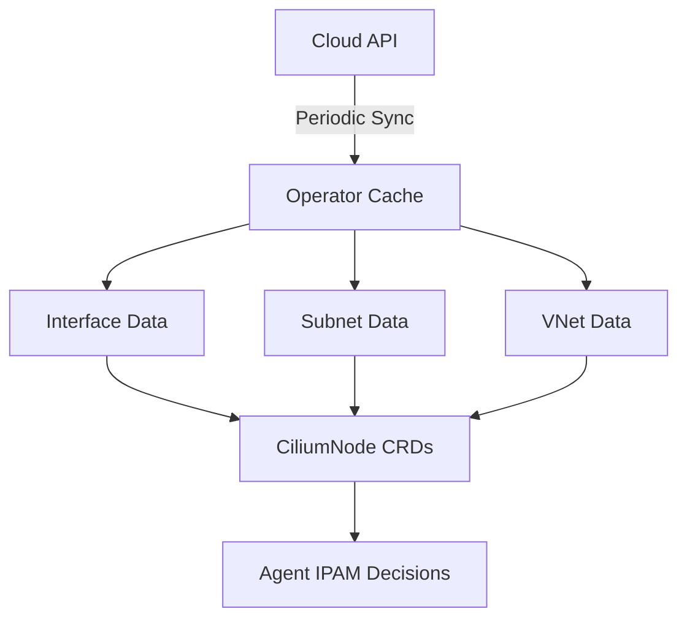

# Configuring Interface, Subnet, and VirtualNetwork Caching in Cilium IPAM

Author: [nawazdhandala](https://github.com/nawazdhandala)

Tags: Cilium, Kubernetes, IPAM, Azure, Cloud Networking

Description: How to configure and optimize the cache of interfaces, subnets, and virtual networks in Cilium IPAM for cloud-provider deployments on Azure.

---

## Introduction

When Cilium runs in cloud environments like Azure, the IPAM subsystem needs to interact with cloud APIs to discover network interfaces, subnets, and virtual networks. To avoid excessive API calls and latency, Cilium caches this information locally. Configuring this cache correctly balances freshness of network data with API rate limit consumption.

The cache stores the mapping between nodes and their network interfaces, the available subnets and their remaining IP capacity, and virtual network topology. Stale cache data can lead to IP allocation failures or incorrect routing, while overly aggressive refreshing can hit cloud API rate limits.

This guide covers configuring the interface, subnet, and virtual network cache for optimal IPAM operation in cloud environments.

## Prerequisites

- Kubernetes cluster running on Azure (or other cloud provider)
- Cilium installed with Azure IPAM mode
- kubectl and Helm v3 configured
- Azure credentials configured for Cilium

## Configuring Azure IPAM Mode

```yaml
# cilium-azure-ipam.yaml
ipam:
  mode: azure
  azure:
    resourceGroup: "my-aks-resource-group"

azure:
  enabled: true
  resourceGroup: "my-aks-resource-group"
  subscriptionID: "your-subscription-id"
  tenantID: "your-tenant-id"
```

```bash
helm upgrade cilium cilium/cilium \
  --namespace kube-system \
  --reuse-values \
  -f cilium-azure-ipam.yaml
```

## Cache Configuration

### Interface Cache Settings

```yaml
# Control how often the interface cache refreshes
operator:
  # Interval between interface resync operations
  resources:
    limits:
      cpu: "1"
      memory: "1Gi"
```

The operator periodically queries the cloud API for interface data. The default resync interval balances freshness with API usage:

```bash
# Check current cache state in operator logs
kubectl logs -n kube-system -l name=cilium-operator | \
  grep -i "interface" | tail -20

# Monitor API call rates
kubectl logs -n kube-system -l name=cilium-operator | \
  grep -i "api call" | tail -20
```

### Subnet Cache

```bash
# View cached subnet information
kubectl get ciliumnodes -o json | jq '.items[0].spec.ipam'

# Check available IPs per subnet
kubectl get ciliumnodes -o json | jq '.items[] | {
  name: .metadata.name,
  subnets: .spec.azure.interfaces
}'
```



## Optimizing Cache Refresh

### For Large Clusters

```yaml
operator:
  replicas: 2
  resources:
    limits:
      cpu: "2"
      memory: "2Gi"
    requests:
      cpu: "500m"
      memory: "512Mi"
```

### Monitoring Cache Health

```bash
#!/bin/bash
# monitor-ipam-cache.sh

echo "=== IPAM Cache Health ==="

# Check CiliumNode resources for interface data
kubectl get ciliumnodes -o json | jq '.items[] | {
  name: .metadata.name,
  interfaces: (.spec.azure.interfaces // [] | length),
  allocated: (.status.ipam.used // {} | length)
}'

# Check operator sync status
kubectl logs -n kube-system -l name=cilium-operator --tail=50 | \
  grep -c "resync"
echo "Recent resyncs in operator logs"
```

## Verification

```bash
# Verify IPAM mode
cilium status | grep IPAM

# Check that nodes have interface data
kubectl get ciliumnodes -o json | jq '.items | length'

# Verify IP allocation works
kubectl run test-pod --image=nginx:1.27 --restart=Never
kubectl get pod test-pod -o jsonpath='{.status.podIP}'
kubectl delete pod test-pod
```

## Troubleshooting

- **Cache data stale**: Restart the operator to force a resync. Check cloud API credentials.
- **API rate limiting**: Increase the resync interval or reduce operator replicas.
- **Missing subnet data**: Verify the operator has permissions to list subnets in the resource group.
- **Interface not discovered**: Check that the cloud provider plugin is correctly configured in Cilium.

## Conclusion

Properly configured IPAM caching in cloud environments keeps IP allocation fast and reliable while respecting cloud API rate limits. Monitor cache freshness, tune resync intervals for your cluster size, and ensure the operator has sufficient resources and permissions to maintain accurate interface, subnet, and virtual network data.