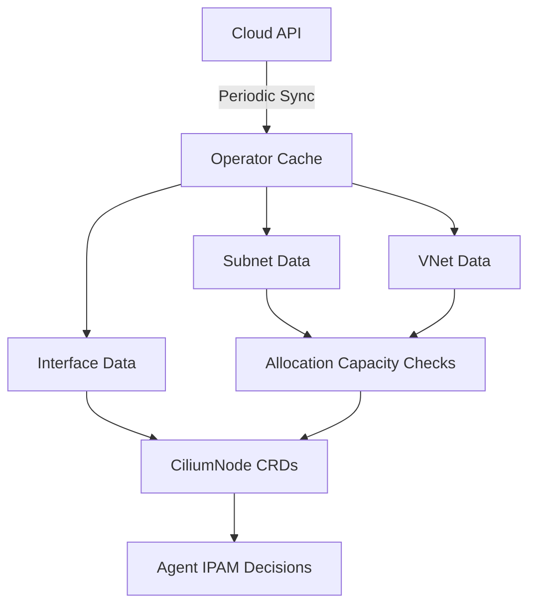

# Configuring Interface, Subnet, and VirtualNetwork Caching in Cilium IPAM

Author: [nawazdhandala](https://github.com/nawazdhandala)

Tags: Cilium, Kubernetes, IPAM, Azure, Cloud Networking

Description: How to configure and optimize the cache of interfaces, subnets, and virtual networks in Cilium IPAM for cloud-provider deployments on Azure.

---

## Introduction

When Cilium runs in cloud environments like Azure, the IPAM subsystem needs to interact with cloud APIs to discover network interfaces, subnets, and virtual networks. To avoid excessive API calls and latency, Cilium caches this information locally. Understanding this cache helps balance freshness of network data with API rate limit consumption.

The cache stores the mapping between nodes and their network interfaces, the available subnets and their remaining IP capacity, and virtual network topology. Stale cache data can lead to IP allocation failures or incorrect routing, while overly aggressive refreshing can hit cloud API rate limits.

This guide covers how the interface, subnet, and virtual network cache works and how to monitor it for IPAM operation in cloud environments.

## Prerequisites

- Kubernetes cluster running on Azure (or other cloud provider)
- Cilium installed with Azure IPAM mode
- kubectl and Helm v3 configured
- Azure credentials configured for Cilium

## Configuring Azure IPAM Mode

```yaml
# cilium-azure-ipam.yaml

ipam:
  mode: azure

azure:
  enabled: true
  resourceGroup: "my-aks-node-resource-group"
  subscriptionID: "your-subscription-id"
  tenantID: "your-tenant-id"
  clientID: "your-client-id"
  clientSecret: "your-client-secret"
```

```bash
helm upgrade cilium cilium/cilium \
  --namespace kube-system \
  --reuse-values \
  -f cilium-azure-ipam.yaml
```

## Cache Configuration

### Interface Cache Settings

```yaml
# Resource settings for the operator maintaining the Azure IPAM cache
operator:
  resources:
    limits:
      cpu: "1"
      memory: "1Gi"
```

The Azure IPAM cache refresh interval is not exposed as a Helm setting. The operator updates the cache once per minute, and also after an IP allocation has been performed. When an allocation triggers an update, it runs at most once per second:

```bash
# Check current cache state in operator logs
kubectl logs -n kube-system -l io.cilium/app=operator | \
  grep -i "interface" | tail -20

# Monitor API call rates
kubectl logs -n kube-system -l io.cilium/app=operator | \
  grep -i "api call" | tail -20
```

### Subnet Cache

```bash
# View cached subnet information
kubectl get ciliumnodes -o json | jq '.items[0] | {
  available: .spec.ipam.available,
  interfaces: .status.azure.interfaces
}'

# Check interfaces published by the Azure IPAM operator
kubectl get ciliumnodes -o json | jq '.items[] | {
  name: .metadata.name,
  interfaces: .status.azure.interfaces
}'
```


```mermaid
graph TD
    A[Cloud API] -->|Periodic Sync| B[Operator Cache]
    B --> C[Interface Data]
    B --> D[Subnet Data]
    B --> E[VNet Data]
    C --> F[CiliumNode CRDs]
    D --> H[Allocation Capacity Checks]
    E --> H
    F --> G[Agent IPAM Decisions]
    H --> F
```

## Optimizing Cache Operation

### For Large Clusters

```yaml
operator:
  replicas: 2
  resources:
    limits:
      cpu: "2"
      memory: "2Gi"
    requests:
      cpu: "500m"
      memory: "512Mi"
```

### Monitoring Cache Health

```bash
#!/bin/bash
# monitor-ipam-cache.sh

echo "=== IPAM Cache Health ==="

# Check CiliumNode resources for interface data
kubectl get ciliumnodes -o json | jq '.items[] | {
  name: .metadata.name,
  interfaces: (.status.azure.interfaces // {} | length),
  available: (.spec.ipam.available // {} | length),
  allocated: (.status.ipam.used // {} | length)
}'

# Check operator sync status
kubectl logs -n kube-system -l io.cilium/app=operator --tail=50 | \
  grep -c "resync"
echo "Recent resyncs in operator logs"
```

## Verification

```bash
# Verify IPAM mode
cilium status | grep IPAM

# Check that nodes have interface data
kubectl get ciliumnodes -o json | jq '.items | length'

# Verify IP allocation works
kubectl run test-pod --image=nginx:1.27 --restart=Never
kubectl get pod test-pod -o jsonpath='{.status.podIP}'
kubectl delete pod test-pod
```

## Troubleshooting

- **Cache data stale**: Restart the operator to force a resync. Check cloud API credentials.
- **API rate limiting**: Tune the operator's external API rate limit settings or review operator replicas.
- **Missing subnet data**: Verify the operator has permissions in the AKS node resource group to list virtual networks, network interfaces, and virtual machine scale sets.
- **Interface not discovered**: Check that the cloud provider plugin is correctly configured in Cilium.

## Conclusion

Proper IPAM cache monitoring in cloud environments keeps IP allocation fast and reliable while respecting cloud API rate limits. Monitor cache freshness, tune operator resources and external API rate limits for your cluster size, and ensure the operator has sufficient permissions to maintain accurate interface, subnet, and virtual network data.
