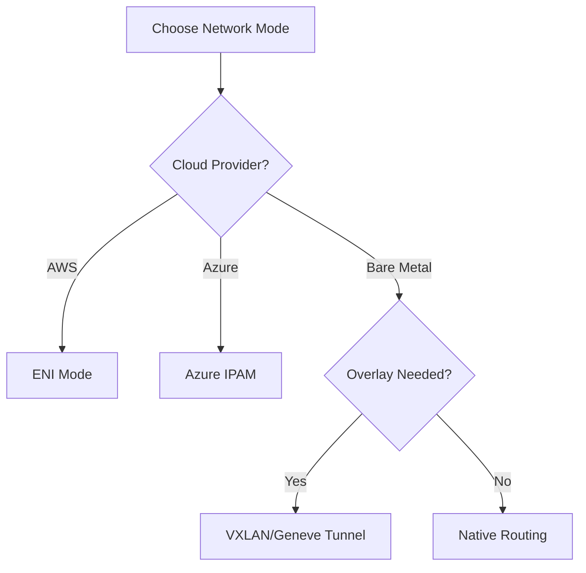

# Configuring Cilium for Kubernetes: A Complete Configuration Guide

Author: [nawazdhandala](https://github.com/nawazdhandala)

Tags: Cilium, Kubernetes, Configuration, Networking, CNI

Description: A comprehensive guide to configuring Cilium as your Kubernetes CNI, covering Helm values, network modes, IPAM options, and feature enablement for production.

---

## Introduction

Cilium configuration determines how your cluster handles networking, security policies, load balancing, and observability. The primary configuration surface is Helm chart values, which translate into a ConfigMap consumed by the Cilium agent and operator.

Cilium supports multiple operating modes (overlay with VXLAN or Geneve, direct routing, cloud-provider integration), different IPAM backends (cluster-pool, AWS ENI, Azure), and feature toggles for encryption, Hubble, and service mesh. Each choice affects performance, compatibility, and operational complexity.

This guide covers the key configuration decisions and provides tested Helm values for common deployments.

## Prerequisites

- Kubernetes cluster (v1.25+)
- Helm v3 installed
- kubectl configured with cluster access

## Core Configuration

### Basic Installation

```bash
helm repo add cilium https://helm.cilium.io/
helm repo update

helm install cilium cilium/cilium \
  --namespace kube-system \
  --set ipam.mode=cluster-pool \
  --set ipam.operator.clusterPoolIPv4PodCIDRList=10.0.0.0/8 \
  --set ipam.operator.clusterPoolIPv4MaskSize=24
```

### Production Helm Values

```yaml
# cilium-production.yaml
tunnel: disabled
autoDirectNodeRoutes: true
ipv4NativeRoutingCIDR: "10.0.0.0/8"

ipam:
  mode: cluster-pool
  operator:
    clusterPoolIPv4PodCIDRList:
      - "10.0.0.0/8"
    clusterPoolIPv4MaskSize: 24

hubble:
  enabled: true
  relay:
    enabled: true
  ui:
    enabled: true
  metrics:
    enabled:
      - dns
      - drop
      - tcp
      - flow

prometheus:
  enabled: true
  serviceMonitor:
    enabled: true

operator:
  replicas: 2

resources:
  limits:
    cpu: "2"
    memory: "2Gi"
  requests:
    cpu: "100m"
    memory: "512Mi"

bpf:
  mapDynamicSizeRatio: 0.0025
  preallocateMaps: true

bandwidthManager:
  enabled: true
```

```bash
helm install cilium cilium/cilium \
  --namespace kube-system \
  -f cilium-production.yaml
```

## Network Mode Configuration



### VXLAN Overlay Mode

```yaml
tunnel: vxlan
```

### Native Routing Mode

```yaml
tunnel: disabled
autoDirectNodeRoutes: true
ipv4NativeRoutingCIDR: "10.0.0.0/8"
```

## Security Configuration

### WireGuard Encryption

```yaml
encryption:
  enabled: true
  type: wireguard
```

### Network Policy Enforcement

```yaml
policyEnforcementMode: "default"
```

## Verification

```bash
cilium status
kubectl get pods -n kube-system -l k8s-app=cilium
cilium connectivity test
kubectl get configmap cilium-config -n kube-system -o yaml
```

## Troubleshooting

- **Pods stuck in ContainerCreating**: Check Cilium agent logs. Usually CNI binary or config issues.
- **No pod connectivity**: Verify tunnel mode and routing config. Check `cilium status` for datapath errors.
- **High memory usage**: Tune BPF map sizes and enable `bpf.preallocateMaps`.
- **Operator not scheduling**: Check RBAC permissions and resources.

## Conclusion

Cilium configuration is a foundational decision. Choose networking mode based on your infrastructure, enable Hubble from the start, and size resources for growth. The Helm values here provide a solid starting point for production.