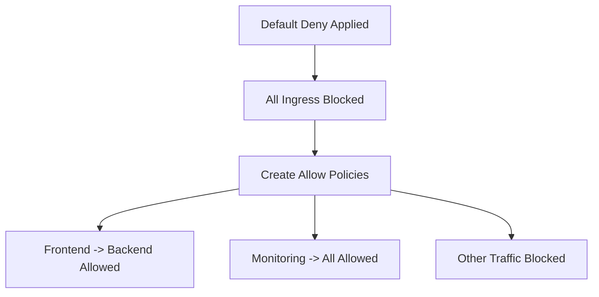

# Configuring Cilium Default Deny Ingress Network Policy

Author: [nawazdhandala](https://github.com/nawazdhandala)

Tags: Cilium, Kubernetes, Network Policy, Security, Ingress

Description: How to configure a default deny ingress policy with Cilium to enforce zero-trust networking and only allow explicitly permitted inbound traffic.

---

## Introduction

A default deny ingress policy is the foundation of zero-trust networking in Kubernetes. It blocks all inbound traffic to pods unless explicitly allowed by another policy. Without a default deny policy, any pod in the cluster can reach any other pod, which violates the principle of least privilege.

Cilium supports both standard Kubernetes NetworkPolicy and its own CiliumNetworkPolicy CRD. For default deny, either works, but CiliumNetworkPolicy provides additional capabilities like L7 filtering and DNS-based rules that complement the default deny posture.

This guide covers implementing default deny ingress with Cilium and building allow policies on top of it.

## Prerequisites

- Kubernetes cluster with Cilium installed
- kubectl configured
- Understanding of your application communication patterns

## Creating a Default Deny Ingress Policy

### Using Kubernetes NetworkPolicy

```yaml
# default-deny-ingress.yaml
apiVersion: networking.k8s.io/v1
kind: NetworkPolicy
metadata:
  name: default-deny-ingress
  namespace: default
spec:
  podSelector: {}
  policyTypes:
    - Ingress
```

### Using CiliumNetworkPolicy

```yaml
# cilium-default-deny-ingress.yaml
apiVersion: cilium.io/v2
kind: CiliumNetworkPolicy
metadata:
  name: default-deny-ingress
  namespace: default
spec:
  endpointSelector: {}
  ingress: []
```

```bash
kubectl apply -f cilium-default-deny-ingress.yaml
```

## Applying Across All Namespaces

```bash
#!/bin/bash
# apply-default-deny-all-namespaces.sh

for ns in $(kubectl get namespaces -o jsonpath='{.items[*].metadata.name}'); do
  # Skip system namespaces
  if [[ "$ns" == "kube-system" || "$ns" == "kube-public" || "$ns" == "kube-node-lease" ]]; then
    continue
  fi
  
  cat <<EOF | kubectl apply -f -
apiVersion: cilium.io/v2
kind: CiliumNetworkPolicy
metadata:
  name: default-deny-ingress
  namespace: $ns
spec:
  endpointSelector: {}
  ingress: []
EOF
  echo "Applied default deny to namespace: $ns"
done
```



## Building Allow Policies

Once default deny is in place, create specific allow policies:

```yaml
# allow-frontend-to-backend.yaml
apiVersion: cilium.io/v2
kind: CiliumNetworkPolicy
metadata:
  name: allow-frontend-to-backend
  namespace: default
spec:
  endpointSelector:
    matchLabels:
      app: backend
  ingress:
    - fromEndpoints:
        - matchLabels:
            app: frontend
      toPorts:
        - ports:
            - port: "8080"
              protocol: TCP
```

```yaml
# allow-monitoring.yaml
apiVersion: cilium.io/v2
kind: CiliumNetworkPolicy
metadata:
  name: allow-monitoring
  namespace: default
spec:
  endpointSelector: {}
  ingress:
    - fromEndpoints:
        - matchLabels:
            app: prometheus
      toPorts:
        - ports:
            - port: "9090"
              protocol: TCP
```

## Using CiliumClusterwideNetworkPolicy

For cluster-wide default deny:

```yaml
apiVersion: cilium.io/v2
kind: CiliumClusterwideNetworkPolicy
metadata:
  name: default-deny-ingress-clusterwide
spec:
  endpointSelector: {}
  ingress: []
```

## Verification

```bash
# Verify policy is applied
kubectl get ciliumnetworkpolicies -n default

# Check endpoint policy status
kubectl get ciliumendpoints -n default -o json | jq '.items[] | {
  name: .metadata.name,
  ingress_enforcing: .status.policy.ingress.enforcing
}'

# Test that traffic is blocked
kubectl exec -n default deploy/frontend -- \
  curl -s --connect-timeout 5 http://backend:8080
# Should fail without allow policy

# Test that allowed traffic works
kubectl apply -f allow-frontend-to-backend.yaml
kubectl exec -n default deploy/frontend -- \
  curl -s --connect-timeout 5 http://backend:8080
# Should succeed
```

## Troubleshooting

- **Policy not taking effect**: Check that Cilium agent is running and endpoints show `enforcing: true`.
- **Legitimate traffic blocked**: Create specific allow policies for required communication paths.
- **DNS resolution broken**: Add a policy allowing DNS traffic to kube-dns on port 53.
- **Health checks failing**: Add allow policies for kubelet health check traffic.

## Conclusion

Default deny ingress is the starting point for Kubernetes network security. Apply it to all non-system namespaces and build specific allow policies for each communication path. Cilium makes this practical with its identity-based policy model and L7 filtering capabilities.