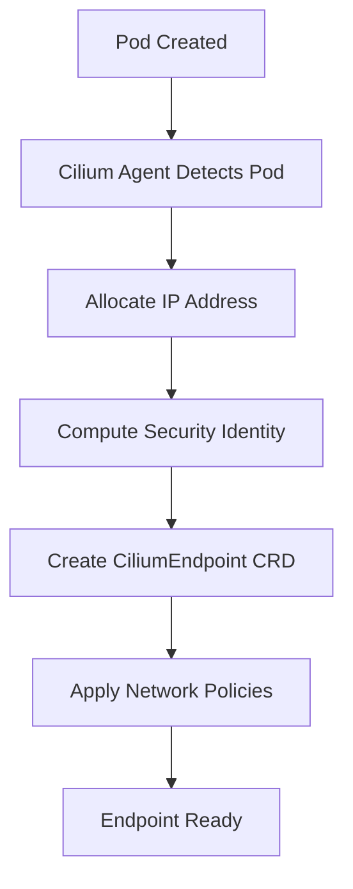

# Configuring Cilium Endpoint Custom Resource Definitions

Author: [nawazdhandala](https://github.com/nawazdhandala)

Tags: Cilium, Kubernetes, Networking, Endpoint, CRD

Description: Learn how to configure and manage CiliumEndpoint custom resources to control endpoint identity, networking, and policy enforcement in Cilium-managed Kubernetes clusters.

---

## Introduction

CiliumEndpoint is a CRD that Cilium creates automatically for each pod managed by the Cilium agent. Each CiliumEndpoint represents a network endpoint with its own identity, IP address, and policy state. While Cilium manages these resources automatically, understanding their configuration is essential for debugging and advanced networking setups.

The CiliumEndpoint CRD stores the endpoint security identity, labels used for policy selection, networking state, and policy enforcement status. Inspecting a CiliumEndpoint gives you a complete picture of how Cilium sees a workload.

This guide walks through configuring the Cilium agent for endpoint management, customizing endpoint behavior, and integrating endpoint data with your infrastructure.

## Prerequisites

- Kubernetes cluster (v1.25+) with Cilium installed (v1.14+)
- kubectl configured with cluster access
- Cilium CLI installed
- Helm v3 for configuration changes

## Understanding the CiliumEndpoint Resource

```bash
# List all CiliumEndpoints in a namespace
kubectl get ciliumendpoints -n default

# Get detailed view of a specific endpoint
kubectl get ciliumendpoint <pod-name> -n default -o yaml
```

A typical CiliumEndpoint status:

```yaml
apiVersion: cilium.io/v2
kind: CiliumEndpoint
metadata:
  name: my-app-7d8f9c6b4-x2k9p
  namespace: default
status:
  id: 1234
  identity:
    id: 56789
    labels:
      - "k8s:app=my-app"
      - "k8s:io.kubernetes.pod.namespace=default"
  networking:
    addressing:
      - ipv4: "10.0.1.45"
  policy:
    egress:
      enforcing: true
      state: "OK"
    ingress:
      enforcing: true
      state: "OK"
  state: ready
```

## Configuring Cilium Agent for Endpoint Management

### Basic Endpoint Configuration

```yaml
# cilium-endpoint-config.yaml
endpointRoutes:
  enabled: false  # Set true for direct routing to endpoints

ipam:
  mode: "cluster-pool"
  operator:
    clusterPoolIPv4PodCIDRList:
      - "10.0.0.0/8"
    clusterPoolIPv4MaskSize: 24

endpointStatus:
  enabled: true
  status: "policy health controllers log state"
```

```bash
helm upgrade cilium cilium/cilium \
  --namespace kube-system \
  --reuse-values \
  -f cilium-endpoint-config.yaml
```

### Configuring Endpoint Labels

```bash
# Control which labels Cilium uses for identity computation
helm upgrade cilium cilium/cilium \
  --namespace kube-system \
  --reuse-values \
  --set "labels=k8s:app k8s:io.kubernetes.pod.namespace k8s:env"
```

### Enabling Endpoint Health Checking

```yaml
healthChecking: true
healthPort: 9879
endpointGCInterval: "5m0s"
```



## Advanced Endpoint Configuration

### Per-Endpoint Bandwidth Management

```yaml
apiVersion: v1
kind: Pod
metadata:
  name: bandwidth-limited-app
  annotations:
    kubernetes.io/egress-bandwidth: "10M"
    kubernetes.io/ingress-bandwidth: "10M"
spec:
  containers:
    - name: app
      image: nginx:1.27
```

```bash
helm upgrade cilium cilium/cilium \
  --namespace kube-system \
  --reuse-values \
  --set bandwidthManager.enabled=true \
  --set bandwidthManager.bbr=true
```

### Endpoint Route Configuration

```bash
# For environments requiring direct endpoint routing
helm upgrade cilium cilium/cilium \
  --namespace kube-system \
  --reuse-values \
  --set endpointRoutes.enabled=true
```

## Verification

```bash
cilium status
cilium endpoint list
kubectl get ciliumendpoint <pod-name> -n <namespace> \
  -o jsonpath='{.status.identity}'
cilium endpoint health <endpoint-id>
```

## Troubleshooting

- **CiliumEndpoint not created**: Check Cilium agent is running on the node. Review logs with `kubectl logs -n kube-system -l k8s-app=cilium`.
- **Endpoint stuck in not-ready**: Usually IP allocation failure or BPF issue. Check agent logs for compilation errors.
- **Identity mismatch**: Check pod labels. Cilium computes identity from labels, so missing/extra labels change the identity.
- **Policy not enforcing**: Verify endpoint shows `enforcing: true`. If not, check that a CiliumNetworkPolicy selects the endpoint.

## Conclusion

CiliumEndpoint CRDs are the foundation of Cilium networking and policy. Understanding their configuration and the agent settings that control endpoint behavior lets you tune performance, troubleshoot connectivity, and maintain visibility into cluster networking.