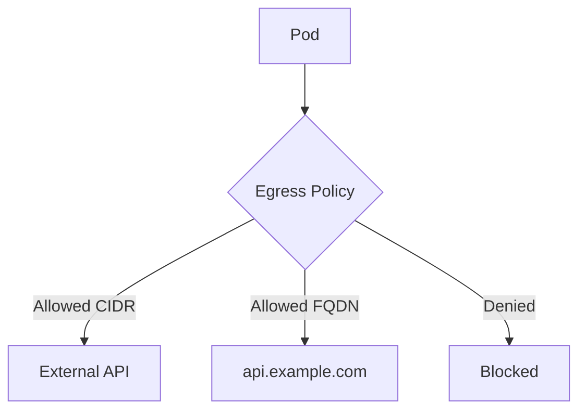

# Configuring Cilium External Lock-Down Network Policy

Author: [nawazdhandala](https://github.com/nawazdhandala)

Tags: Cilium, Kubernetes, Network Policy, Security, External Traffic

Description: How to configure Cilium network policies to lock down external traffic, restricting which pods can communicate with services outside the cluster.

---

## Introduction

External lock-down policies control which pods can access external services outside the cluster. Without these policies, any pod can reach any external IP address, creating a large attack surface. A compromised pod could exfiltrate data to any external endpoint.

Cilium provides powerful egress policies that can restrict external access by CIDR, DNS name, or even AWS/Azure security groups. This guide covers implementing external lock-down policies that follow the principle of least privilege.

## Prerequisites

- Kubernetes cluster with Cilium installed
- kubectl configured
- Understanding of which pods need external access

## Default Deny Egress

Start by denying all egress traffic:

```yaml
# default-deny-egress.yaml
apiVersion: cilium.io/v2
kind: CiliumNetworkPolicy
metadata:
  name: default-deny-egress
  namespace: default
spec:
  endpointSelector: {}
  egress: []
```

Then add specific allow policies:

```yaml
# allow-dns-egress.yaml
apiVersion: cilium.io/v2
kind: CiliumNetworkPolicy
metadata:
  name: allow-dns
  namespace: default
spec:
  endpointSelector: {}
  egress:
    - toEndpoints:
        - matchLabels:
            k8s:io.kubernetes.pod.namespace: kube-system
            k8s-app: kube-dns
      toPorts:
        - ports:
            - port: "53"
              protocol: UDP
            - port: "53"
              protocol: TCP
```

## Allowing Specific External Access

### By CIDR

```yaml
# allow-external-api.yaml
apiVersion: cilium.io/v2
kind: CiliumNetworkPolicy
metadata:
  name: allow-external-api
  namespace: default
spec:
  endpointSelector:
    matchLabels:
      app: api-client
  egress:
    - toCIDR:
        - "203.0.113.0/24"
      toPorts:
        - ports:
            - port: "443"
              protocol: TCP
```

### By DNS Name (FQDN)

```yaml
# allow-external-fqdn.yaml
apiVersion: cilium.io/v2
kind: CiliumNetworkPolicy
metadata:
  name: allow-external-fqdn
  namespace: default
spec:
  endpointSelector:
    matchLabels:
      app: api-client
  egress:
    - toFQDNs:
        - matchName: "api.example.com"
      toPorts:
        - ports:
            - port: "443"
              protocol: TCP
```



## Cluster-Wide External Lock-Down

```yaml
apiVersion: cilium.io/v2
kind: CiliumClusterwideNetworkPolicy
metadata:
  name: lockdown-external
spec:
  endpointSelector: {}
  egress:
    - toEndpoints:
        - {}
    - toEntities:
        - kube-apiserver
    - toCIDR:
        - "10.0.0.0/8"
        - "172.16.0.0/12"
        - "192.168.0.0/16"
```

This allows all internal cluster traffic but blocks external access unless explicitly permitted.

## Verification

```bash
# Verify policies are applied
kubectl get ciliumnetworkpolicies -n default

# Test external access is blocked
kubectl exec deploy/test-pod -- curl -s --connect-timeout 5 https://example.com
# Should timeout

# Test allowed access works
kubectl exec deploy/api-client -- curl -s --connect-timeout 5 https://api.example.com
# Should succeed
```

## Troubleshooting

- **DNS resolution fails**: Always allow DNS egress before applying deny-all.
- **Internal services break**: Allow internal CIDRs or use `toEndpoints` for cluster-internal traffic.
- **FQDN policy not matching**: FQDN policies require DNS to be working. Apply DNS allow first.
- **Kube-apiserver unreachable**: Add `toEntities: kube-apiserver` to your egress rules.

## Conclusion

External lock-down policies prevent unauthorized external access from cluster pods. Start with deny-all egress, allow DNS, then add specific CIDR or FQDN rules for pods that need external access. This significantly reduces the attack surface of a compromised pod.