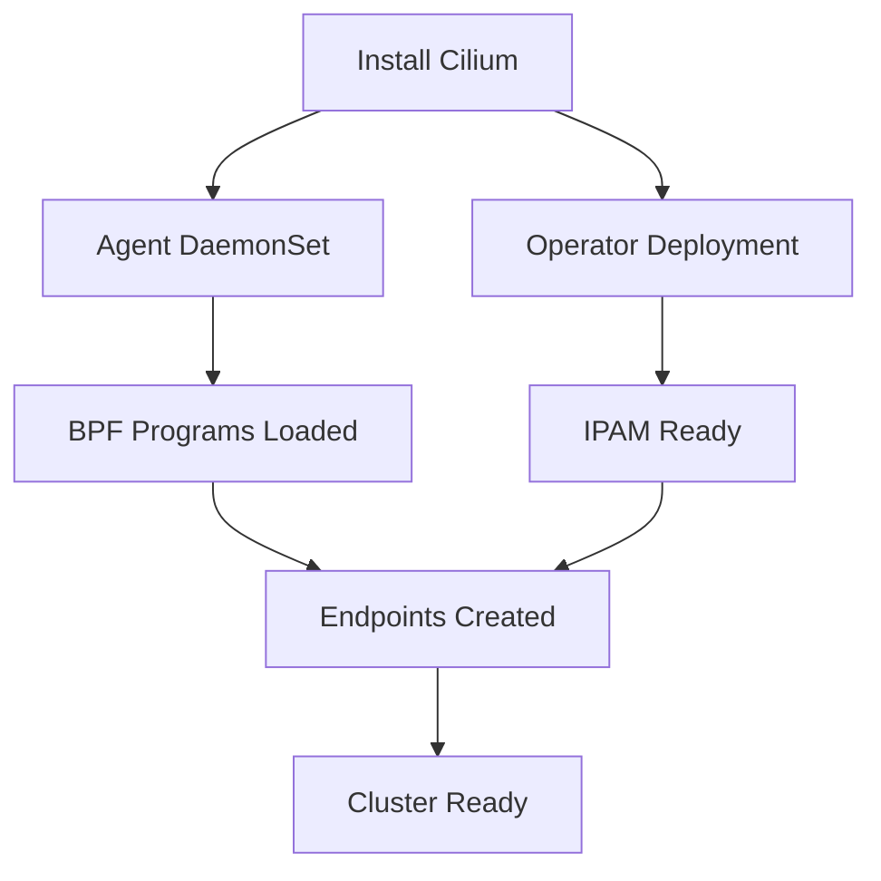

# Configuring Cilium: Getting Started with Installation and Setup

Author: [nawazdhandala](https://github.com/nawazdhandala)

Tags: Cilium, Kubernetes, Installation, Networking, Getting Started

Description: A beginner-friendly guide to installing and configuring Cilium on Kubernetes, covering cluster requirements, installation methods, and initial setup verification.

---

## Introduction

Cilium is an eBPF-based networking, observability, and security solution for Kubernetes. Getting started with Cilium means choosing an installation method, configuring the basic networking parameters, and verifying that the data plane is operational. This guide focuses on the initial setup experience.

Unlike traditional CNI plugins that rely on iptables, Cilium uses eBPF programs in the Linux kernel to handle packet forwarding, load balancing, and network policy enforcement. This architectural difference means Cilium has specific kernel requirements and offers capabilities that other CNIs cannot match.

This guide takes you from a fresh Kubernetes cluster to a working Cilium installation with basic networking, observability, and policy enforcement.

## Prerequisites

- Kubernetes cluster (v1.25+) without an existing CNI or with the ability to replace one
- Linux kernel 5.10+ on all nodes (5.15+ recommended)
- Helm v3 installed
- kubectl configured with cluster access

## Installing Cilium

### Using Helm (Recommended)

```bash
# Add the Cilium Helm repository
helm repo add cilium https://helm.cilium.io/
helm repo update

# Install Cilium with default configuration
helm install cilium cilium/cilium \
  --namespace kube-system \
  --set ipam.mode=cluster-pool \
  --set ipam.operator.clusterPoolIPv4PodCIDRList=10.0.0.0/8 \
  --set ipam.operator.clusterPoolIPv4MaskSize=24
```

### Using Cilium CLI

```bash
# Install the Cilium CLI
CILIUM_CLI_VERSION=$(curl -s https://raw.githubusercontent.com/cilium/cilium-cli/main/stable.txt)
curl -L --fail \
  https://github.com/cilium/cilium-cli/releases/download/${CILIUM_CLI_VERSION}/cilium-linux-amd64.tar.gz | \
  sudo tar xzvf - -C /usr/local/bin

# Install Cilium
cilium install
```

## Initial Configuration

### Choosing a Network Mode

```yaml
# Option 1: VXLAN overlay (works everywhere)
tunnel: vxlan

# Option 2: Native routing (better performance, requires routing setup)
tunnel: disabled
autoDirectNodeRoutes: true
ipv4NativeRoutingCIDR: "10.0.0.0/8"
```

### Enabling Observability from Day One

```yaml
# cilium-initial.yaml
hubble:
  enabled: true
  relay:
    enabled: true
  ui:
    enabled: true
prometheus:
  enabled: true
```

```bash
helm upgrade cilium cilium/cilium \
  --namespace kube-system \
  --reuse-values \
  -f cilium-initial.yaml
```



## Post-Installation Setup

### Deploy a Test Application

```bash
# Create a simple test deployment
kubectl create deployment nginx --image=nginx:1.27 --replicas=2
kubectl expose deployment nginx --port=80

# Verify pods have Cilium endpoints
kubectl get ciliumendpoints -n default
```

### Verify Network Policies Work

```yaml
# test-policy.yaml
apiVersion: cilium.io/v2
kind: CiliumNetworkPolicy
metadata:
  name: test-policy
  namespace: default
spec:
  endpointSelector:
    matchLabels:
      app: nginx
  ingress:
    - fromEndpoints:
        - matchLabels:
            app: client
      toPorts:
        - ports:
            - port: "80"
              protocol: TCP
```

```bash
kubectl apply -f test-policy.yaml
```

## Verification

```bash
# Check Cilium status
cilium status

# Run connectivity tests
cilium connectivity test

# Verify Hubble is working
cilium hubble port-forward &
hubble observe --last 10

# Check all agents are healthy
kubectl get pods -n kube-system -l k8s-app=cilium -o wide
```

## Troubleshooting

- **Agents not starting**: Check kernel version with `uname -r`. Cilium requires kernel 5.10+.
- **Pods stuck in Pending**: Verify IPAM configuration and check that the cluster CIDR does not overlap with node networks.
- **Connectivity test fails**: Check agent logs. Common issues are firewall rules blocking VXLAN (port 8472) or missing kernel modules.
- **Hubble not working**: Ensure Hubble relay is deployed. Check with `kubectl get pods -n kube-system -l k8s-app=hubble-relay`.

## Conclusion

Getting started with Cilium requires choosing a network mode, installing via Helm or CLI, and verifying the data plane with connectivity tests. Enable Hubble from the start for observability and deploy a test workload to confirm policies work. This foundation supports all advanced Cilium features you will add later.