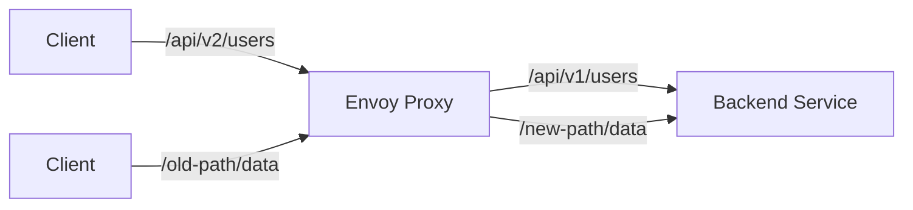

# Configuring Cilium L7 Path Translation for HTTP Traffic

Author: [nawazdhandala](https://github.com/nawazdhandala)

Tags: Cilium, Kubernetes, L7, Envoy, Path Translation

Description: How to configure Cilium L7 path translation to rewrite HTTP request paths between services using Envoy proxy and CiliumEnvoyConfig.

---

## Introduction

Cilium L7 path translation allows you to rewrite HTTP request paths as traffic flows between services. This is useful when a frontend service uses a different URL structure than the backend, when migrating APIs between versions, or when consolidating multiple backend paths behind a single external endpoint.

Path translation in Cilium is implemented through the Envoy proxy. When L7 policies are in place, traffic passes through Envoy, which can modify request paths before forwarding to the upstream service.

## Prerequisites

- Kubernetes cluster with Cilium installed (v1.14+)
- Envoy proxy enabled (l7Proxy=true)
- kubectl and Helm configured

## Enabling L7 Proxy

```bash
helm upgrade cilium cilium/cilium \
  --namespace kube-system \
  --reuse-values \
  --set l7Proxy=true
```

## Configuring Path Translation

### Using CiliumEnvoyConfig

```yaml
apiVersion: cilium.io/v2
kind: CiliumEnvoyConfig
metadata:
  name: path-translation
  namespace: default
spec:
  services:
    - name: backend-service
      namespace: default
  resources:
    - "@type": type.googleapis.com/envoy.config.route.v3.RouteConfiguration
      name: default/backend-service
      virtual_hosts:
        - name: backend
          domains: ["*"]
          routes:
            - match:
                prefix: "/api/v2/"
              route:
                cluster: default/backend-service
                prefix_rewrite: "/api/v1/"
            - match:
                prefix: "/old-path/"
              route:
                cluster: default/backend-service
                prefix_rewrite: "/new-path/"
            - match:
                prefix: "/"
              route:
                cluster: default/backend-service
```

```bash
kubectl apply -f path-translation.yaml
```



## Advanced Path Rewriting

### Regex-Based Path Translation

```yaml
apiVersion: cilium.io/v2
kind: CiliumEnvoyConfig
metadata:
  name: regex-path-translation
  namespace: default
spec:
  services:
    - name: backend-service
      namespace: default
  resources:
    - "@type": type.googleapis.com/envoy.config.route.v3.RouteConfiguration
      name: default/backend-service
      virtual_hosts:
        - name: backend
          domains: ["*"]
          routes:
            - match:
                safe_regex:
                  regex: "/users/([0-9]+)/profile"
              route:
                cluster: default/backend-service
                regex_rewrite:
                  pattern:
                    regex: "/users/([0-9]+)/profile"
                  substitution: "/v1/profiles/\1"
            - match:
                prefix: "/"
              route:
                cluster: default/backend-service
```

## Testing Path Translation

```bash
# Deploy test service
kubectl exec -n default deploy/client -- \
  curl -s -v http://backend-service:8080/api/v2/users 2>&1

# Verify the backend receives the rewritten path
kubectl logs -n default deploy/backend-service --tail=5

# Check Hubble for L7 flow details
hubble observe --protocol http -n default --last 10 -o json | \
  jq '.flow.l7.http | {url: .url, method: .method}'
```

## Verification

```bash
# Verify Envoy config is applied
kubectl get ciliumenvoyconfigs -n default

# Check Envoy routes
kubectl exec -n kube-system <cilium-pod> -- \
  curl -s localhost:9901/config_dump | jq '.configs[] | select(.["@type"] | contains("RoutesConfigDump"))'

# Test path translation
kubectl exec deploy/client -- curl -s http://backend-service:8080/api/v2/test
```

## Troubleshooting

- **Path not being rewritten**: Verify CiliumEnvoyConfig is applied and matches the service. Check Envoy route config dump.
- **503 errors after applying config**: The route configuration may be invalid. Check Envoy admin logs.
- **Regex not matching**: Test regex patterns separately. Envoy uses RE2 syntax.
- **Traffic bypassing Envoy**: Ensure an L7 policy exists to force traffic through the proxy.

## Conclusion

Cilium L7 path translation through CiliumEnvoyConfig provides flexible HTTP path rewriting between services. Use prefix rewrites for simple cases and regex rewrites for complex patterns. Always verify with Hubble flow observation to confirm paths are translated correctly.