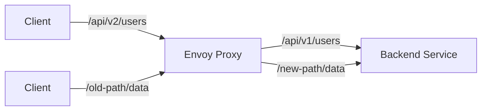

# Configuring Cilium L7 Path Translation for HTTP Traffic

Author: [nawazdhandala](https://github.com/nawazdhandala)

Tags: Cilium, Kubernetes, L7, Envoy, Path Translation

Description: How to configure Cilium L7 path translation to rewrite HTTP request paths between services using Envoy proxy and CiliumEnvoyConfig.

---

## Introduction

Cilium L7 path translation allows you to rewrite HTTP request paths as traffic flows between services. This is useful when a frontend service uses a different URL structure than the backend, when migrating APIs between versions, or when consolidating multiple backend paths behind a single external endpoint.

Path translation in Cilium is implemented through the Envoy proxy. When a service is selected by a CiliumEnvoyConfig or L7 policies are in place, traffic passes through Envoy, which can modify request paths before forwarding to the upstream service.

## Prerequisites

- Kubernetes cluster with Cilium installed (v1.14+)
- CiliumEnvoyConfig enabled (`envoyConfig.enabled=true`) and kube-proxy replacement enabled (`kubeProxyReplacement=true`)
- kubectl and Helm configured

## Enabling CiliumEnvoyConfig

```bash
helm upgrade cilium cilium/cilium \
  --namespace kube-system \
  --reuse-values \
  --set kubeProxyReplacement=true \
  --set envoyConfig.enabled=true
```

## Configuring Path Translation

### Using CiliumEnvoyConfig

```yaml
apiVersion: cilium.io/v2
kind: CiliumEnvoyConfig
metadata:
  name: path-translation
  namespace: default
  annotations:
    cec.cilium.io/use-original-source-address: "false"
spec:
  services:
    - name: backend-service
      namespace: default
      listener: path-translation-listener
  resources:
    - "@type": type.googleapis.com/envoy.config.listener.v3.Listener
      name: path-translation-listener
      filter_chains:
        - filters:
            - name: envoy.filters.network.http_connection_manager
              typed_config:
                "@type": type.googleapis.com/envoy.extensions.filters.network.http_connection_manager.v3.HttpConnectionManager
                stat_prefix: path-translation
                rds:
                  route_config_name: path_translation_route
                http_filters:
                  - name: envoy.filters.http.router
                    typed_config:
                      "@type": type.googleapis.com/envoy.extensions.filters.http.router.v3.Router
    - "@type": type.googleapis.com/envoy.config.route.v3.RouteConfiguration
      name: path_translation_route
      virtual_hosts:
        - name: backend
          domains: ["*"]
          routes:
            - match:
                prefix: "/api/v2/"
              route:
                cluster: default/backend-service
                prefix_rewrite: "/api/v1/"
            - match:
                prefix: "/old-path/"
              route:
                cluster: default/backend-service
                prefix_rewrite: "/new-path/"
            - match:
                prefix: "/"
              route:
                cluster: default/backend-service
    - "@type": type.googleapis.com/envoy.config.cluster.v3.Cluster
      name: default/backend-service
      connect_timeout: 5s
      lb_policy: ROUND_ROBIN
      type: EDS
```

```bash
kubectl apply -f path-translation.yaml
```


```mermaid
graph LR
    A[Client] -->|/api/v2/users| B[Envoy Proxy]
    B -->|/api/v1/users| C[Backend Service]
    D[Client] -->|/old-path/data| B
    B -->|/new-path/data| C
```

## Advanced Path Rewriting

### Regex-Based Path Translation

```yaml
apiVersion: cilium.io/v2
kind: CiliumEnvoyConfig
metadata:
  name: regex-path-translation
  namespace: default
  annotations:
    cec.cilium.io/use-original-source-address: "false"
spec:
  services:
    - name: backend-service
      namespace: default
      listener: regex-path-translation-listener
  resources:
    - "@type": type.googleapis.com/envoy.config.listener.v3.Listener
      name: regex-path-translation-listener
      filter_chains:
        - filters:
            - name: envoy.filters.network.http_connection_manager
              typed_config:
                "@type": type.googleapis.com/envoy.extensions.filters.network.http_connection_manager.v3.HttpConnectionManager
                stat_prefix: regex-path-translation
                rds:
                  route_config_name: regex_path_translation_route
                http_filters:
                  - name: envoy.filters.http.router
                    typed_config:
                      "@type": type.googleapis.com/envoy.extensions.filters.http.router.v3.Router
    - "@type": type.googleapis.com/envoy.config.route.v3.RouteConfiguration
      name: regex_path_translation_route
      virtual_hosts:
        - name: backend
          domains: ["*"]
          routes:
            - match:
                safe_regex:
                  google_re2: {}
                  regex: "^/users/([0-9]+)/profile$"
              route:
                cluster: default/backend-service
                regex_rewrite:
                  pattern:
                    google_re2: {}
                    regex: "^/users/([0-9]+)/profile$"
                  substitution: '/v1/profiles/\1'
            - match:
                prefix: "/"
              route:
                cluster: default/backend-service
    - "@type": type.googleapis.com/envoy.config.cluster.v3.Cluster
      name: default/backend-service
      connect_timeout: 5s
      lb_policy: ROUND_ROBIN
      type: EDS
```

## Testing Path Translation

```bash
# Deploy test service

kubectl exec -n default deploy/client -- \
  curl -s -v http://backend-service:8080/api/v2/users 2>&1

# Verify the backend receives the rewritten path
kubectl logs -n default deploy/backend-service --tail=5

# Check Hubble for L7 flow details
hubble observe --protocol http -n default --last 10 -o json | \
  jq '.flow.l7.http | {url: .url, method: .method}'
```

## Verification

```bash
# Verify Envoy config is applied
kubectl get ciliumenvoyconfigs -n default

# Check Envoy routes
kubectl exec -n kube-system <cilium-pod> -c cilium-agent -- \
  cilium-dbg envoy admin config routes --name path_translation_route

# Test path translation
kubectl exec deploy/client -- curl -s http://backend-service:8080/api/v2/test
```

## Troubleshooting

- **Path not being rewritten**: Verify CiliumEnvoyConfig is applied and matches the service. Check Envoy route config dump.
- **503 errors after applying config**: The Envoy configuration may be invalid. Check Cilium agent logs.
- **Regex not matching**: Test regex patterns separately. Envoy uses RE2 syntax.
- **Traffic bypassing Envoy**: Ensure the service is selected by the CiliumEnvoyConfig or an L7 policy exists to force traffic through the proxy.

## Conclusion

Cilium L7 path translation through CiliumEnvoyConfig provides flexible HTTP path rewriting between services. Use prefix rewrites for simple cases and regex rewrites for complex patterns. Always verify with backend logs, Envoy configuration, and Hubble flow observation.
