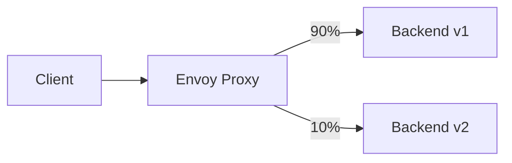

# Configuring Cilium L7 Traffic Shifting

Author: [nawazdhandala](https://github.com/nawazdhandala)

Tags: Cilium, Kubernetes, L7, Traffic Shifting, Canary

Description: How to configure Cilium L7 traffic shifting to implement canary deployments and gradual traffic migration between service versions.

---

## Introduction

Cilium L7 traffic shifting lets you split HTTP traffic between multiple backend versions based on weight percentages. This enables canary deployments, A/B testing, and gradual migrations. Traffic shifting in Cilium is implemented through the Envoy proxy using CiliumEnvoyConfig resources.

Unlike Kubernetes-native traffic splitting (which works at L4), Cilium L7 traffic shifting can split based on HTTP headers, paths, and other L7 attributes, giving you fine-grained control over which traffic goes to which backend.

## Prerequisites

- Kubernetes cluster with Cilium installed (v1.14+)
- L7 proxy enabled
- Two versions of a service deployed
- kubectl and Helm configured

## Deploying Two Service Versions

```yaml
# backend-v1.yaml
apiVersion: apps/v1
kind: Deployment
metadata:
  name: backend-v1
  namespace: default
spec:
  replicas: 3
  selector:
    matchLabels:
      app: backend
      version: v1
  template:
    metadata:
      labels:
        app: backend
        version: v1
    spec:
      containers:
        - name: backend
          image: nginx:1.27
          ports:
            - containerPort: 80
---
# backend-v2.yaml
apiVersion: apps/v1
kind: Deployment
metadata:
  name: backend-v2
  namespace: default
spec:
  replicas: 1
  selector:
    matchLabels:
      app: backend
      version: v2
  template:
    metadata:
      labels:
        app: backend
        version: v2
    spec:
      containers:
        - name: backend
          image: nginx:1.27
          ports:
            - containerPort: 80
```

```bash
kubectl apply -f backend-v1.yaml -f backend-v2.yaml
```

## Configuring Traffic Shifting

```yaml
# traffic-shift.yaml
apiVersion: cilium.io/v2
kind: CiliumEnvoyConfig
metadata:
  name: traffic-shift
  namespace: default
spec:
  services:
    - name: backend
      namespace: default
  resources:
    - "@type": type.googleapis.com/envoy.config.route.v3.RouteConfiguration
      name: default/backend
      virtual_hosts:
        - name: backend-split
          domains: ["*"]
          routes:
            - match:
                prefix: "/"
              route:
                weighted_clusters:
                  clusters:
                    - name: default/backend-v1
                      weight: 90
                    - name: default/backend-v2
                      weight: 10
```

```bash
kubectl apply -f traffic-shift.yaml
```



## Gradual Traffic Migration

Shift traffic progressively:

```bash
# Start with 10% to v2
# 90/10 split (applied above)

# Move to 50/50
kubectl patch ciliumenvoyconfig traffic-shift -n default --type=merge -p '
spec:
  resources:
    - "@type": type.googleapis.com/envoy.config.route.v3.RouteConfiguration
      name: default/backend
      virtual_hosts:
        - name: backend-split
          domains: ["*"]
          routes:
            - match:
                prefix: "/"
              route:
                weighted_clusters:
                  clusters:
                    - name: default/backend-v1
                      weight: 50
                    - name: default/backend-v2
                      weight: 50'

# Complete migration to v2
# Update to 0/100
```

## Verification

```bash
# Verify traffic distribution
for i in $(seq 1 100); do
  kubectl exec deploy/client -- curl -s http://backend/ -H "Host: backend" 2>/dev/null
done | sort | uniq -c

# Check Hubble for traffic distribution
hubble observe --protocol http -n default --to-label app=backend --last 100 -o json | \
  jq -r '.flow.destination.labels[]' | sort | uniq -c

# Verify CiliumEnvoyConfig
kubectl get ciliumenvoyconfigs -n default
```

## Troubleshooting

- **All traffic goes to one version**: Check that CiliumEnvoyConfig matches the correct service.
- **Traffic split not matching weights**: Small sample sizes show high variance. Test with 1000+ requests.
- **503 errors on the new version**: Backend v2 may not be healthy. Check pod readiness.
- **Config not applied**: Verify L7 proxy is enabled and an L7 policy is in place.

## Conclusion

Cilium L7 traffic shifting through CiliumEnvoyConfig enables canary deployments and gradual migrations. Start with a small percentage to the new version, monitor error rates and latency, and gradually increase the weight as confidence grows.