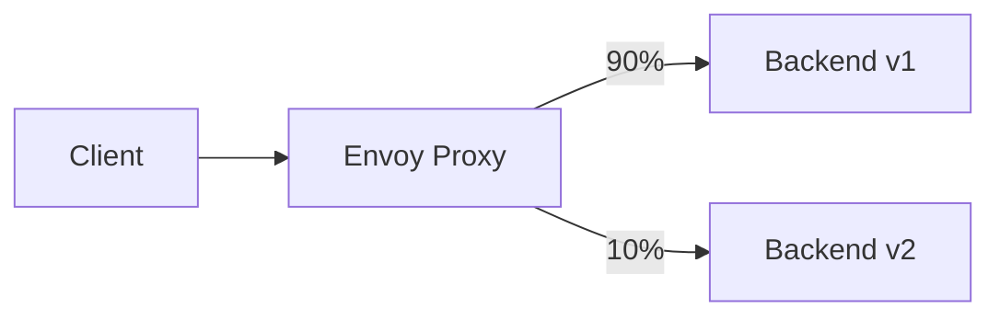

# Configuring Cilium L7 Traffic Shifting

Author: [nawazdhandala](https://github.com/nawazdhandala)

Tags: Cilium, Kubernetes, L7, Traffic Shifting, Canary

Description: How to configure Cilium L7 traffic shifting to implement canary deployments and gradual traffic migration between service versions.

---

## Introduction

Cilium L7 traffic shifting lets you split HTTP traffic between multiple backend versions based on weight percentages. This enables canary deployments, A/B testing, and gradual migrations. Traffic shifting in Cilium is implemented through the Envoy proxy using CiliumEnvoyConfig resources.

Unlike ordinary Kubernetes Service load balancing, Cilium L7 traffic shifting can split based on HTTP headers, paths, and other L7 attributes, giving you fine-grained control over which traffic goes to which backend.

## Prerequisites

- Kubernetes cluster with Cilium installed (v1.19+)
- Cilium configured with `kubeProxyReplacement=true`, `envoyConfig.enabled=true`, and `loadBalancer.l7.backend=envoy`
- Two versions of a service deployed
- kubectl and Helm configured

## Deploying Two Service Versions

```yaml
# backend-v1.yaml

apiVersion: apps/v1
kind: Deployment
metadata:
  name: backend-v1
  namespace: default
spec:
  replicas: 3
  selector:
    matchLabels:
      app: backend
      version: v1
  template:
    metadata:
      labels:
        app: backend
        version: v1
    spec:
      containers:
        - name: backend
          image: docker.io/istio/examples-helloworld-v1
          ports:
            - containerPort: 5000
---
# backend-v2.yaml
apiVersion: apps/v1
kind: Deployment
metadata:
  name: backend-v2
  namespace: default
spec:
  replicas: 1
  selector:
    matchLabels:
      app: backend
      version: v2
  template:
    metadata:
      labels:
        app: backend
        version: v2
    spec:
      containers:
        - name: backend
          image: docker.io/istio/examples-helloworld-v2
          ports:
            - containerPort: 5000
---
# services.yaml
apiVersion: v1
kind: Service
metadata:
  name: backend
  namespace: default
spec:
  selector:
    app: backend
  ports:
    - name: http
      port: 5000
      targetPort: 5000
---
apiVersion: v1
kind: Service
metadata:
  name: backend-v1
  namespace: default
spec:
  selector:
    app: backend
    version: v1
  ports:
    - name: http
      port: 5000
      targetPort: 5000
---
apiVersion: v1
kind: Service
metadata:
  name: backend-v2
  namespace: default
spec:
  selector:
    app: backend
    version: v2
  ports:
    - name: http
      port: 5000
      targetPort: 5000
---
# client.yaml
apiVersion: apps/v1
kind: Deployment
metadata:
  name: client
  namespace: default
  labels:
    app: client
spec:
  replicas: 1
  selector:
    matchLabels:
      app: client
  template:
    metadata:
      labels:
        app: client
    spec:
      containers:
        - name: client
          image: quay.io/cilium/alpine-curl:v1.5.0
          command: ["/bin/ash", "-c", "sleep 10000000"]
```

```bash
kubectl apply -f backend-v1.yaml -f backend-v2.yaml -f services.yaml -f client.yaml
```

## Configuring Traffic Shifting

```yaml
# traffic-shift.yaml
apiVersion: cilium.io/v2
kind: CiliumEnvoyConfig
metadata:
  name: traffic-shift
  namespace: default
  annotations:
    cec.cilium.io/use-original-source-address: "false"
spec:
  services:
    - name: backend
      namespace: default
  backendServices:
    - name: backend-v1
      namespace: default
    - name: backend-v2
      namespace: default
  resources:
    - "@type": type.googleapis.com/envoy.config.listener.v3.Listener
      name: traffic-shift-listener
      filter_chains:
        - filters:
            - name: envoy.filters.network.http_connection_manager
              typed_config:
                "@type": type.googleapis.com/envoy.extensions.filters.network.http_connection_manager.v3.HttpConnectionManager
                stat_prefix: traffic-shift-listener
                rds:
                  route_config_name: traffic_shift_route
                http_filters:
                  - name: envoy.filters.http.router
                    typed_config:
                      "@type": type.googleapis.com/envoy.extensions.filters.http.router.v3.Router
    - "@type": type.googleapis.com/envoy.config.route.v3.RouteConfiguration
      name: traffic_shift_route
      virtual_hosts:
        - name: backend-split
          domains: ["*"]
          routes:
            - match:
                prefix: "/"
              route:
                weighted_clusters:
                  clusters:
                    - name: default/backend-v1
                      weight: 90
                    - name: default/backend-v2
                      weight: 10
    - "@type": type.googleapis.com/envoy.config.cluster.v3.Cluster
      name: default/backend-v1
      connect_timeout: 5s
      lb_policy: ROUND_ROBIN
      type: EDS
    - "@type": type.googleapis.com/envoy.config.cluster.v3.Cluster
      name: default/backend-v2
      connect_timeout: 5s
      lb_policy: ROUND_ROBIN
      type: EDS
```

```bash
kubectl apply -f traffic-shift.yaml
```


```mermaid
graph LR
    A[Client] --> B[Envoy Proxy]
    B -->|90%| C[Backend v1]
    B -->|10%| D[Backend v2]
```

## Gradual Traffic Migration

Shift traffic progressively:

```bash
# Start with 10% to v2
# 90/10 split (applied above)

# Move to 50/50
kubectl edit ciliumenvoyconfig traffic-shift -n default
# In the RouteConfiguration, change backend-v1 and backend-v2 weights to 50 and 50.

# Complete migration to v2
# Update to 0/100
```

## Verification

```bash
# Verify traffic distribution
for i in $(seq 1 100); do
  kubectl exec deploy/client -- curl -s http://backend:5000/hello 2>/dev/null
done | sort | uniq -c

# Check Hubble for traffic distribution
hubble observe --protocol http -n default --to-label app=backend --last 100 -o json | \
  jq -r '.flow.destination.labels[] | select(startswith("version="))' | sort | uniq -c

# Verify CiliumEnvoyConfig
kubectl get ciliumenvoyconfigs -n default
```

## Troubleshooting

- **All traffic goes to one version**: Check that CiliumEnvoyConfig matches the frontend service and that `backendServices` lists both version-specific services.
- **Traffic split not matching weights**: Small sample sizes show high variance. Test with 1000+ requests.
- **503 errors on the new version**: Backend v2 may not be healthy. Check pod readiness.
- **Config not applied**: Verify Cilium is configured with Envoy config support and check Cilium agent logs for Envoy parsing errors.

## Conclusion

Cilium L7 traffic shifting through CiliumEnvoyConfig enables canary deployments and gradual migrations. Start with a small percentage to the new version, monitor error rates and latency, and gradually increase the weight as confidence grows.
