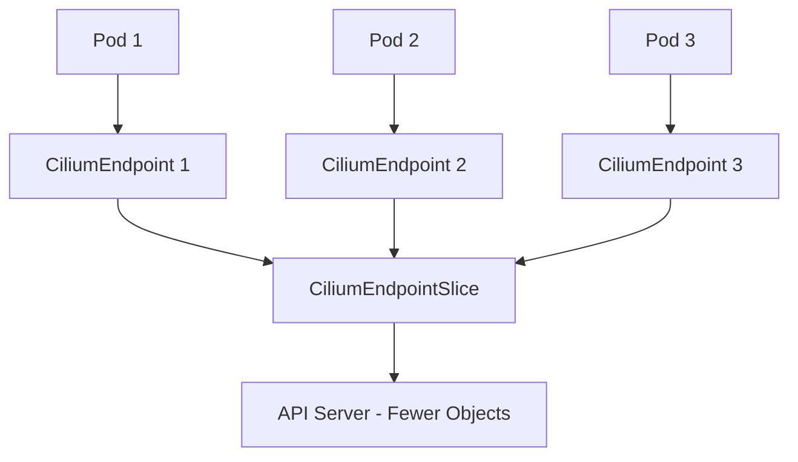

# Configuring CiliumEndpointSlice for Scalable Endpoint Management

Author: [nawazdhandala](https://github.com/nawazdhandala)

Tags: Cilium, Kubernetes, Networking, EndpointSlice, Scalability

Description: Learn how to configure CiliumEndpointSlice resources to improve endpoint management scalability and reduce API server load in large Cilium clusters.

---

## Introduction

CiliumEndpointSlice (CES) addresses scalability challenges with individual CiliumEndpoint resources. In large clusters with thousands of pods, each CiliumEndpoint generates API server watch events and increases etcd storage. CES batches multiple endpoints into a single resource, reducing the number of API objects and associated overhead.

When CES is enabled, the Cilium operator groups endpoints into slices. Each slice contains a configurable number of endpoints, and the operator manages their lifecycle automatically. The result is fewer API calls, less etcd storage, and faster endpoint synchronization.

This guide covers enabling, configuring, and tuning CES for production.

## Prerequisites

- Kubernetes cluster (v1.25+) with Cilium (v1.14+)
- Helm v3 installed
- kubectl configured with cluster access
- Cilium CLI installed

## Enabling CiliumEndpointSlice

```bash
helm upgrade cilium cilium/cilium \
  --namespace kube-system \
  --reuse-values \
  --set ciliumEndpointSlice.enabled=true
```

Verify the CRD:

```bash
kubectl get crd ciliumendpointslices.cilium.io
```

## Configuring Slice Parameters

```yaml
# cilium-ces-values.yaml
ciliumEndpointSlice:
  enabled: true
  rateLimits:
    - nodes: 0
      limit: 10
      burst: 20
```

```bash
helm upgrade cilium cilium/cilium \
  --namespace kube-system \
  --reuse-values \
  -f cilium-ces-values.yaml
```

### Operator Configuration

```yaml
operator:
  replicas: 2
  resources:
    limits:
      cpu: "1"
      memory: "1Gi"
    requests:
      cpu: "100m"
      memory: "128Mi"
```



## Tuning for Large Clusters

For clusters with more than 1000 nodes:

```yaml
ciliumEndpointSlice:
  enabled: true

operator:
  replicas: 2
  resources:
    limits:
      cpu: "2"
      memory: "2Gi"
```

## Migrating to CiliumEndpointSlice

```bash
# Enable CES
helm upgrade cilium cilium/cilium \
  --namespace kube-system \
  --reuse-values \
  --set ciliumEndpointSlice.enabled=true

# Restart operator
kubectl rollout restart deployment/cilium-operator -n kube-system

# Verify CES resources are created
kubectl get ciliumendpointslices --all-namespaces

# Monitor migration
kubectl get ciliumendpointslices --all-namespaces --no-headers | wc -l
```

## Verification

```bash
cilium status | grep -i "endpointslice"
kubectl get ciliumendpointslices --all-namespaces
CES_ENDPOINTS=$(kubectl get ciliumendpointslices --all-namespaces -o json | \
  jq '[.items[].endpoints[]] | length')
echo "Endpoints in CES: $CES_ENDPOINTS"
```

## Troubleshooting

- **CES not created**: Ensure the operator is running and the feature is enabled. Check operator logs.
- **Stale CES resources**: The operator garbage-collects empty slices. If stale ones persist, restart the operator.
- **API server still under high load**: Check that CiliumEndpoint watch events are reduced.
- **Operator OOM**: Increase memory limits. CES management adds overhead proportional to endpoint count.

## Conclusion

CiliumEndpointSlice is essential for running Cilium at scale. Enable it early in large clusters and tune operator resources based on endpoint count. Migration from individual CiliumEndpoints is seamless.