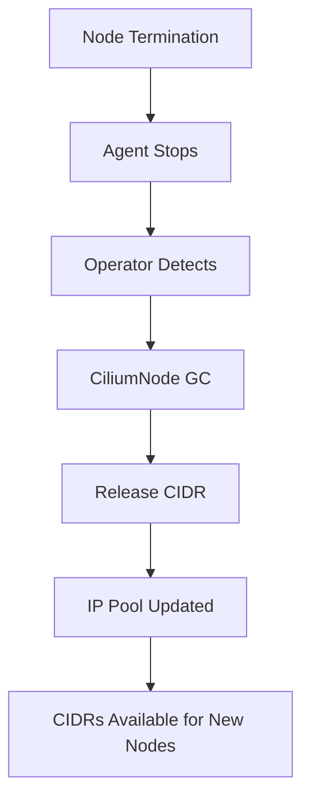

# Configuring Node Termination Handling in Cilium IPAM

Author: [nawazdhandala](https://github.com/nawazdhandala)

Tags: Cilium, Kubernetes, IPAM, Node Management, Networking

Description: How to configure Cilium IPAM to properly handle node termination, ensuring clean IP release and resource cleanup when nodes leave the cluster.

---

## Introduction

When a Kubernetes node is terminated, Cilium IPAM must clean up all IP allocations associated with that node, release the node CIDR back to the pool, and remove the CiliumNode custom resource. Proper node termination handling prevents IP address leaks and ensures the IP pool remains accurate.

In cloud environments, node termination happens frequently during autoscaling, spot instance reclamation, and rolling upgrades. If cleanup does not happen correctly, the cluster gradually loses available IP addresses until IPAM exhaustion occurs.

This guide covers configuring Cilium to handle node termination gracefully.

## Prerequisites

- Kubernetes cluster with Cilium installed
- Helm v3 and kubectl configured
- Understanding of your cluster scaling patterns

## Default Node Termination Behavior

When a node is removed from the cluster, Cilium:
1. The agent on the node stops
2. The operator detects the node is gone
3. The operator cleans up the CiliumNode resource
4. CIDR allocation is released back to the pool

```bash
# Check current CiliumNode cleanup behavior
kubectl get ciliumnodes -o json | jq '.items | length'
kubectl get nodes --no-headers | wc -l
# These should match
```

## Configuring Termination Handling

```yaml
# cilium-node-termination.yaml
operator:
  # Enable node garbage collection
  nodeGCInterval: "5m0s"
  replicas: 2
  resources:
    limits:
      cpu: "1"
      memory: "1Gi"
```

```bash
helm upgrade cilium cilium/cilium \
  --namespace kube-system \
  --reuse-values \
  -f cilium-node-termination.yaml
```



## Handling Cloud Provider Node Termination

### Graceful Shutdown Configuration

```yaml
# Ensure Cilium agent handles SIGTERM properly
terminationGracePeriodSeconds: 30

# Configure agent for graceful shutdown
agent:
  terminationGracePeriodSeconds: 30
```

### Spot Instance Handling

For AWS spot instances or Azure spot VMs:

```bash
# Check for orphaned CiliumNodes
NODES=$(kubectl get nodes -o jsonpath='{.items[*].metadata.name}' | tr ' ' '\n' | sort)
CILIUMNODES=$(kubectl get ciliumnodes -o jsonpath='{.items[*].metadata.name}' | tr ' ' '\n' | sort)

# Find CiliumNodes without corresponding Kubernetes nodes
comm -13 <(echo "$NODES") <(echo "$CILIUMNODES")
```

## Automated Cleanup Script

```bash
#!/bin/bash
# cleanup-orphaned-ciliumnodes.sh

NODES=$(kubectl get nodes -o jsonpath='{.items[*].metadata.name}')

for cn in $(kubectl get ciliumnodes -o jsonpath='{.items[*].metadata.name}'); do
  if ! echo "$NODES" | grep -qw "$cn"; then
    echo "Orphaned CiliumNode found: $cn"
    kubectl delete ciliumnode "$cn"
    echo "Deleted orphaned CiliumNode: $cn"
  fi
done
```

## Verification

```bash
# Verify node count matches CiliumNode count
echo "Nodes: $(kubectl get nodes --no-headers | wc -l)"
echo "CiliumNodes: $(kubectl get ciliumnodes --no-headers | wc -l)"

# Check operator GC is working
kubectl logs -n kube-system -l name=cilium-operator | \
  grep -i "garbage" | tail -10

# Verify CIDR pool has available ranges
cilium status | grep IPAM
```

## Troubleshooting

- **Orphaned CiliumNodes**: Operator GC may be too slow. Decrease nodeGCInterval or run cleanup script.
- **CIDR not released after node termination**: Restart operator. Check for finalizers on the CiliumNode.
- **IP pool shrinking over time**: Likely orphaned CiliumNodes holding CIDRs. Run the cleanup script.
- **New nodes cannot get CIDRs**: Check if the cluster CIDR is exhausted by counting allocated ranges.

## Conclusion

Proper node termination handling in Cilium IPAM prevents IP address leaks and maintains pool accuracy. Configure operator GC intervals, monitor for orphaned CiliumNodes, and run cleanup scripts for environments with frequent node churn like spot instances.